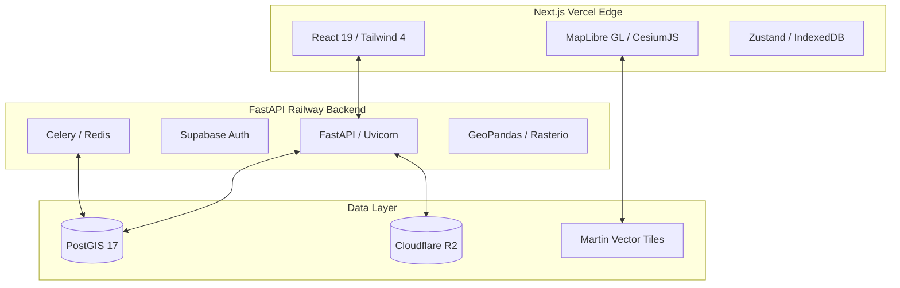

# 🌍 CapeTown GIS Hub

> **Multi-tenant PWA for spatial property intelligence** — City of Cape Town & Western Cape Province.

[](https://github.com/<owner>/capegis/actions/workflows/ci.yml)
[](https://github.com/<owner>/capegis/actions/workflows/deploy.yml)

## Overview

CapeTown GIS Hub (**capegis**) is a progressive web application delivering geospatial intelligence for property analysis, urban planning, and environmental monitoring. The platform combines interactive 2D/3D mapping with real-time data overlays, ML-powered analytics, and multi-tenant role-based access.

This repository is structured as a mono-repo. The core frontend framework (Next.js) resides in the root directory and `src/`, while the Python-based geospatial backend services reside in the `backend/` directory.

### Project Navigation

- [**Root Repository**](#) — High-level architecture and quickstart setups.
- [**Frontend Documentation**](./frontend/README.md) — UI stack, Next.js setups, components, and state management.
- [**Backend Documentation**](./backend/README.md) — FastAPI, PostGIS, ML pipelines, and Celery jobs.

---

## System Architecture



---

## Tech Stack Detection

- **Frontend Core**: Next.js 16 (App Router), React 19, TypeScript
- **UI & Styling**: Tailwind CSS 4, Zustand 5
- **Mapping Stack**: MapLibre GL 4, CesiumJS, Martin MVT
- **Backend Core**: FastAPI, Uvicorn, Python 3.11+, Celery
- **Geospatial Processing**: GeoPandas, Shapely, GeoAlchemy2, Rasterio
- **Database / Infrastructure**: PostgreSQL 17 + PostGIS 3.5, Redis 7, LocalStack, Supabase Auth
- **CI/CD**: GitHub Actions, Vercel (Frontend), Railway (Backend)
- **Testing**: Vitest, Playwright, Pytest

---

## Quick Start

### 1. Prerequisites

- **Node.js** ≥ 20 and **npm**
- **Python** ≥ 3.11
- **Docker** & **Docker Compose**

### 2. Base Setup

```bash
# Clone the repository
git clone https://github.com/<owner>/capegis.git
cd capegis

# Run Docker dependencies (Postgres, Martin, LocalStack)
docker compose up -d
```

### 3. Frontend / UI Setup

```bash
# Install NPM dependencies
npm ci

# Configure environment
cp .env.example .env.local

# Start the frontend application (http://localhost:3000)
npm run dev
```
👉 *[See Frontend README](./frontend/README.md) for full details.*

### 4. Backend Setup

```bash
cd backend

# Setup Python environment
python -m venv .venv
source .venv/bin/activate
pip install -r requirements.txt

# Configure environment
cp .env.example .env

# Start Backend APIs (http://localhost:8000)
uvicorn main:app --reload
```
👉 *[See Backend README](./backend/README.md) for full details.*

---

## Common Scripts

| Domain   | Command                       | Description                               |
|----------|-------------------------------|-------------------------------------------|
| Frontend | `npm run dev`                 | Next.js Dev Server (localhost:3000)       |
| Frontend | `npm run test:e2e`            | Run Playwright End-to-End tests           |
| Backend  | `uvicorn main:app --reload`   | FastAPI Dev Server (localhost:8000)       |
| Backend  | `pytest tests/`               | Run Pytest unit and integration tests     |
| Docker   | `docker compose up -d`        | Boot up local database and dev services   |

---

## Security & Workflow Checks

- **Dependabot**: Automatically enabled for NPM and Pip dependencies.
- **Pre-commit**: Linters (Prettier, ESLint, Ruff) enforce syntax and formatting.
- **CI Pipelines**: Found under `.github/workflows/` handling PR validations, type checking, security static scans (CodeQL, Bandit), and deployments.
- **Secrets Management**: Relies heavily on Supabase RLS and environment variable isolation (`.env` files are `.gitignore`d).

## Contributing

1. Check the [OPEN_QUESTIONS.md](docs/OPEN_QUESTIONS.md) for blocking items.
2. Read the [architecture rules](docs/PYTHON_BACKEND_ARCHITECTURE.md).
3. Ensure CI completes successfully before creating pull requests.
