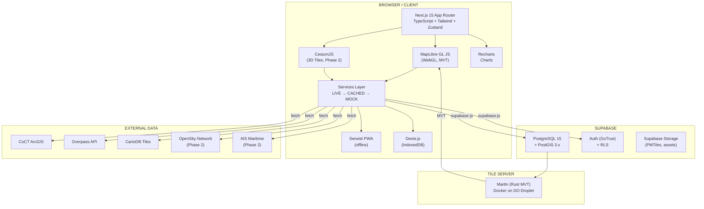
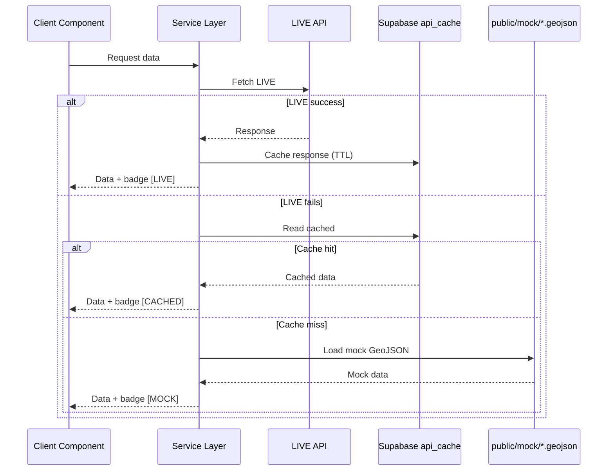

# System Design — CapeTown GIS Hub

> **TL;DR:** Multi-tenant GIS PWA serving Cape Town + Western Cape. Next.js 15 frontend with MapLibre GL JS renders 2D vector maps; Supabase (PostgreSQL 15 + PostGIS) provides data + auth + RLS; Martin serves MVT tiles from Docker. All external data follows a mandatory LIVE → CACHED → MOCK fallback. Tenant isolation is enforced via RLS + application layer. Phase 2 adds CesiumJS hybrid 3D, OpenSky flight tracking, AIS maritime fusion, and 4DGS temporal replay.

---

## Six Architecture Pillars

| # | Pillar | Milestones | Status |
|---|--------|-----------|--------|
| 1 | **Foundation & Governance** — Schema, RLS, auth, POPIA | M0–M2 | [VERIFIED] In progress |
| 2 | **Spatial Visualization** — MapLibre basemap, overlays, Martin MVT | M3–M4b | [VERIFIED] Planned |
| 3 | **Data Platform** — Three-tier fallback, GV Roll, zoning, search | M4a, M5–M7 | [VERIFIED] Planned |
| 4 | **Offline & PWA** — Serwist, Dexie, PMTiles, background sync | M4c | [VERIFIED] Planned |
| 5 | **Immersive Intelligence** — CesiumJS hybrid, OpenSky, AIS, 4DGS | M5–M8 (Phase 2) | [ASSUMPTION — UNVERIFIED] |
| 6 | **Product & Operations** — Analytics, white-label, DPIA, deploy | M9–M15 | [VERIFIED] Planned |

---

## Architecture Overview



---

## Data Flow: Three-Tier Fallback



---

## Deployment Topology

| Component | Host | Purpose |
|-----------|------|---------|
| Next.js 15 PWA | Vercel | Frontend + API routes + edge middleware |
| PostgreSQL + PostGIS | Supabase Cloud | Database, RLS, Auth |
| Martin tile server | DigitalOcean Droplet | MVT vector tiles from PostGIS |
| PMTiles | Supabase Storage | Pre-generated offline vector tiles |

---

## Multi-Tenancy Architecture

- **Strategy:** Shared schema with RLS isolation [VERIFIED]
- All tenant-scoped tables have `tenant_id UUID NOT NULL`
- Tenant-scoped tables: `profiles` · `saved_searches` · `favourites` · `valuation_data` · `api_cache` · `audit_log` · `tenant_settings` · `layer_permissions`

```sql
-- Canonical RLS pattern (CLAUDE.md §4)
ALTER TABLE [table] ENABLE ROW LEVEL SECURITY;
ALTER TABLE [table] FORCE ROW LEVEL SECURITY;
CREATE POLICY "[table]_tenant_isolation" ON [table]
  USING (tenant_id = current_setting('app.current_tenant', TRUE)::uuid);
```

- **Session variables** set at connection time: `app.current_tenant`, `app.current_role`
- **Tenant routing:** subdomain-based (`[tenant-slug].capegis.com`) via Next.js middleware (ADR-005)

### RBAC Hierarchy

```
GUEST → VIEWER → ANALYST → POWER_USER → TENANT_ADMIN → PLATFORM_ADMIN
```

- JWT lifetime: 1h · Refresh: 7d · White-label tokens in `tenant_settings`

---

## Spatial Reference System

- **Storage:** EPSG:4326 (WGS 84) [VERIFIED]
- **Rendering:** EPSG:3857 (Web Mercator) via MapLibre [VERIFIED]
- Never mix CRS without explicit reprojection
- Geographic scope: `{ west: 18.0, south: -34.5, east: 19.5, north: -33.0 }`
- Initial centre: `{ lng: 18.4241, lat: -33.9249 }` · Zoom: 11

---

## External Data Sources

| Source | Auth | Cache TTL | Fallback | Milestone |
|--------|------|-----------|----------|-----------|
| CoCT ArcGIS | TBC | 24h (zoning), 168h (cadastral) | `api_cache` → mock GeoJSON | M5 |
| CoCT GV Roll 2022 | None (bulk) | Static import | Pre-loaded in DB | M6 |
| Overpass API | None | 24h | mock GeoJSON | M4a |
| CartoDB tiles | None (CDN) | Browser cache | OSM tile fallback | M3 |
| Google Street View | API key | N/A | Tab hidden if absent | M10 |
| OpenSky Network | Optional auth | 30s | `api_cache` → mock GeoJSON | M7 (Phase 2) |
| AIS Maritime | Commercial | 30s | `api_cache` → mock GeoJSON | M5–M7 (Phase 2) |

---

## Map Layer Z-Order (top → bottom)

1. **User draw layer** (highest)
2. **Risk overlays** (flood, fire) — semi-transparent
3. **Zoning overlay** (IZS codes)
4. **Cadastral parcels** (zoom ≥ 14)
5. **Suburb boundaries**
6. **CartoDB Dark Matter basemap** (lowest)

---

## Milestone Cross-Reference

| Milestone | Goal | Key Deliverables |
|-----------|------|-----------------|
| **M0** | Foundation & governance | Clean repo, CLAUDE.md, docker-compose, CI |
| **M1** | Database schema + RLS | All tables, RLS policies, spatial indexes, seed data |
| **M2** | Auth + RBAC + POPIA | Supabase Auth, JWT claims, POPIA consent flow |
| **M3** | MapLibre base map | CartoDB basemap, attribution, responsive dark UI |
| **M4a** | Three-tier fallback | `dataService`, source badges, `api_cache` |
| **M4b** | Martin MVT integration | Martin ↔ PostGIS, cadastral at z≥14 |
| **M4c** | Serwist PWA / offline | Service worker, Dexie, background sync |
| **M4d** | RLS test harness | Vitest tenant isolation + RBAC tests |
| **M5** | Zoning overlay | IZS codes on map |
| **M6** | GV Roll 2022 import | Property valuations loaded |
| **M7** | Search + filters | Full-text + spatial search |
| **M8** | Draw polygon + analysis | Spatial analysis tools |
| **M9** | Favourites + saved searches | User data persistence |
| **M10** | Property detail panel | Detailed property view |
| **M11** | Analytics dashboard | Recharts visualizations |
| **M12** | Multi-tenant white-label | Subdomain branding |
| **M13** | Share URLs | Deep-link sharing |
| **M14** | QA | All acceptance criteria verified |
| **M15** | DPIA + production deploy | POPIA compliance, go-live |

---

## Related ADRs

- **ADR-001:** Next.js 15 monorepo pivot
- **ADR-002:** MapLibre GL JS selection
- **ADR-003:** Martin tile server
- **ADR-004:** Stripe billing
- **ADR-005:** Subdomain tenant routing
- **ADR-006:** Desktop-to-web GIS mapping
- **ADR-007:** Offline-first architecture (Serwist + Dexie + PMTiles)
- **ADR-008:** Playful documentation UI
- **ADR-009:** Three-tier data fallback pattern

---

*v3.0 · 2026-03-05 · Updated during architecture documentation polish*
