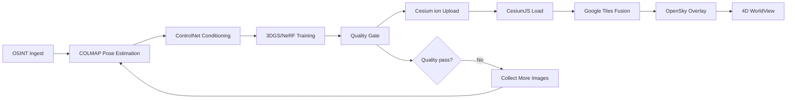

# AI Reconstruction Pipeline Architecture

## TL;DR
The pipeline ingests public event signals, reconstructs scene geometry through ControlNet-conditioned NeRF/3DGS workflows, applies hard quality + labeling gates, and publishes tenant-isolated Cesium assets for 4D playback.

## Verified Facts vs Assumptions

### Verified Facts
- Canonical flow: OSINT ingest → COLMAP/conditioning/training → export → Cesium visualization.
- Splatfacto (3DGS) is the primary production route; Instant-NGP-family methods support fast prototyping/fallback.
- Quality thresholds use PSNR/SSIM tiers with mandatory human review gates for evidence export.
- Tenant storage must follow per-tenant namespacing.

### [ASSUMPTION — UNVERIFIED]
- Exact metric thresholds may require per-domain calibration (e.g., smoke/fire vs urban static scenes).

---

## Full Mermaid Pipeline



---

## Hardware Requirements

| GPU Class | VRAM | ControlNet Inference | Splatfacto Training | Typical Use Case |
|---|---:|---|---|---|
| RTX 3060 | 12 GB | Slow/single job | 20–45 min | Dev, low-volume pilots |
| RTX 4090 / A5000 | 24 GB | Fast single-tenant | 15–30 min | Production baseline |
| A100/H100 | 40+ GB | Parallel workloads | 10–20 min | Multi-tenant high throughput |

---

## Quality Metric Thresholds

| Level | PSNR | SSIM | Operational Interpretation |
|---|---|---|---|
| low | < 25 | < 0.75 | Exploratory only, no evidence export |
| medium | > 25 | 0.75–0.85 | Analyst use with caveats |
| high | > 30 | > 0.85 | Strong visual fidelity, still human-reviewed for evidence |

---

## Multitenant Storage Paths

```text
NERF_MODEL_STORAGE_PATH/{tenantId}/{eventId}/    # trained checkpoints
CESIUM_TILES_OUTPUT_PATH/{tenantId}/{eventId}/   # 3D Tiles outputs
CONTROLNET_CACHE_PATH/{tenantId}/{eventId}/      # conditioning intermediates
```

Isolation rule: no cross-tenant reads/writes without explicit grant + audit trail.

---

## Two Deployment Modes

1. **External GPU Service**
   - App tier submits reconstruction job to managed GPU workers.
   - Best for burst handling and tenant elasticity.
2. **On-Prem GPU Container**
   - Localized execution for controlled environments.
   - Better data residency control, higher ops overhead.

---

## Quality Feedback Loop
- Low confidence or failed metrics trigger “recapture-needed” status.
- Pipeline loops back to source image collection and pose refinement.
- Reviewers can approve exploratory release while blocking evidence export.

## Provider Policy and Tenant Routing
- Model-provider selection is tenant-policy constrained (e.g., sensitive tenants cannot route to disallowed tiers).
- Routing decisions must emit auditable records: `tenantId`, provider, model, policy reason code, retention tag.
- [ASSUMPTION — UNVERIFIED] final legal sufficiency of provider-policy mapping is pending counsel review.

## AI Labeling + Human Review Gates
- Every AI scene includes `AIContentMetadata` payload.
- Watermark is always displayed.
- `humanReviewed=false` blocks verified-evidence export; scene remains exploratory only.

## ⚖️ Compliance & Governance
- Public-data provenance must be documented for each reconstruction.
- Exported artifacts must include citation and uncertainty disclosures.
- Governance logs retain decisions, thresholds, and reviewer identity.

## Ralph Q/A
- **Q:** What if quality is high numerically but scene is semantically wrong?
  **A:** Semantic inconsistency triggers manual rejection despite strong PSNR/SSIM.
- **Q:** What if we cannot obtain more source imagery?
  **A:** Keep asset in labeled exploratory mode; do not upgrade confidence.

## Known Unknowns
- Domain-specific threshold tuning strategy (journalism vs emergency response) needs controlled validation.
- Quantitative metric drift across weather/night scenes is not fully characterized.

## References
- `docs/prompts/GIS_FLEET_PLAN_PROMPT_V3.md` (Pillar 3 pipeline spec)
- `docs/context/GIS_MASTER_CONTEXT.md` (§7.1–§7.3, §9, §10)
