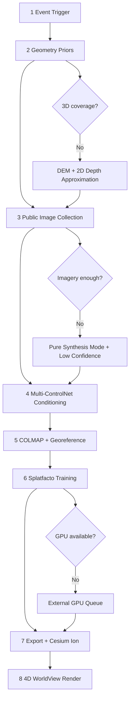

# ControlNet Workflow for GIS Reconstruction

## TL;DR
This workflow converts event triggers into tenant-isolated, Cesium-ready reconstructed scenes via an 8-step pipeline centered on geometry priors, multi-ControlNet conditioning, COLMAP alignment, and Splatfacto training.

## Verified Facts vs Assumptions

### Verified Facts
- 8-step reconstruction flow and toolchain are defined in project context.
- Primary production training path is Nerfstudio Splatfacto (3DGS), with Nerfacto fallback.
- Georeferencing anchor is EPSG:4326 + ellipsoidal height.
- Human review + mandatory watermark are hard gates for evidence workflows.

### [ASSUMPTION — UNVERIFIED]
- MVControl/GaussCtrl/ControlNet++ relative performance depends on scene class and current model release maturity.
- Cesium ion quotas and processing durations can vary by subscription and region.

---

## Full 8-Step Pipeline

| Step | Input | Output | Tool | Documentation Requirement | Edge Case + Answer |
|---|---|---|---|---|---|
| 1. Event Trigger & OSINT Ingestion | OpenSky event context (`eventId`, bbox, timestamp) | Event entity in ontology | OSINT ingest service | Define Event entity + links to ontology | If telemetry gaps exist, mark event as `partial_observation` |
| 2. Geometry Prior Extraction | Event bbox | Depth/normal/edge (+ optional semantic mask) | Cesium offscreen renderer + tiles | Document extraction params and fallback logic | No 3D coverage → DEM + 2D satellite depth approximation |
| 3. Public Image Collection | Location + time window | 4–8+ source images + rough camera hints | Street View/public cams/satellite archives | Record provenance and timestamp confidence | Zero imagery → pure-synthesis mode, confidence capped `low` |
| 4. Multi-ControlNet Conditioning | Real images + priors | 8–16 novel views | ControlNet depth/normal/canny (+ 2026 extensions) | Capture conditioning stack in metadata | Invented geometry risk → cross-check against latest dated imagery |
| 5. Pose Estimation & Dataset Assembly | Mixed image set | `transforms.json` + normalized dataset | COLMAP + geospatial anchoring | Document reprojection and pose QA | Textureless failure → add texture guidance / recapture |
| 6. 3DGS / NeRF Training | Aligned dataset | Trained scene checkpoints | Nerfstudio Splatfacto (primary), Nerfacto fallback | Record config + hardware class + metrics | No GPU → deferred queue / external GPU service |
| 7. Export & Cesium Tiling | Checkpoints | Cesium-ready assets + `assetId` | `ns-export` + Cesium ion API | Record asset lineage and metadata | Quota exhausted → self-hosted tiler fallback path |
| 8. 4D WorldView Rendering | `assetId` + time streams | Interactive timeline scene | CesiumJS + timeline sync | Ensure layer stack parity and labeling gate | Low-end device → downgrade LOD + offer report export |

---

## ControlNet Conditioning Signal Table

| Signal Type | Source | Control Model | Quality Impact | Edge Risk |
|---|---|---|---|---|
| Depth | Z-buffer from 3D tiles | ControlNet-depth | Highest geometry anchoring | Sparse tiles produce noisy depth |
| Normal | Tile normal render | ControlNet-normal | Surface fidelity | Over-smoothed facades |
| Canny | Edge extraction | ControlNet-canny | Structural lines | Edge noise in foliage |
| Semantic mask | Land-use/material classes | ControlNet-seg | Material consistency | Misclassification drift |
| Pose | COLMAP + trajectory hints | MVControl | Multi-view coherence | Pose mismatch in dynamic scenes |

---

## 2026 Extensions Comparison

| Extension | Best Fit | Strength | Limitation |
|---|---|---|---|
| MVControl | Sparse-view multi-angle synthesis | Better view consistency | Sensitive to pose errors |
| GaussCtrl | Post-3DGS scene editing | Fast iterative corrections | Can hide provenance if poorly governed |
| ControlNet++ | Complex control composition | Rich conditioning stack | Heavier compute and tuning burden |

---

## Compute Requirements (Reference)

| Profile | GPU | VRAM | ControlNet Inference | Splatfacto Training |
|---|---|---:|---|---|
| Development | RTX 3060 | 12 GB | Slow but feasible | 20–45 min |
| Operational baseline | A10/A4000 | 24 GB | Stable | 15–30 min |
| High-throughput | A100 | 40–80 GB | Fast parallel batches | 10–20 min |

---

## Mermaid Pipeline Diagram

---

## Multitenant Isolation Rules
- All intermediate and final artifacts persist under `/{BASE}/{tenantId}/{eventId}/`.
- Queueing, rate limits, and quotas are tenant-scoped.
- Cross-tenant transfer requires explicit share grant + audit record.

## Human Review Gates & Compliance
- `humanReviewed=true` is required before verified-evidence export; high metric scores alone are insufficient.
- Watermark cannot be removed in UI or export path.
- Compliance audit log must retain reviewer identity, timestamp, and rationale.

## Ralph Q/A
- **Q:** What if ControlNet invents a building?
  **A:** Flag as inferred geometry, lower confidence, require reviewer acknowledgment before any external publication.
- **Q:** What if COLMAP fails repeatedly?
  **A:** Escalate to recapture or constrain to non-metric visual product.

## Evidence Boundary Rules
- Output confidence reflects reconstruction quality, not legal truth status.
- Missing provenance, unresolved source conflicts, or reviewer uncertainty force exploratory classification.
- External publication must preserve watermark and citation payload; stripping either is a policy violation.

## Known Unknowns
- How robustly can synthesis handle extreme weather/low-light without hallucination?
- Which conditioning mix is most stable for maritime scenes versus urban canyons?

## References
- `docs/prompts/GIS_FLEET_PLAN_PROMPT_V3.md` (Pillar 3)
- `docs/context/GIS_MASTER_CONTEXT.md` (§7.3, §9, §10)
