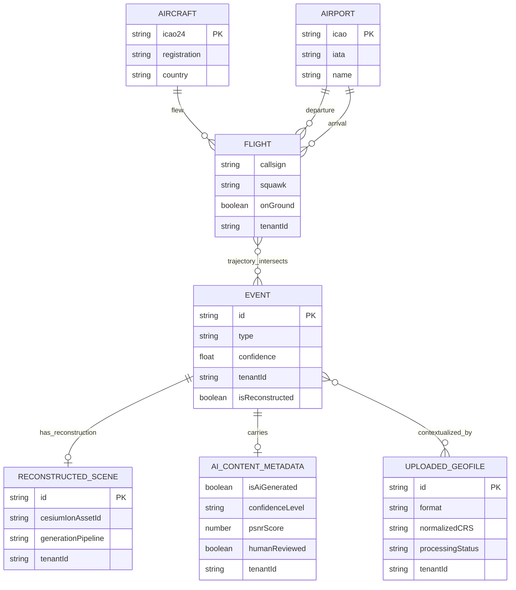

# Data Fusion Ontology (Pillar 2)

## TL;DR
This ontology defines typed entities and explicit relationships for multi-source OSINT fusion in Palantir mode: `Aircraft`, `Flight`, `Airport`, `Event`, `ReconstructedScene`, `AIContentMetadata`, and `UploadedGeoFile`. It formalizes the reconstruction trigger (`Flight.trajectory intersects Event.boundingBox`) and confidence fusion so cross-source conflicts remain transparent and auditable. Tenant isolation is first-class: all core entities are scoped by `tenantId`.

> **Ralph Question:** *"If two source graphs disagree, do we edit history to make it tidy?"*  
> **Answer:** Never. We preserve all source observations, compute confidence per source, and expose conflict state explicitly.

## Full Entity Model (Typed)

```ts
interface Aircraft {
  icao24: string;
  registration: string | null;
  type: string | null;
  country: string;
  flights: Flight[];
}

interface Flight {
  callsign: string;
  departureAirport: Airport | null;
  arrivalAirport: Airport | null;
  aircraft: Aircraft;
  trajectory: SampledPositionProperty;
  squawk: string | null;
  onGround: boolean;
  eventsNear: Event[];
  tenantId: string;
}

interface Airport {
  icao: string;
  iata: string | null;
  name: string;
  location: GeoJSON.Point;
}

interface Event {
  id: string;
  type: "aircraft_incident" | "wildfire" | "flood" | "protest" | "infrastructure_failure" | "crop_damage" | "environmental_change" | "other";
  location: GeoJSON.Feature;
  boundingBox: [number, number, number, number];
  timeStart: string;
  timeEnd: string | null;
  sources: Source[];
  confidence: number;
  tenantId: string;
  reconstructionAssetId: string | null;
  isReconstructed: boolean;
  aiContentMetadata: AIContentMetadata | null;
}

interface ReconstructedScene {
  id: string;
  event: Event;
  cesiumIonAssetId: string;
  gaussianSplatPlyPath: string | null;
  pointcloudPath: string | null;
  generationPipeline: "instant-ngp" | "splatfacto" | "block-nerf" | "nerfacto";
  controlnetConditioning: ("depth" | "normal" | "edge" | "segmentation" | "pose")[];
  aiContentMetadata: AIContentMetadata;
  timeDimension: { start: string; end: string } | null;
  tenantId: string;
}

interface AIContentMetadata {
  isAiGenerated: true;
  generationMethod: "3dgs" | "nerf" | "controlnet" | "diffusion" | "hybrid";
  generationFramework: string;
  sourceImagesCount: number;
  sourceImagesVerified: boolean;
  reconstructionDate: string;
  eventId: string;
  tenantId: string;
  confidenceLevel: "low" | "medium" | "high";
  psnrScore: number | null;
  ssimScore: number | null;
  humanReviewed: boolean;
  displayWatermark: true;
}

interface UploadedGeoFile {
  id: string;
  tenantId: string;
  filename: string;
  format: string;
  normalizedCRS: "EPSG:4326";
  featureType: "point" | "line" | "polygon" | "raster" | "pointcloud" | "mixed";
  featureCount: number | null;
  processingStatus: "pending" | "processing" | "ready" | "failed";
}
```

## Mermaid Entity-Relationship Diagram



> **Ralph Question:** *"What if one Event maps to multiple reconstructions over time?"*  
> **Answer:** Maintain versioned reconstruction entities and mark one as active; never overwrite prior reconstructions.

## The Reconstruction Trigger (Pillar 2 → Pillar 3 Bridge)

```text
Flight.trajectory --[intersects]--> Event.boundingBox → initiates 3DGS pipeline
```

Trigger gates:
1. Spatial intersection threshold met.
2. Temporal overlap within event window.
3. Minimum source confidence threshold.
4. Tenant policy allows reconstruction for event class.

Cross-reference: Pillar 3 reconstruction pipeline and `docs/architecture/osint-intelligence-layer.md` workflow.

## Confidence Scoring Schema

```text
confidence = (sourceReliabilityScore + dataFreshnessScore + crossValidationScore) / 3
```

### Source Reliability Scores

| Source | Score |
|---|---:|
| OpenSky ADS-B credentialed | 0.95 |
| OpenSky ADS-B anonymous | 0.85 |
| AIS maritime | 0.90 |
| NASA FIRMS | 0.92 |
| USGS earthquake | 0.98 |
| Sentinel-2 satellite | 0.88 |
| Public webcam / social OSINT | 0.40–0.65 |
| AI-reconstructed (high PSNR) | 0.65–0.75 |
| AI-reconstructed (low PSNR) | 0.30–0.50 |
| User-uploaded GeoFile | 0.60–0.80 |

### Data Freshness Scores

| Data Age | Score |
|---|---:|
| < 1 minute | 1.00 |
| 1–10 minutes | 0.95 |
| 10m–1h | 0.80 |
| 1h–24h | 0.60 |
| > 24h | 0.40 |

### Cross-Validation Scores

| Corroborating Sources | Score |
|---|---:|
| 1 source | 0.40 |
| 2 sources | 0.65 |
| 3+ sources | 0.85–1.00 |

## Confidence Fusion Patterns

- **Consensus pattern:** similar values across 3+ independent sources, score uplift.
- **Conflict pattern:** diverging telemetry retained as parallel claims with per-claim confidence.
- **Sparse-emergency pattern:** low volume but high criticality (e.g., emergency squawk) escalates visibility while retaining low certainty label.
- **Temporal drift pattern:** sequence reordered only after timestamp normalization and confidence recalculation.

## Data Quality / Risk Taxonomy

| Risk Class | Example | Impact | Policy |
|---|---|---|---|
| `source_conflict` | Altitude mismatch OpenSky vs inferred reconstruction | Misleading analysis | Show both; no silent overwrite |
| `coverage_gap` | Receiver blind spot | False absence of activity | Show gap envelope + confidence decay |
| `synthetic_overreach` | AI scene appears precise beyond evidence | Over-trust | Watermark + `humanReviewed` gate |
| `identity_linkage` | Callsign linked to person-level profile | Privacy harm | Prohibited by bright lines |
| `tenant_leakage` | Cross-tenant join exposure | Security breach | Hard tenant boundary + RLS |

## Access Tier Model

| Capability | Public | Professional | Agency | Admin |
|---|---:|---:|---:|---:|
| Live aircraft layer (simplified) | ✅ | ✅ | ✅ | ✅ |
| Raw multi-source fusion graph | ❌ | ✅ | ✅ | ✅ |
| Emergency workflow controls | ❌ | ✅ | ✅ | ✅ |
| Pattern-of-life analytics | ❌ | ⚠️ restricted | ✅ controlled | ✅ controlled |
| Cross-tenant visibility | ❌ | ❌ | ❌ | Break-glass only (audited) |
| Policy/risk configuration | ❌ | ❌ | ✅ limited | ✅ full |

> **Ralph Question:** *"Can Admin override privacy bright lines for a ‘special case’?"*  
> **Answer:** No. Bright lines are platform-level prohibitions, not role-level toggles.

## Multi-Source Fusion Matrix

| Source | Entity Contribution | Typical Latency | Reliability Band | Primary Role in Fusion |
|---|---|---|---|---|
| OpenSky | Aircraft, Flight trajectory | Seconds | High | Real-time motion backbone |
| AIS | Maritime movement context | Seconds-minutes | High | Port/sea correlation |
| NASA FIRMS | Thermal anomaly events | Minutes-hours | High | Fire/event trigger corroboration |
| USGS | Seismic events | Minutes | Very high | Ground-truth seismic signals |
| Sentinel-2 | Environmental imagery | Hours-days | Medium-high | Change detection baseline |
| NOAA | Weather and hazard feeds | Minutes-hours | High | Meteorological causality context |

## Evidence Boundary Contract
- Reconstructed entities are **analysis aids** until `humanReviewed=true` and provenance checks pass.
- `confidenceLevel=high` does not, by itself, authorize evidence-grade claims.
- Evidence exports must include watermark + citation template + source lineage bundle.
- Any missing provenance field downgrades output to exploratory mode.

## Privacy Bright Lines

> ⚠️ **Prohibited even when source data is public:**
> - Persistent tracking of specific individuals through aircraft registration linkage
> - Building person-level movement profiles from ADS-B and auxiliary datasets
> - De-anonymisation via cross-source triangulation
> - Presenting AI reconstructions as photographic evidence without visible labeling

## Multitenant Entity Scoping

- `tenantId` required on `Flight`, `Event`, `ReconstructedScene`, `AIContentMetadata`, `UploadedGeoFile`.
- Query boundaries enforce tenant-local graph traversal.
- Shared upstream sources produce tenant-specific derived entities (no global derived-event table exposure).
- Provenance logs are tenant-scoped and non-exportable across tenant boundaries by default.

## References
- OpenSky Network: https://opensky-network.org/
- OpenSky API Docs: https://openskynetwork.github.io/opensky-api/
- NASA FIRMS: https://firms.modaps.eosdis.nasa.gov/
- USGS Earthquake API: https://earthquake.usgs.gov/fdsnws/event/1/
- Sentinel-2 (Copernicus): https://dataspace.copernicus.eu/
- NOAA API Portal: https://www.noaa.gov/
