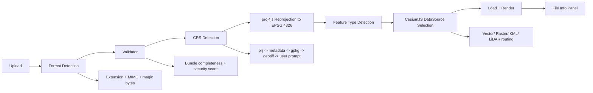

# File Import Pipeline Architecture

## TL;DR
The import pipeline converts heterogeneous geospatial uploads into validated, tenant-scoped assets normalized to `EPSG:4326` before rendering in Cesium. It uses deterministic gates (format detection, validation, CRS detection, reprojection, feature typing) with explicit failure paths rather than silent degradation. Security checks and multitenant boundaries are enforced at every step.

## End-to-End Pipeline Diagram

> **Ralph Q:** *What if format detection guesses wrong and we parse a malicious file as geodata?*  
> **A:** Detection is a multi-signal gate (extension, MIME, magic bytes) and must pass security policy before parsing begins.

## Format Detection Logic

Detection precedence:
1. Trusted upload manifest metadata.
2. File extension signature.
3. MIME type inspection.
4. Magic-byte/content sniffing for ambiguous containers.

Ambiguous or conflicting signals -> quarantine state and user-visible error with remediation guidance.

## Validator Specification

### Valid Criteria (examples)
- Shapefile bundle includes `.shp`, `.dbf`, `.shx` (plus `.prj` recommended).
- GeoPackage contains readable SQLite header and geometry tables.
- QGIS project XML parses and references at least one resolvable layer source.
- GeoTIFF includes readable geospatial tags/header.

### Invalid Criteria (hard fail)
- Required companion files missing.
- Corrupted geometry or unreadable core headers.
- Security scan failure (malware/zip bomb/path traversal).
- Tenant-token mismatch or unauthorized upload context.

### Multi-file Bundle Rules
- Bundle files must share canonical basename.
- Bundle completeness is checked before any geometry extraction.
- Partial bundles are never ingested as complete datasets.

> **Ralph Q:** *If one file in a 4-file bundle is bad, do we ingest the rest anyway?*  
> **A:** No for required core files; the transaction fails atomically to prevent invalid partial geometry states.

## CRS Detection Priority

1. `.prj` file WKT (shapefile)
2. Internal layer metadata
3. GeoPackage `gpkg_spatial_ref_sys`
4. GeoTIFF header tags
5. User prompt/manual CRS selection

Policy behaviour:
- High-assurance mode: unresolved CRS -> block import.
- Standard mode: unresolved CRS -> warning + explicit fallback confirmation.

## Reprojection Behaviour

- Reprojection target is always `EPSG:4326`.
- `originalCRS` and transformation metadata are persisted for audit and UI display.
- Precision checks flag potentially significant distortion.
- Antimeridian wrapping rules are applied before rendering.

## CesiumJS DataSource Selection

| Data Type | Route |
|---|---|
| Vector (GeoJSON, converted shapefile/gpkg) | `GeoJsonDataSource` |
| KML/KMZ | `KmlDataSource` |
| GeoTIFF / raster | `SingleTileImageryProvider` or COG tile service |
| LiDAR (LAZ/LAS) | `Cesium3DTileset` after server-side conversion |

## Upload Limits and Performance Controls

- File size caps enforced via `GEO_FILE_MAX_SIZE_MB`.
- Feature-count warnings and optional simplification thresholds per zoom.
- Chunked/resumable upload for unstable networks.
- Progressive loading for large datasets.
- Queue-based server processing for heavy transforms.

### Failure Handling Matrix
- **Validation fail:** reject + actionable error.
- **CRS unresolved:** prompt/block depending on policy.
- **Reprojection fail:** halt render, keep diagnostic metadata.
- **Render-route mismatch:** fallback route attempt where safe, else fail explicit.
- **Timeout/resource pressure:** retry/defer to async worker.

> **Ralph Q:** *What if reprojection succeeds but rendering still fails?*  
> **A:** The pipeline reports the failed stage separately (transform vs render) to avoid false CRS blame and speed recovery.

## UploadedGeoFile Ontology Entity

Every accepted upload materializes as a tenant-scoped entity with provenance and transform metadata.

Minimal fields:
- `uploadId`
- `tenantId`
- `sourceFormat`
- `originalCRS` (nullable)
- `normalizedCRS` (`EPSG:4326`)
- `ingestionStatus`
- `createdAt` / `uploadedAt`
- `securityScanStatus`

## Multitenant Storage and Ingestion Boundaries

- Storage path pattern: `GEO_FILE_STORAGE_PATH/{tenantId}/{uploadId}/`.
- Temporary extraction spaces are tenant-isolated and short-lived.
- Service-layer authZ validates tenant context on upload, parse, render, and export.
- Billing attribution and audit logs require tenant trace on each pipeline transition.

### External Job Orchestrator Handoff (Cycle 1)

If an external workflow/ERP sidecar is introduced, it may orchestrate **job metadata and queue triggers only**. It must not bypass validation, CRS, reprojection, or tenant-security gates defined in this pipeline.

Mandatory handoff fields:
- `tenantId` (authoritative tenant context)
- `uploadId` (idempotent correlation)
- `requestedOperation` (validate/import/reprocess)
- `requestedBy` (auditable actor/service principal)
- `policyVersion` (for governance traceability)

Any sidecar request with tenant-context mismatch is rejected and logged as a high-severity event.

*(Source: `docs/research/swarm-frappe-spatial-integrations.md`)*

## Tenant Isolation Risk Treatment
- Upload queues, temp directories, and parser workers are partitioned by `tenantId`.
- Import telemetry and diagnostics are retained per tenant; cross-tenant analytics requires explicit authorization.
- Any tenant-context mismatch is treated as a high-severity security event and blocks pipeline progress.

## Security Checks by Stage

- **Pre-ingest:** authN/authZ, signed URL claim validation, rate limiting.
- **Detection/validation:** MIME/magic-byte checks, archive safety checks.
- **Parse:** sandboxed extract/parse, memory/CPU guardrails.
- **Post-parse:** geometry/schema sanitization, metadata normalization.
- **Pre-render:** enforce `pre-file-render` hook requiring successful CRS detection and safety state.

## Known Unknowns
- Should CRS-unresolved imports default to block for all paid tiers?
- What maximum feature count should trigger forced simplification per tenant tier?
- Which parser stages should move to isolated worker pools first for resilience?
- How should partial project imports be visualized without implying completeness?
