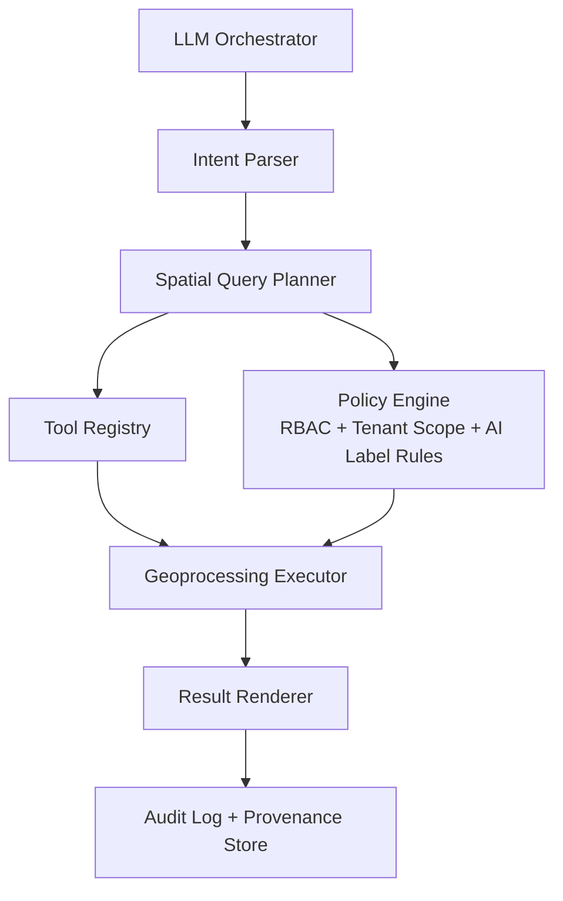

# GIS Copilot Agent Design

## TL;DR
Design a multitenant GIS copilot that converts natural-language requests into safe, scoped spatial actions through explicit planning, tool governance, and role-aware output controls.

### Academic Anchors (for architecture framing)
- *GIS Copilot* conceptual direction (natural-language geospatial assistance).
- *Autonomous GIS* workflow framing (planner + executor + validation loops).

## Verified Facts vs Assumptions

### Verified Facts
- Required architecture stages include: orchestrator, intent parsing, spatial planning, tool registry, execution, rendering.
- Guardrails must enforce role/tier limits, bbox limits, and high-risk confirmations.
- Tenant isolation and AI labeling compliance apply to agent-driven outputs.

### [ASSUMPTION — UNVERIFIED]
- Exact model split (single LLM vs specialized model ensemble) remains implementation-choice dependent.

---

## Architecture Diagram

---

## Spatial Term Disambiguation

| Term | Default | Urban Context | Maritime Context | Documentation Note |
|---|---|---|---|---|
| near | 50 km | 5 km | 200 km | Request confirmation when risk-sensitive |
| recent | 24 h | 2 h in emergency mode | 24 h | Show applied time window |
| large area | >1,000 km² | >5 km² | >10,000 km² | Context-aware scaling |
| populated | >10,000 people | >1,000 | any settlement | Ask if operationally critical |

---

## Tool Registry (Documented, Not Implemented)

| Tool Class | Inputs (Schema Summary) | Outputs | Safety Notes |
|---|---|---|---|
| Spatial query | bbox, timeWindow, layerSet, tenantId | feature set + confidence | Enforce max bbox and result caps |
| Reconstruction trigger | eventId, tenantId, priority | job ticket | Require analyst+ role |
| Export service | assetId, exportProfile, tenantId | downloadable package | Enforce human review gate |
| Geofile overlay | fileRef, CRS, tenantId | normalized layer | Reject invalid CRS / missing metadata |
| Audit logger | action, actor, tenantId, context | immutable log id | Mandatory for high-impact operations |

---

## Guardrails
- **Max bbox by tier:** public small, professional medium, agency large, admin override.
- **Max result count:** enforce pagination + summarization for safety and performance.
- **Human confirmation triggers:** evidence export, cross-tenant share, high-cost GPU job, destructive actions, or requests that collapse uncertainty labels.
- **AI policy hooks:** deny any attempt to disable watermark or labeling metadata.

---

## Workflow Templates
1. **Incident analysis:** detect event → gather layers → timeline replay → publish reviewed brief.
2. **Route optimization:** ingest constraints → compute corridors → compare alternatives.
3. **Change detection:** baseline vs current imagery → anomaly shortlist → confidence-ranked report.
4. **Hazard forecast:** fuse historical + current feeds → model spread zones → export actionable map.
5. **Pattern-of-life:** aggregate movement traces in policy-compliant windows with privacy guardrails.

---

## Tenant Isolation Risk Treatment
- Default policy is strict tenant-local execution, caches, and telemetry partitions.
- PLATFORM_ADMIN cross-tenant access is break-glass for platform operations and must include reason code + immutable audit trail.
- Copilot must refuse prompts that request silent cross-tenant joins or de-anonymisation.

## Multitenant Isolation & Asset Governance
- Every agent action is tenant-scoped by token + policy context.
- Shared models/tools may exist, but outputs and caches are namespace-isolated.
- Cross-tenant operations require explicit grants + full audit chain.

## ⚖️ Compliance & Responsible AI
- Enforce AI-content labeling on any reconstructed or inferred geometry.
- Preserve provenance and citation metadata in generated outputs.
- Maintain role-based restrictions to reduce misuse and overreach.

## Ralph Q/A
- **Q:** What if I ask “show me nearby incidents” but I meant 2 km, not 50 km?
  **A:** Copilot confirms ambiguous terms when action materially changes operational output.
- **Q:** What if copilot suggests data outside my tenant?
  **A:** Policy engine blocks request and returns scoped alternative.

## Known Unknowns
- Best interaction pattern for low-expertise users under high-pressure incidents needs usability testing.
- Optimal balance between autonomy and mandatory confirmation is context dependent.

## References
- `docs/prompts/GIS_FLEET_PLAN_PROMPT_V3.md` (GIS copilot requirements)
- `docs/context/GIS_MASTER_CONTEXT.md` (§8, §9, §10, §12)
