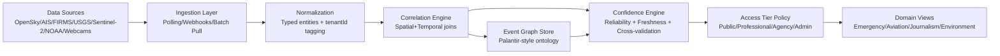
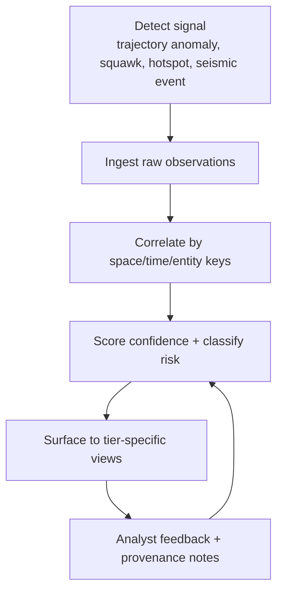
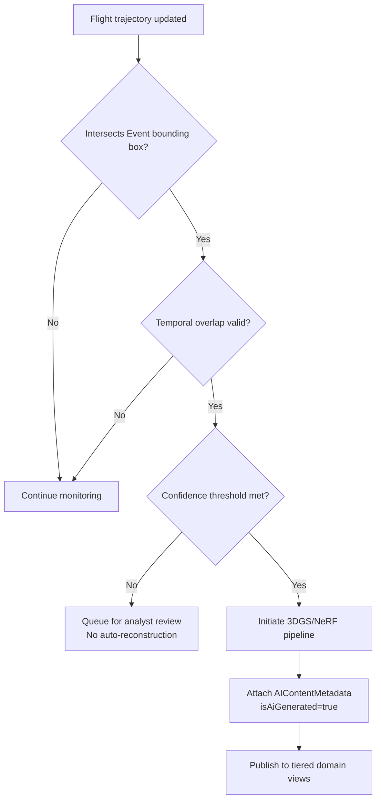

# OSINT Intelligence Layer Architecture (Pillar 2)

## TL;DR
The OSINT intelligence layer fuses aviation and geospatial public sources into a typed event graph, scores confidence transparently, and routes outputs by access tier. It is the operational bridge between live telemetry ingestion (Pillar 2) and reconstruction workflows (Pillar 3). Every event remains provenance-rich, uncertainty-labeled, and tenant-isolated.

> **Ralph Question:** *"If the graph is uncertain, should the UI still look certain because it’s cleaner?"*  
> **Answer:** No. Visual confidence markers are mandatory; ambiguity is part of the product truth.

## Architecture Flow (Sources → Domain Views)



## Event Fusion Workflow



### Workflow States
1. **Detect:** identify candidate signal from one or more sources.
2. **Ingest:** normalize payloads into typed entities.
3. **Correlate:** connect `Flight`, `Event`, `Airport`, and contextual sources.
4. **Score:** apply confidence formula and risk taxonomy.
5. **Surface:** expose results by RBAC tier with required caveats.

## Reconstruction Trigger Flow (Documented Explicitly)



Cross-reference:
- Ontology and trigger semantics: `docs/architecture/data-fusion-ontology.md`
- Reconstructed-event labeling policy: `docs/architecture/ai-content-labeling.md` (Pillar 3 deliverable)

> **Ralph Question:** *"Can we auto-trigger reconstruction from a single noisy source during a crisis?"*  
> **Answer:** Only with explicit low-confidence labeling and analyst gate if corroboration is absent.

## Confidence Engine and Fusion Patterns

Formula:

```text
confidence = (sourceReliabilityScore + dataFreshnessScore + crossValidationScore) / 3
```

Fusion patterns used in layer logic:
- **Corroborated event:** 3+ source agreement increases confidence and reduces operator load.
- **Divergent claims:** preserve competing claims as separate evidence nodes.
- **Aging signal:** confidence decays over time with stale-state visual indicator.
- **Critical sparse signal:** emergency-coded but sparse data is high-priority, low-certainty.

## Data Quality & Risk Taxonomy

| Class | Trigger | Risk | Surface Rule |
|---|---|---|---|
| `freshness_decay` | last contact exceeds threshold | Acting on stale telemetry | Show stale banner + confidence downgrade |
| `cross_source_conflict` | contradictory values across feeds | Incorrect decisions | Show side-by-side provenance cards |
| `coverage_void` | no reception in AOI | False negatives | Display coverage confidence map |
| `synthetic_bias` | AI reconstruction exceeds source evidence | Misleading interpretation | Watermark + professional export gate |
| `policy_violation_risk` | use request crosses privacy bright lines | Compliance breach | Block action and log policy decision |

## Pattern-of-Life Analysis (Concept + Constraints)

Pattern-of-life analysis means identifying recurring movement or activity signatures over time from fused public signals. In this platform, it is constrained by ethics and tier policies.

| Tier | Pattern-of-Life Availability | Constraint |
|---|---|---|
| Public | Not available | No individual tracking analytics |
| Professional | Restricted summaries | Aggregated/non-identifying patterns only |
| Agency | Controlled access | Case-bound lawful purpose + audit trail |
| Admin | Policy oversight only | Cannot bypass bright lines |

> **Ralph Question:** *"Is public OSINT fusion automatically ethical because data is public?"*  
> **Answer:** No. Public availability does not remove duty to prevent individual harm, re-identification, or misuse.

## Policy and Evidence Gates (Cycle 1 Alignment)
- OpenSky live commercial usage is a deployment gate; when unresolved, force non-commercial mode or fallback layers.
- Public-source fusion does not remove POPIA duties; pattern-of-life outputs remain role-gated and auditable.
- AI-assisted reconstructions remain analysis aids and must carry uncertainty labels until human-reviewed.

## Per-Tenant Event Isolation Boundaries

- All derived events and correlations are bound to `tenantId`.
- No cross-tenant graph traversal in default query paths.
- Shared source ingestion is separated from tenant-specific derived intelligence.
- Access tier checks are evaluated inside tenant context.

## References
- OpenSky Network: https://opensky-network.org/
- OpenSky API Docs: https://openskynetwork.github.io/opensky-api/
- NASA FIRMS: https://firms.modaps.eosdis.nasa.gov/
- USGS Earthquake API: https://earthquake.usgs.gov/fdsnws/event/1/
- Sentinel-2 (Copernicus): https://dataspace.copernicus.eu/
- NOAA: https://www.noaa.gov/
