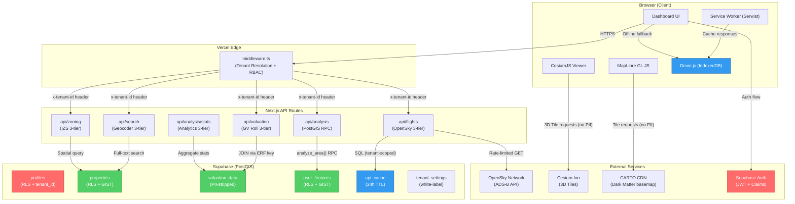

# POPIA Data Flow Diagram
## CapeConnect GIS Hub

> Visual representation of all data flows for DPIA compliance review.



## Data Classification Legend

| Color | Classification | Description |
|---|---|---|
| 🔴 Red | **PII Present** | Contains personal information (email, name). Protected by RLS + Auth. |
| 🟢 Green | **PII-Stripped** | Originally contained PII, now safe after ETL processing. |
| 🔵 Blue | **Cache/Temporary** | Auto-expiring data with TTL. No PII. |

## Key Data Flows

### 1. User Authentication
```
Browser → Supabase Auth → JWT (tenant_id + role claims) → middleware.ts → API routes
```
**PII:** Email, password hash (managed by Supabase). Never exposed to application code.

### 2. Property Search
```
Browser → api/search → PostGIS full-text → properties table (RLS-filtered) → Browser
```
**PII:** None. Search queries are anonymized and tenant-scoped.

### 3. GV Roll Valuation
```
CoCT CSV → import-gv-roll.py (Full_Names STRIPPED) → valuation_data → api/valuation → Browser
```
**PII:** Explicitly removed during ETL. Only property values and ERF numbers retained.

### 4. Flight Tracking
```
api/flights → OpenSky API (rate-limited) → GeoJSON transform (guest filter) → FlightLayer
```
**PII:** None. ADS-B data is publicly broadcast. Guest users see filtered subset.

### 5. User-Drawn Features
```
DrawControl → api/features → user_features (tenant_id + user_id RLS) → AnalysisResultPanel
```
**PII:** Indirect (location context). Strictly private to user via RLS policy.

---

> **Cross-reference:** Full DPIA details in [`DPIA.md`](./DPIA.md)
