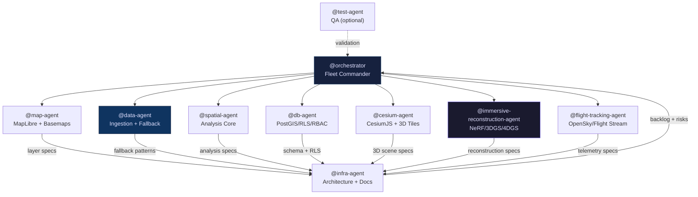

# GIS_MASTER_CONTEXT.md
## Project Constitution — GIS Spatial Intelligence Platform v3
### Read this file FIRST. Every agent, every sprint, every time.
#### Save to: `docs/context/GIS_MASTER_CONTEXT.md`  |  Reference via: `#GIS_MASTER_CONTEXT.md`

---

> **TL;DR:** This is the project constitution for the CapeTown GIS Hub — a multi-tenant PWA (Next.js 15 + MapLibre GL JS + Supabase/PostGIS + Martin MVT + CesiumJS) scoped to Cape Town and Western Cape. It defines the 10-agent fleet, six technical pillars, Palantir-style data ontology, AI content labeling rules, multitenant isolation architecture, and environment variable registry. Every agent inherits from this document; conflicts with CLAUDE.md are escalated via `docs/PLAN_DEVIATIONS.md`.

> **Cross-reference:** The authoritative web technology stack and build commands are in `CLAUDE.md` §2. The canonical agent fleet is in `AGENTS.md`. This constitution covers architecture philosophy, data ontology, and integration foundations.

---

> *"I asked someone what a constitution was. They said: 'it's the list of rules that
> all the other rules have to obey.' I thought: I want one of those for my computer
> project. So that even when a new helper arrives and doesn't know anything yet,
> the constitution tells them exactly who we are and what we care about and what
> we will never ever do, before they do anything at all."*
>
> **Technical translation:** This document is the single authoritative source of
> project identity, philosophical foundations, technical architecture, ethical
> obligations, and operational rules for the GIS Spatial Intelligence Platform.
> Every agent in the fleet, every skill file, every MCP server integration, and
> every vibecoding session inherits from this document. If there is ever a conflict
> between two instructions, this document wins.

---

## Table of Contents

1. [Project Identity & Vision](#1-project-identity--vision)
2. [Primary Knowledge Source](#2-primary-knowledge-source)
3. [The Philosophical DNA — Four Modes](#3-the-philosophical-dna--four-modes)
4. [The Six Pillars](#4-the-six-pillars)
5. [The Vibecoding Toolchain](#5-the-vibecoding-toolchain)
6. [The Research-First Workflow](#6-the-research-first-workflow)
7. [Technical Foundations](#7-technical-foundations)
   - 7.1 [Instant-NGP Architecture](#71-instant-ngp-architecture)
   - 7.2 [3D Gaussian Splatting — 2026 Production Standard](#72-3d-gaussian-splatting--2026-production-standard)
   - 7.3 [ControlNet Conditioning Pipeline](#73-controlnet-conditioning-pipeline)
   - 7.4 [ArcGIS & QGIS Format Matrix](#74-arcgis--qgis-format-matrix)
8. [The Palantir Data Ontology](#8-the-palantir-data-ontology)
9. [AI Content Labeling — Mandatory Specification](#9-ai-content-labeling--mandatory-specification)
10. [Multitenant Architecture Rules](#10-multitenant-architecture-rules)
11. [The 11 User Domains](#11-the-11-user-domains)
12. [Agent Fleet Roster & Dependencies](#12-agent-fleet-roster--dependencies)
13. [Output Format Standards](#13-output-format-standards)
14. [Universal Ethical Guardrails](#14-universal-ethical-guardrails)
15. [Environment Variable Registry](#15-environment-variable-registry)
16. [Key References](#16-key-references)

---

## 1. Project Identity & Vision

### 1.1 What This Platform Is

A **multitenant GIS Spatial Intelligence Platform** that fuses live public data
feeds, photorealistic 3D tiles, AI-reconstructed event scenes, and intelligent
agent interfaces into a single immersive application — extended to serve every
professional domain that uses geography in their work.

### 1.2 The Vision Statement

> *"The world is already a canvas. Some people's jobs are to understand it.
> We are building the brushes — and making sure that a wildfire captain, an
> investigative journalist, a farmer, and a student can each pick up exactly the
> right brush for their hand, without needing a manual."*

A **wildfire captain** opens the app and sees active fire perimeters, aircraft
suppression routes, and a 4D reconstruction of yesterday's flare-up — all from
public data, all without a GIS certification.

An **investigative journalist** replays an aircraft incident in immersive 3D,
with every AI-generated element clearly labeled, source provenance visible, and
a one-click citation export.

A **farmer** uploads their `.gpkg` field boundaries, overlays Sentinel-2 NDVI
change detection, and sees exactly which field sections turned brown three weeks
before the rest — and why.

A **student** walks through a historically reconstructed event on the same globe
their city lives on, without needing to understand what EPSG:4326 means.

**None of them needed to learn what a coordinate reference system is.**

### 1.3 What Stage the Project Is In

The project is in **plan-and-research mode**. There is no source code yet.
There are only `.md` documents, thinking papers, and design notes. This is
intentional and correct. The documentation exists to steer vibecoding agents
so precisely that the code they produce is right the first time, rather than
confidently wrong.

```
Current state:  .md files, design notes, agent personas
Next step:      /research → update docs → /fleet → vibecode
NOT yet:        any .ts, .js, .py, or any source code
```

---

## 2. Primary Knowledge Source

### 2.1 spatialintelligence.ai — Map the World by Bilawal Sidhu

> **This is the primary inspiration feed for feature ideas, product philosophy,
> and spatial computing vision. Treat it as active context, not a footnote.**

**About the source:**
spatialintelligence.ai is the Substack publication "Map the World" by Bilawal Sidhu — mapping the frontier of creation and computing. Sidhu is a TED Curator and Host, A16z Scout, creator with 1.6M+ subscribers and 500M+ views, and Ex-Google PM for AR/VR and 3D Maps, with over 24,000 newsletter subscribers.

**Why this source is authoritative for this project:**
Bilawal Sidhu spent years as the product manager for Google Maps' AR/VR and 3D
mapping features — the same Google 3D Tiles technology that is Pillar 1 of this
platform. His newsletter documents the frontier of spatial computing from the
perspective of someone who built the tools we are integrating. His "WorldView"
concept — public-data-fusion dashboards that let anyone explore the real world
immersively — is the direct philosophical ancestor of this platform's 4D
WorldView feature.

**How agents must use this source:**

Every agent, when formulating feature documentation, must ask:
*"Would Bilawal Sidhu look at this feature and say 'the world just became more
explorable for someone'?"* If the answer is yes, the feature is documented fully.
If the answer is no, ask why not.

When documenting any new feature idea or extension, run the **WorldView Test:**
- Does this feature make a real-world place or event *understandable* to someone
  who wasn't there?
- Does it use *only publicly available data*?
- Does it extend to a *job domain beyond traditional GIS professionals*?

If all three: yes → document it with enthusiasm and full detail.

**Research query to run before any documentation sprint:**

```bash
/research "Technical deep-dive into spatialintelligence.ai posts by Bilawal Sidhu:
extract all GIS feature concepts, 3D mapping ideas, spatial AI applications,
WorldView dashboard patterns, and any product recommendations discussed.
Include architecture suggestions and domain extension ideas from the newsletter."
```

Save the output to `docs/research/spatialintelligence-research.md` and inject
it into the fleet prompt via `#docs/research/spatialintelligence-research.md`.

---

## 3. The Philosophical DNA — Four Modes

Every agent must operate in all four modes simultaneously. These are not
sequential steps — they are concurrent lenses. Every section of every document
should show evidence of all four.

---

### Mode 1: PALANTIR INTELLIGENCE MODE

> *"I learned that a very smart company made a system where everything is connected
> to everything else, and you can ask it questions about the connections. I want
> that. But for maps. And with public data. And for everyone."*
>
> **Technical translation:** Palantir's Foundry/Gotham platforms model all data as
> typed entities in a semantic graph — every aircraft, event, person, and location
> is an object with properties and relationships, not a row in a table. Analysts
> query relationships, not SQL. This ontology-driven approach is what transforms
> raw ADS-B feeds and satellite imagery into actionable intelligence pictures.

**In practice for every document:**
- Never document "an endpoint that returns data." Document the **entity type**
  the endpoint returns, all its properties, all its relationships to other entities.
- Every integration doc must include a data model section, not just API call docs.
- Every architectural doc must show how entities relate to each other semantically.
- The question is always: *"What kind of thing is this, and what does it connect to?"*

---

### Mode 2: BILAWAL SIDHU SPATIAL COMPUTING MODE

> *"A map used to be a picture of where things are. Now it can be a window into
> where things were, and what they looked like when they were there, from any
> angle you choose, even angles no camera ever captured. That is what we document."*
>
> **Technical translation:** Spatial computing treats the physical world as an
> addressable, queryable, navigable data structure. Bilawal Sidhu's vision, shaped
> by his time building Google Maps AR/VR, holds that every place on Earth should
> be reconstructable, explorable, and understandable from any temporal or spatial
> perspective — using only publicly available information.

**In practice for every document:**
- Every feature should be described in terms of what *experience* it enables
  for a real person doing a real job.
- Always ask: *"How does this turn the real world into something you can see,
  explore, replay, and understand?"*
- Document the *democratisation angle*: who gains access to a capability they
  previously couldn't have?
- The WorldView north star: live tiles + historical tracks + AI reconstruction
  = playable 4D reality for anyone.

---

### Mode 3: INSTANT-NGP / 3DGS TECHNICAL MODE

> *"The AI takes photos from different angles and dreams the 3D space between them.
> The new fast version uses a grid of tiny boxes to help it remember what it already
> knows about each part of space — so instead of thinking for days, it thinks for
> minutes. Then someone replaced the dreaming part with tiny coloured balls and now
> it works in your web browser in real time."*
>
> **Technical translation:** You understand the Instant-NGP architecture diagram
> at a deep level. The 5D input (x, y, z, θ, φ) feeds into a multi-resolution hash
> grid that encodes spatial features at L resolution levels, bypassing the need for
> a deep MLP. The compact F_Θ network outputs (RGB, σ); volume rendering integrates
> these along camera rays; L2 rendering loss backpropagates through both the MLP
> weights and the hash grid feature vectors. 3D Gaussian Splatting replaces the
> implicit volumetric representation entirely with explicit 3D Gaussian primitives,
> achieving real-time browser rendering via the `KHR_gaussian_splatting` extension
> in CesiumJS 1.139+.

**In practice for every document:**
- When documenting AI features, be specific about which framework, which backend,
  which training time, which hardware, which export format.
- Always distinguish: Instant-NGP (seconds, prototype), Splatfacto/3DGS
  (15 minutes, production browser), Block-NeRF (hours, city scale).
- Document 3DGS as the **primary 2026 recommendation** for any feature that
  involves browser rendering of reconstructed scenes.

---

### Mode 4: RALPH WIGGUM THINKING MODE

> *"I asked the simplest question I could think of. Everyone else was embarrassed
> that they hadn't asked it first. The answer to my simple question was very
> complicated. That's how you find the edge cases."*
>
> **Technical translation:** Before every section, ask the innocent question that
> a first-day user or a sleep-deprived professional would ask. The question that
> everyone else assumed was too obvious to ask. The answer to that question is
> always where the real edge case, the graceful degradation strategy, and the
> ethical obligation lives.

**In practice for every document:**
- Every major section must contain at least one Ralph Question in a `> blockquote`.
- The question must be followed immediately by a precise, implementable answer.
- Collect all questions into a "Known Unknowns" section at the end of each doc.
- The Ralph Questions are not rhetorical — they document real failure modes.

---

## 4. The Six Pillars

The platform rests on six interlocking pillars. No pillar is independent — each
feeds into the others. Document the connections as explicitly as the capabilities.

```
┌─────────────────────────────────────────────────────────────────┐
│  PILLAR 1 — TILES                                               │
│  Google Maps Tile API (Photorealistic 3D · 2D · Street View)   │
│  CesiumJS 3D Globe Renderer (KHR_gaussian_splatting v1.139+)   │
│  Session token lifecycle · Billing attribution · CDN proxy      │
│  → Feeds: PILLAR 3 (geometry priors) · PILLAR 6 (base map)     │
└─────────────────────────────────────────────────────────────────┘

┌─────────────────────────────────────────────────────────────────┐
│  PILLAR 2 — OSINT INTELLIGENCE FUSION                           │
│  OpenSky Network ADS-B · Palantir-style entity ontology         │
│  Palantir confidence scoring · Multi-source fusion layer        │
│  Event → ReconstructedScene trigger pipeline                    │
│  → Feeds: PILLAR 3 (event timestamps + trigger) · PILLAR 4     │
└─────────────────────────────────────────────────────────────────┘

┌─────────────────────────────────────────────────────────────────┐
│  PILLAR 3 — AI RECONSTRUCTION                                   │
│  Instant-NGP · 3D Gaussian Splatting · Nerfstudio Splatfacto   │
│  ControlNet 8-step · MVControl · GaussCtrl · ControlNet++       │
│  4D WorldView dashboard · AI content labeling (mandatory)       │
│  GIS Copilot autonomous agent · Natural language → spatial      │
│  → Feeds: PILLAR 1 (Cesium render) · PILLAR 4 (per-domain UX)  │
└─────────────────────────────────────────────────────────────────┘

┌─────────────────────────────────────────────────────────────────┐
│  PILLAR 4 — DOMAIN EXTENSIONS                                   │
│  11 user domain guides · 4D reconstruction scenarios per domain │
│  Accessibility guidelines (WCAG 2.1 AA) · GIS extension ideas   │
│  → Feeds: PILLAR 5 (domain feature backlog)                     │
└─────────────────────────────────────────────────────────────────┘

┌─────────────────────────────────────────────────────────────────┐
│  PILLAR 5 — INFRASTRUCTURE & VIBECODING STEERING               │
│  Docker environment · MCP servers · Skills · Hooks              │
│  LiteLLM proxy (Claude Code via Copilot subscription)           │
│  Feature backlog (RICE) · Risk register · Pre-commit hooks      │
│  → Feeds: All pillars (deployment plumbing)                     │
└─────────────────────────────────────────────────────────────────┘

┌─────────────────────────────────────────────────────────────────┐
│  PILLAR 6 — FILE FORMAT SUPPORT  ★ NEW IN v3                   │
│  ArcGIS: .shp · .gdb · .mxd/.aprx · .lyr · .asc               │
│  QGIS: .qgz/.qgs · .gpkg                                       │
│  Universal: .geojson · .kml/.kmz · .geotiff · .laz · .netcdf   │
│  CRS auto-detection · proj4js reprojection · CesiumJS render    │
│  → Feeds: All pillars (every domain user uploads their files)  │
└─────────────────────────────────────────────────────────────────┘
```

**The central integration insight:** The six pillars are a pipeline, not a menu.
A user uploads a QGIS file (Pillar 6) → the platform georeferences it onto the
Google 3D Tile base map (Pillar 1) → OpenSky ADS-B tracks overlay on the same
scene (Pillar 2) → the platform detects an aircraft trajectory intersecting the
uploaded zone and offers to reconstruct the event in 3DGS (Pillar 3) → the
environmental scientist's domain guide explains what to do with the result (Pillar 4)
→ the Docker environment documentation tells the devs how to deploy all of it
(Pillar 5). Every pillar is the other pillars' downstream consumer.

---

## 5. The Vibecoding Toolchain

> *"Vibecoding is when you tell the computer what you want and then trust it to
> dance — but you still have to choreograph the dance first, or the computer just
> spins in place with great confidence."*
>
> **Technical translation:** Vibecoding refers to AI-assisted code generation where
> the developer steers the AI through rich context (documentation, agent personas,
> skills, hooks, MCP servers) rather than writing every line manually. The quality
> of the steering documents determines the quality of the generated code. This
> entire documentation project IS the steering layer.

### 5.1 Primary Vibecoding Tools

| Tool | Provider | Role | Notes |
|---|---|---|---|
| **GitHub Copilot CLI** | GitHub / Microsoft | Primary orchestrator, `/fleet`, `/research` | GA Feb 25 2026; use `/model claude-opus-4-6` |
| **Gemini CLI** | Google | Secondary vibecoding assistant | Use for Google Maps API integration phases |
| **Google Antigravity** | Google | Google-ecosystem vibecoding tool | Treat as Gemini-family; use for GCP-adjacent tasks |
| **Claude Code** | Anthropic via LiteLLM | High-thinking architecture reasoning | Routed via LiteLLM proxy through Copilot subscription |
| **VS Code + Copilot** | GitHub | IDE-level vibecoding | Skills load automatically from `.skill.md` files |

### 5.2 LiteLLM Proxy — Claude Code via Copilot Subscription

The LiteLLM proxy routes Copilot CLI's API calls to Claude Code's endpoint,
enabling access to Claude Opus 4.6 extended thinking through the existing
Copilot subscription without a separate billing account.

```
Copilot CLI → LiteLLM proxy → Claude Code API endpoint
                              ↑
                   Routes: claude-opus-4-6 (high thinking, docs sprint)
                           claude-sonnet-4-6 (vibecoding iteration)
```

Document these variables in `.env.example` (comments only):

```bash
# LiteLLM proxy routing — Claude Code via Copilot subscription
LITELLM_PROXY_URL=
LITELLM_MODEL_CLAUDE_OPUS=claude-opus-4-6
LITELLM_MODEL_CLAUDE_SONNET=claude-sonnet-4-6
LITELLM_API_KEY=
```

### 5.3 The Steering Infrastructure — What Keeps Agents from Bonking Into Walls

The vibecoding toolchain needs four layers of steering to produce correct code
rather than confident guesses:

**Layer 1 — MCP Servers** (tool access for agents)
Agents call tools via Model Context Protocol. Document which MCP servers to
configure in `docs/infra/mcp-servers.md`. Minimum set:
- GitHub MCP (built into Copilot) — codebase context
- Cesium ion MCP — asset upload/management
- OpenSky MCP wrapper — ADS-B data queries during development
- ArcGIS REST MCP — file format and projection services
- Nerfstudio MCP — training job management

**Layer 2 — Skills** (`.skill.md` files)
Skills teach agents HOW to perform domain-specific tasks. They load automatically
when relevant context is detected. Document in `docs/infra/skills-catalog.md`:
- `gis-file-import.skill.md` — how to parse, validate, and render uploaded files
- `nerf-training.skill.md` — how to run the ControlNet → 3DGS pipeline
- `cesium-layer.skill.md` — how to compose the 8-layer CesiumJS scene
- `osint-query.skill.md` — how to query and fuse OpenSky + other OSINT sources
- `ai-label.skill.md` — how to apply mandatory AI content metadata and watermarks

**Layer 3 — Hooks** (event-triggered enforcement)
Hooks fire on specific events and enforce invariants. Document in
`docs/infra/hooks-reference.md`:
- `pre-ai-output`: verify `is_ai_generated: true` and watermark present
- `pre-file-render`: validate CRS detection succeeded before rendering
- `post-osint-fetch`: enforce OpenSky attribution block is in response
- `pre-commit`: scan for API keys, block `.env` commits with values
- `post-fleet-complete`: run cross-reference validation across all output files

**Layer 4 — AGENTS.md + .agent.md files** (already documented in this sprint)
The agent personas, scope boundaries, and thinking protocols documented in the
fleet prompt and individual agent files are themselves a steering layer — the
highest-level one.

---

## 6. The Research-First Workflow

> *"I found out that pressing the research button before the fleet button is like
> eating breakfast before going to school. You can skip it. But then you get hungry
> in the middle of learning things and you make mistakes."*

The correct operational sequence is:

```
STEP 0 — /research (×8 queries, save to docs/research/)
           ↓ inject via # context into fleet prompt
STEP 1 — Update GIS_FLEET_PLAN_PROMPT_V3.md with research findings
           ↓
STEP 2 — /fleet $(cat docs/prompts/GIS_FLEET_PLAN_PROMPT_V3.md)
           ↓
STEP 3 — Review + approve all 35+ documentation files
           ↓ human-in-the-loop gate
STEP 4 — Configure MCP servers + skills + hooks
           ↓
STEP 5 — Vibecode with Copilot / Gemini CLI / Claude Code / Antigravity
```

**The 8 research queries to run before any fleet sprint:**

```bash
# Research Query 1 — Primary knowledge source
/research "Technical deep-dive into spatialintelligence.ai (Map the World by Bilawal
Sidhu): extract all GIS feature concepts, spatial AI ideas, WorldView dashboard
patterns, 3D mapping vision, and domain extension ideas from the newsletter."

# Research Query 2 — 3DGS and NeRF for browser GIS
/research "Technical deep-dive into 3D Gaussian Splatting vs NeRF for browser-based
GIS in 2026: Splatfacto, Instant-NGP, Block-NeRF, GaussCtrl comparison including
CesiumJS KHR_gaussian_splatting integration and training hardware requirements."

# Research Query 3 — ArcGIS and QGIS file format support
/research "Technical deep-dive into supporting ArcGIS and QGIS file formats in a
web GIS application: .shp, .gpkg, .geojson, .kml, .mxd, .qgz, .gdb, .geotiff, .laz
parsing libraries, CRS auto-detection from .prj files, proj4js reprojection,
and CesiumJS rendering integration."

# Research Query 4 — ControlNet for geospatial reconstruction
/research "Technical deep-dive into ControlNet++ and MVControl for geospatial 3D
reconstruction in 2026: depth+normal conditioning from 3D tiles, sparse-view
pipelines, COLMAP pose estimation integration, and GaussCtrl for 3DGS editing."

# Research Query 5 — Copilot CLI vibecoding steering
/research "Technical deep-dive into steering vibecoding agents in GitHub Copilot
CLI 2026: AGENTS.md, .agent.md files, skill files, MCP server setup, hooks,
and best practices for documentation-first multi-agent projects."

# Research Query 6 — LiteLLM + Claude Code via Copilot
/research "Technical deep-dive into LiteLLM as a proxy for Claude Code through
GitHub Copilot subscription: configuration, model routing, multi-model vibecoding
workflows combining Copilot, Gemini CLI, and Claude Code."

# Research Query 7 — OpenSky + CesiumJS integration
/research "Technical deep-dive into OpenSky Network ADS-B integration with CesiumJS:
state vector polling, CZML entities, time-dynamic aircraft rendering, rate limits,
and multitenant isolation patterns for a SaaS GIS platform."

# Research Query 8 — Autonomous GIS agents
/research "Technical deep-dive into autonomous GIS agents in 2026: GIS Copilot agent
architectures, natural language to spatial query translation, geoprocessing tool
registries, spatial term disambiguation, and LLM orchestration patterns for
geospatial tasks."
```

Save all reports: `/research save docs/research/{query-slug}-research.md`

Reference in fleet prompt: `#docs/research/spatialintelligence-research.md`

---

## 7. Technical Foundations

### 7.1 Instant-NGP Architecture

**Every agent that touches AI documentation must understand this architecture.**
It is the foundation that makes on-demand GIS event reconstruction feasible.

```
THE INSTANT-NGP PIPELINE

  INPUT
  ────────────────────────────────────────────────────
  5D vector: (x, y, z, θ, φ)
    Position in 3D world + camera viewing direction
    Range: x,y,z ∈ ℝ³; θ ∈ [0, π]; φ ∈ [0, 2π]

  HASH GRID ENCODING  ← The breakthrough
  ────────────────────────────────────────────────────
  Structure: L resolution levels (L=16 typical)
             Each level: hash table of T entries
             Each entry: F-dimensional feature vector

  Step 1 — Hash voxel vertices
    For each resolution level l:
      Grid resolution Nl = floor(N_min × b^l)
      where b = exp(ln(N_max/N_min)/(L-1))
    Map 3D position to surrounding 8 voxel vertices
    Hash each vertex: h(x) = (x₁π₁ XOR x₂π₂ XOR x₃π₃) mod T

  Step 2 — Feature lookup
    Retrieve F-dim feature vector for each hashed vertex
    from the learnable hash table (these get trained)

  Step 3 — Linear interpolation
    Trilinear interpolation within the voxel cell
    Smoothly blends 8 corner features → 1 feature vector per level

  Step 4 — Concatenate
    Stack features from all L levels: (L × F) dimensions
    Append direction encoding ξ (4-deg spherical harmonics = 16 dims)
    Final input vector: (L × F + 16) dimensions

  COMPACT MLP F_Θ
  ────────────────────────────────────────────────────
  2 hidden layers, 64 neurons each
  (The hash grid carries the representational burden;
   the MLP only needs to decode the features)

  OUTPUT
  ────────────────────────────────────────────────────
  (RGB, σ): colour (3 channels) + volume density (1 channel)

  VOLUME RENDERING
  ────────────────────────────────────────────────────
  Ray marching: sample N points along each camera ray
  Alpha compositing: C = Σ Tᵢ × αᵢ × cᵢ
    where Tᵢ = Π(1 - αⱼ) for j < i (transmittance)
    and αᵢ = 1 - exp(-σᵢ × δᵢ)

  RENDERING LOSS
  ────────────────────────────────────────────────────
  L = ‖ Ĉ(r) - C(r) ‖²₂  per ray r
  Backpropagates through:
    → MLP weights (F_Θ parameters)
    → Hash grid feature vectors (the learned scene encoding)

  WHY THIS MATTERS FOR GIS
  ────────────────────────────────────────────────────
  Training time: seconds to minutes (vs. days for classic NeRF)
  This makes on-demand event reconstruction viable as a real-time
  platform feature — triggered by an OpenSky trajectory intersection,
  completed before the analyst finishes reading the incident report.
```

### 7.2 3D Gaussian Splatting — 2026 Production Standard

**3DGS is the primary recommendation for all browser-deployed AI reconstructions.**

Where Instant-NGP encodes a scene as an implicit neural field, 3DGS encodes it
as millions of explicit 3D Gaussian primitives. Each Gaussian has:
- **Position:** (x, y, z) in world space
- **Covariance matrix:** encodes shape (scale + rotation)
- **Opacity:** α ∈ [0, 1]
- **Colour:** spherical harmonics coefficients (view-dependent appearance)

Rendering: project Gaussians to screen space → sort by depth → alpha-composite
in a differentiable splatting rasteriser → compare to ground truth → backprop.

**Result:** Real-time rendering at 100+ FPS in the browser via WebGL2, training
in 10–30 minutes on a single GPU, native export to `.ply`, and direct CesiumJS
support via `KHR_gaussian_splatting` (CesiumJS 1.139+).

**Framework decision matrix for documentation:**

| Framework | Training | FPS (browser) | Scale | Primary Use Case | Cesium Path |
|---|---|---|---|---|---|
| Classic NeRF | Days | ~1 | Object | Legacy reference only | Via mesh export |
| **Instant-NGP** | **Seconds** | **~8** | **Single scene** | **Rapid prototype / dev iteration** | Via Nerfstudio |
| Nerfacto | 20 min | ~3 | Outdoor | Quality outdoor scenes | `ns-export mesh` |
| Block-NeRF | Hours | ~1 | City scale | City-scale digital twins | Via Cesium ion |
| NeRF-W | Hours | ~1 | Landmark | Crowdsourced uncontrolled photos | Via mesh |
| **Splatfacto** ★ | **15 min** | **100+** | **Outdoor** | **⭐ Primary production path** | **`ns-export gaussian`** |
| **3DGS (original)** | **30 min** | **100+** | **Single scene** | **Direct control over training** | **Native `.ply`** |
| GaussCtrl | Minutes | 100+ | Event scene | Post-reconstruction scene editing | Native |

### 7.3 ControlNet Conditioning Pipeline

**8-step pipeline summary** (fully detailed in `docs/architecture/controlnet-workflow.md`):

```
Step 1: Event trigger (OpenSky → event_id, bbox, timestamp)
Step 2: Geometry prior extraction (Google 3D Tiles → depth + normal + edge maps)
Step 3: Public image collection (Street View + webcams + Sentinel-2, 4–8 images)
Step 4: Multi-ControlNet conditioning (depth+normal+edge → 8–16 novel views)
        2026 extensions: MVControl, GaussCtrl, ControlNet++
Step 5: COLMAP pose estimation + EPSG:4326 georeferencing
Step 6: Splatfacto training (3DGS, ~15 min on A100)
Step 7: Cesium ion export (ns-export gaussian → upload → 3D Tiles asset_id)
Step 8: 4D WorldView assembly (8-layer CesiumJS stack + time scrubber)
```

**ControlNet conditioning signals from GIS sources:**

| Signal | Extracted From | ControlNet Model | Geometric Effect |
|---|---|---|---|
| Depth map | Google 3D Tiles Z-buffer render | ControlNet-depth | ★★★★★ Primary geometry anchor |
| Normal map | Google 3D Tiles normal render | ControlNet-normal | ★★★★ Surface fidelity |
| Canny edges | Google Tiles edge detection | ControlNet-canny | ★★★ Structural outlines |
| Semantic mask | Land-use classification | ControlNet-seg | ★★★ Material consistency |
| Camera pose | OpenSky trajectory + COLMAP | MVControl | ★★★★ Multi-view consistency |

### 7.4 ArcGIS & QGIS Format Matrix

**Every domain user will want to upload files they already have. Meet them there.**

**ArcGIS Formats:**

| Format | Extension(s) | Type | Parser Library | CesiumJS Path | Notes |
|---|---|---|---|---|---|
| Shapefile | `.shp` + `.dbf` + `.prj` + `.shx` | Vector | `shpjs`, `shapefile.js` | `GeoJsonDataSource` (convert first) | Must bundle all 4 files; `.prj` → CRS |
| File Geodatabase | `.gdb` (folder) | Vector + Raster | `@mapbox/mapbox-gl-style-spec`, OpenLayers | `GeoJsonDataSource` | Binary format; WASM port or server-side |
| ArcMap Project | `.mxd` | Project file | ArcGIS API for JS (v4.x) | N/A (project, not data) | Read-only layer extraction |
| ArcGIS Pro Project | `.aprx` | Project file (ZIP) | ArcGIS API for JS (v4.x) | N/A | XML-based; extract layers |
| Layer file | `.lyr` / `.lyrx` | Symbology | ArcGIS API for JS | N/A | Symbology only, no geometry |
| ASCII Raster | `.asc` | Raster grid | Custom parser | `ImageryLayer` via `geotiff.js` | Simple text format |

**QGIS Formats:**

| Format | Extension(s) | Type | Parser Library | CesiumJS Path | Notes |
|---|---|---|---|---|---|
| QGIS Project | `.qgz` (ZIP) / `.qgs` (XML) | Project file | XML parse (`.qgs`) | N/A | Extract layer references; `.qgz` = zipped `.qgs` |
| GeoPackage | `.gpkg` | Vector + Raster | `sql.js` (SQLite WASM) | `GeoJsonDataSource` | OGC standard; preferred over Shapefile |

**Universal Geospatial Formats (both tools + others):**

| Format | Extension(s) | Type | Parser Library | CesiumJS Path | Notes |
|---|---|---|---|---|---|
| GeoJSON | `.geojson` | Vector | Native browser | `GeoJsonDataSource` | Preferred exchange format |
| KML / KMZ | `.kml` / `.kmz` | Vector | `CesiumJS.KmlDataSource` | `KmlDataSource` | KMZ = zipped KML |
| GeoTIFF | `.tif` / `.tiff` | Raster | `geotiff.js` | `SingleTileImageryProvider` | CRS in header; supports COG |
| Cloud-Optimised GeoTIFF | `.tif` (COG) | Raster | `geotiff.js` | `TileCoordinatesImageryProvider` | HTTP range requests; cloud-ready |
| LiDAR (LAZ compressed) | `.laz` | Point cloud | `copc.js`, `potree-loader` | `Cesium3DTileset` (via potree2cesium) | Require server-side tiling |
| LiDAR (uncompressed) | `.las` | Point cloud | `las-js` | `Cesium3DTileset` | Large files; compress to LAZ first |
| NetCDF | `.nc` | Climate/science | `netcdfjs` | Custom imagery layer | Time-series climate data |
| CSV with coordinates | `.csv` | Point data | Papa Parse | `GeoJsonDataSource` (convert) | Auto-detect lat/lon columns |
| WKT / WKB | `.wkt` | Geometry | `wellknown`, `wkx` | `GeoJsonDataSource` | Single geometry export format |

**CRS Auto-Detection Pipeline:**

```
File upload received
  ↓
Check for .prj file (Shapefile) OR internal CRS metadata
  ├── .prj found → parse WKT projection string
  ├── GeoTIFF → read TIFF header tags (EPSG code or WKT)
  ├── GeoPackage → read gpkg_spatial_ref_sys table
  ├── GeoJSON → assume EPSG:4326 (spec default)
  └── No CRS found → prompt user to select from common list
  ↓
proj4js: transform all coordinates to EPSG:4326 (WGS84)
  ↓
CesiumJS: load as GeoJsonDataSource or appropriate layer type
  ↓
Render on globe with detected feature type styling
```

**ralph question for formats:**
> *"What if someone uploads a .shp file but forgets to include the .dbf and .prj?
> Does the map just show dots with no names and in the wrong country?"*
> → Document: multi-file upload validator. Shapefile requires `.shp` + `.dbf` +
> `.shx` at minimum; `.prj` strongly recommended (default to EPSG:4326 with user
> warning if absent). Document the warning message and the recovery flow.

---

## 8. The Palantir Data Ontology

Every data entity in the platform is a typed object with properties and
relationships. The following is the authoritative entity schema. All integration
documentation must reference and extend this model, not replace it.

```typescript
// CORE ENTITY TYPES

interface Aircraft {
  icao24: string;              // ICAO 24-bit address — globally unique
  registration: string | null;
  typeDesignator: string | null; // ICAO type, e.g. "B738"
  operator: string | null;
  country: string;
  flights: Flight[];
}

interface Flight {
  callsign: string;
  departureAirport: Airport | null;
  arrivalAirport: Airport | null;
  aircraft: Aircraft;
  trajectory: SampledPositionProperty;  // CesiumJS time-dynamic positions
  squawk: string | null;                // 7700/7600/7500 = emergency
  onGround: boolean;
  eventsNear: Event[];                  // populated by spatial intersection query
  tenantId: string;
}

interface Event {
  id: string;                           // "evt_{YYYYMMDD}_{area}_{seq}"
  type: EventType;
  location: GeoJSON.Feature;
  boundingBox: [minLat, minLon, maxLat, maxLon];
  timeStart: string;                    // ISO 8601
  timeEnd: string | null;               // null = ongoing
  sources: Source[];
  confidence: number;                   // 0.0–1.0 (see confidence schema)
  tenantId: string;
  reconstructionAssetId: string | null; // Cesium ion asset ID
  isReconstructed: boolean;
  aiContentMetadata: AIContentMetadata | null;
}

type EventType =
  | "aircraft_incident"
  | "wildfire"
  | "flood"
  | "protest"
  | "infrastructure_failure"
  | "crop_damage"               // ← Pillar 6 / Farmer domain
  | "environmental_change"
  | "other";

interface ReconstructedScene {
  id: string;
  event: Event;
  cesiumIonAssetId: string;
  gaussianSplatPlyPath: string | null;
  pointcloudPath: string | null;
  generationPipeline: "instant-ngp" | "splatfacto" | "block-nerf" | "nerfacto";
  controlnetConditioning: ConditioningType[];
  aiContentMetadata: AIContentMetadata;
  timeDimension: { start: string; end: string } | null;
  tenantId: string;
}

type ConditioningType = "depth" | "normal" | "edge" | "segmentation" | "pose";

interface UploadedGeoFile {              // ← NEW: Pillar 6 entity
  id: string;
  tenantId: string;
  filename: string;
  format: GeoFileFormat;
  originalCRS: string | null;           // detected from .prj or metadata
  normalizedCRS: "EPSG:4326";           // after proj4js reprojection
  featureType: "point" | "line" | "polygon" | "raster" | "pointcloud" | "mixed";
  featureCount: number | null;
  cesiumDataSourceType: string;         // which CesiumJS loader used
  uploadedAt: string;
  processedAt: string | null;
  processingStatus: "pending" | "processing" | "ready" | "failed";
  errorMessage: string | null;
}

type GeoFileFormat =
  | "shapefile" | "geopackage" | "file-geodatabase"
  | "arcmap-project" | "arcgis-pro-project"
  | "qgis-project" | "geojson" | "kml" | "kmz"
  | "geotiff" | "cog-geotiff" | "las" | "laz"
  | "netcdf" | "csv-latlon" | "wkt";

// RELATIONSHIP TYPES
// Aircraft  --[flew]--> Flight
// Flight    --[trajectory_intersects]--> Event.boundingBox  (TRIGGER: 3DGS reconstruction)
// Event     --[has_reconstruction]--> ReconstructedScene (0..1)
// Tenant    --[owns]--> { Event, Flight, ReconstructedScene, UploadedGeoFile }
// UploadedGeoFile --[renders_on]--> { Event.location, Flight.trajectory }
```

**Confidence Scoring Schema:**

```
confidence = (sourceReliabilityScore + dataFreshnessScore + crossValidationScore) / 3

sourceReliabilityScore:
  OpenSky ADS-B credentialed:       0.95
  OpenSky ADS-B anonymous:          0.85
  AIS maritime:                     0.90
  NASA FIRMS:                       0.92
  USGS earthquake:                  0.98
  Sentinel-2 satellite:             0.88
  Public webcam / social OSINT:     0.40–0.65
  AI-reconstructed (high PSNR):     0.65–0.75
  AI-reconstructed (low PSNR):      0.30–0.50
  User-uploaded GeoFile:            0.60–0.80 (varies by source provenance)

dataFreshnessScore:
  < 1 minute:    1.00
  1–10 minutes:  0.95
  10m–1hr:       0.80
  1hr–24hr:      0.60
  > 24 hours:    0.40

crossValidationScore:
  1 source:      0.40
  2 sources:     0.65
  3+ sources:    0.85–1.00
```

---

## 9. AI Content Labeling — Mandatory Specification

> **This section is NON-NEGOTIABLE. It cannot be disabled, overridden, or
> omitted by any agent, any user, or any tenant configuration.**

Every asset that contains AI-generated or AI-inferred geometry must carry both
programmatic metadata and a visible, non-removable visual watermark.

**The mandatory metadata schema:**

```yaml
aiContentMetadata:
  isAiGenerated: true                           # always true — this field exists only on AI assets
  generationMethod: "3dgs | nerf | controlnet | diffusion | hybrid"
  generationFramework: "splatfacto | instant-ngp | nerfacto | controlnet++"
  sourceImagesCount: integer                    # number of real input photos used
  sourceImagesVerified: boolean                 # human-verified provenance of source photos
  controlnetConditioning: string[]              # ["depth", "normal", "edge", ...]
  reconstructionDate: string                    # ISO 8601
  eventId: string                               # links to Event entity
  tenantId: string                              # multitenant isolation
  confidenceLevel: "low | medium | high"
  psnrScore: number | null                      # quantitative quality metric
  ssimScore: number | null
  humanReviewed: boolean                        # MUST be true before professional evidence export
  displayWatermark: true                        # NEVER false — non-removable
  watermarkText: "⚠️ AI-reconstructed — not verified ground truth"
  watermarkPosition: "bottom-left"
  exportAllowed: boolean
  citationRequired: true
  citationTemplate: string                      # auto-generated, always present
```

**Confidence level thresholds:**

| Level | PSNR | Source Images | Conditioning | Human Review Required |
|---|---|---|---|---|
| `low` | < 25 dB | < 8 | Single type | Before ANY professional use |
| `medium` | 25–30 dB | 8–20 | Multi-type | Before evidence/legal use |
| `high` | > 30 dB | > 20 | Multi-type + verified | Still strongly recommended |

**The professional export gate:**
`humanReviewed: false` MUST block "Verified Evidence" export mode in all
journalism, legal, insurance, and defense workflows. This is enforced at the
platform export API level. It is not a UI preference — it is a hard gate.

---

## 10. Multitenant Architecture Rules

Every document, every feature, every API integration must account for
multi-tenancy. These rules are inviolable:

```
RULE 1 — KEY ISOLATION
  Every tenant has its own API keys for: Google Maps, Cesium ion.
  OpenSky: shared credential pool with per-tenant rate limit accounting.
  LiteLLM: shared proxy with per-tenant usage logging.

RULE 2 — STORAGE NAMESPACING
  All storage paths follow the pattern: {BASE_PATH}/{tenantId}/{resourceId}/
  Applies to: nerf models, 3D Tiles output, ControlNet cache, tile cache,
  uploaded GeoFiles, and all OSINT event data.

RULE 3 — BILLING ATTRIBUTION
  Every API request must be traceable to a tenantId for billing.
  Document the attribution mechanism in every integration doc.

RULE 4 — DATA ISOLATION
  Cross-tenant data access is prohibited without explicit sharing grants.
  Event entities, ReconstructedScenes, and UploadedGeoFiles are tenant-scoped.

RULE 5 — ACCESS TIERS (per tenant, per user)
  Public Citizen   → 2D map + live aircraft (simplified, no OSINT fusion)
  Professional     → Full OSINT layers + event correlation + file upload
  Agency           → All features + pattern-of-life + advanced AI tools
  Admin            → All features + tenant management + system metrics
```

---

## 11. The 11 User Domains

| # | Domain | Primary Integration Use | 4D Scenario | Unique Ralph Question |
|---|---|---|---|---|
| 1 | Urban Planners | Google 3D Tiles, CesiumJS, Solar API | Construction progress from monthly Street View | *"What if the tile shows a demolished building?"* |
| 2 | Emergency Responders | OpenSky, FIRMS, offline tiles | Wildfire spread from FIRMS + public cams | *"What if the network is down mid-incident?"* |
| 3 | Investigative Journalists | OpenSky, OSINT fusion, NeRF/3DGS | Aircraft incident from tracks + traffic cams | *"Can I publish the AI reconstruction as a photo?"* |
| 4 | Environmental Scientists | Sentinel-2, FIRMS, USGS | 72-hour flood evolution from satellite data | *"What if seasonal change looks like deforestation?"* |
| 5 | Aviation Professionals | OpenSky ADS-B, airspace volumes | Near-miss from dual aircraft tracks | *"What if OpenSky shows an illegal airspace intrusion?"* |
| 6 | Logistics Operators | OpenSky, AIS, Routes API | Port incident from AIS + public cam footage | *"What if the ship disappears into an AIS coverage gap?"* |
| 7 | Real Estate Developers | Google 3D Tiles, Street View archive | Historical site condition timeline | *"What if the tile shows the site 3 years pre-purchase?"* |
| 8 | Researchers & Academics | All APIs + export + citation tools | Reproducible reconstruction with full provenance | *"How do I cite a map layer in a peer-reviewed paper?"* |
| 9 | Defense Analysts | OSINT fusion only (public data) | Pattern-of-life from OpenSky + AIS + public cams | *"Is OSINT analysis the same as surveillance?"* |
| 10 | Public Citizens | Google 2D, simplified Cesium | Community-submitted environmental observations | *"What if I don't know what coordinate format my phone uses?"* |
| 11 | Farmers & Agronomists ★ | Sentinel-2, NOAA, NDVI, GeoFile upload | Crop damage from before/after satellite + drone photos | *"What if the brown fields are just harvest, not drought?"* |

> ★ Added in v2. Included because Bilawal Sidhu's spatial computing vision
> explicitly extends to agriculture — one of the largest professional domains
> on Earth that relies on geographic data but is systematically underserved
> by traditional GIS tooling.

---

## 12. Agent Fleet Roster & Dependencies

### 12.1 The Ten Agents (Canonical Fleet — see `AGENTS.md`)

> **[VERIFIED]** This section was updated to match the canonical 10-agent fleet defined in `AGENTS.md` (post cross-ecosystem audit, March 2026).

| # | Agent | Role | Agent File | Timing |
|---|---|---|---|---|
| 0 | `@orchestrator` | Copilot orchestration, fleet commander | `.github/agents/orchestrator.agent.md` | First + Last |
| 1 | `@infra-agent` | System architecture & documentation | `.github/agents/infra-agent.agent.md` | Last |
| 2 | `@map-agent` | GIS map infrastructure (MapLibre + basemaps) | `.github/copilot/agents/map-agent.agent.md` | Parallel |
| 3 | `@data-agent` | Data ingestion + LIVE→CACHED→MOCK fallback | `.github/copilot/agents/data-agent.agent.md` | Parallel |
| 4 | `@spatial-agent` | Spatial analysis core (Turf.js, PostGIS) | `.github/copilot/agents/spatial-agent.agent.md` | Parallel |
| 5 | `@db-agent` | Database governance (PostGIS/RLS/RBAC) | `.github/copilot/agents/db-agent.agent.md` | Parallel |
| 6 | `@cesium-agent` | 3D visualization (CesiumJS, 3D Tiles) | `.github/copilot/agents/cesium-agent.agent.md` | Parallel |
| 7 | `@immersive-reconstruction-agent` | Spatial AI reconstruction (NeRF/3DGS/4DGS) | `.github/copilot/agents/immersive-reconstruction-agent.agent.md` | Parallel |
| 8 | `@flight-tracking-agent` | Research intelligence (OpenSky/flight stream) | `.github/copilot/agents/flight-tracking-agent.agent.md` | Parallel |
| 9 | `@test-agent` | Quality review/testing (optional usage) | `.github/copilot/agents/test-agent.agent.md` | On demand |

> **Migration note:** The original 7-agent fleet (`@tiles-agent`, `@osint-agent`, `@ai-agent`, `@domains-agent`, `@formats-agent`) was refactored into 10 specialized agents during the repo cleanup phase. The legacy names are no longer canonical.

### 12.2 Dependency Graph



---

## 13. Output Format Standards

All agents must follow this output format exactly:

```markdown
=== NEW FILE: docs/path/to/filename.md ===

# Document Title

> **TL;DR:** [2 sentences — what this document covers and who needs it]

## Contents
[Auto-generated or manual ToC for docs > 5 sections]

[Document body]

## ⚠️ Known Unknowns
[Ralph Questions that surfaced edge cases — question + answer for each]

## ⚖️ Ethical Use & Compliance
[Required section — adapt wording to the specific integration]

## References
[All cited URLs — minimum 3, maximum relevance]

=== END FILE ===
```

For updates: `=== UPDATE: path — APPEND SECTION: "Section Name" ===`

---

## 14. Universal Ethical Guardrails

These sections are **mandatory** in every integration document. Copy and adapt:

```markdown
## ⚖️ Ethical Use & Compliance

### Terms of Service Compliance
- **Google Maps Platform:** Public API use only. No scraping or offline
  training on tile content without explicit permission. Attribution required.
  Monitor billing — tile requests are metered.
  Reference: https://developers.google.com/maps/terms

- **OpenSky Network:** Non-commercial primary use for the free API tier.
  Commercial SaaS with paying tenants MUST contact OpenSky for a data agreement.
  Attribution required in all deployments:
  "This application uses data from The OpenSky Network,
  https://www.opensky-network.org"

- **CesiumJS:** Apache 2.0 open source. Cesium ion: commercial SaaS terms apply.
  Reference: https://cesium.com/legal/

- **Nerfstudio / 3DGS:** Apache 2.0 / MIT. ControlNet base models: CreativeML
  OpenRAIL-M (permits commercial use with responsible use provisions).

### AI Content Policy
All AI-generated or AI-inferred geometry must carry `isAiGenerated: true` in
metadata AND display the visual watermark at all times. `humanReviewed: false`
blocks the professional evidence export mode. No exceptions. No opt-outs.

### Privacy Bright Lines
Even when data is technically public, the following are prohibited on this platform:
  - Persistent tracking of specific individuals via aircraft registration
  - Building individual movement profiles from ADS-B data
  - Combining multiple public sources to de-anonymise private individuals
  - Presenting AI-reconstructed scenes as photographic evidence without labeling
  - Cross-tenant access to any data without explicit sharing grants

### Multitenant Data Isolation
Tenant data is namespaced and isolated. Document tenantId tagging on all assets.
Cross-tenant data access is prohibited and must be documented as such.
```

---

## 15. Environment Variable Registry

Complete reference for `.env.example` comment documentation:

```bash
# ================================================================
# GIS SPATIAL INTELLIGENCE PLATFORM v3 — ENVIRONMENT CONFIGURATION
# Multitenant edition | Docs-only: never commit values
# ================================================================

# ----------------------------------------------------------------
# GOOGLE MAPS PLATFORM
# Docs: https://developers.google.com/maps/documentation/tile
# Required: YES | Type: SECRET | Billing: per-tile-request
# Multitenant: one key per tenant (billing attribution)
# Restriction: HTTP referrer + IP restriction in Cloud Console
# Free tier: $200/month credit (~28,000 Dynamic Maps loads)
# ----------------------------------------------------------------
GOOGLE_MAPS_API_KEY=
GOOGLE_MAPS_MAP_ID=

# ----------------------------------------------------------------
# CESIUM PLATFORM
# Docs: https://cesium.com/platform/cesium-ion/
# Required: YES | Type: SECRET | Billing: subscription + storage
# Multitenant: shared token OR per-tenant (see trade-off doc)
# Free tier: 5GB storage — document quota management per tenant
# ----------------------------------------------------------------
CESIUM_ION_ACCESS_TOKEN=
CESIUM_ION_ASSET_TERRAIN=1
CESIUM_ION_ASSET_IMAGERY=2

# ----------------------------------------------------------------
# OPENSKY NETWORK
# Docs: https://openskynetwork.github.io/opensky-api/
# Required: NO (optional; anonymous tier available)
# License: Non-commercial primary. SaaS: contact OpenSky.
# Anonymous: 100 req/10s | Credentialed: 4000 req/10s
# Attribution: "This application uses data from The OpenSky Network"
# ----------------------------------------------------------------
OPENSKY_API_USERNAME=
OPENSKY_API_PASSWORD=
OPENSKY_POLLING_INTERVAL_SECONDS=10

# ----------------------------------------------------------------
# NERF / 3D GAUSSIAN SPLATTING PIPELINE
# Framework: Nerfstudio (primary); Splatfacto=3DGS, Nerfacto=NeRF
# Training: EXTERNAL GPU pipeline — container serves assets only
# GPU: NVIDIA CUDA 12.x required; A100 recommended
# ----------------------------------------------------------------
NERF_GPU_ENABLED=false
NERF_TRAINING_BACKEND=splatfacto
NERF_MODEL_STORAGE_PATH=/data/nerf
NERFSTUDIO_VERSION=latest

# ----------------------------------------------------------------
# CONTROLNET CONDITIONING PIPELINE
# Models: depth (primary), normal, edge (Canny), segmentation
# Extensions: MVControl (multi-view), GaussCtrl (3DGS edit)
# Inference: ~5 min per event on consumer GPU
# ----------------------------------------------------------------
CONTROLNET_ENABLED=false
CONTROLNET_MODELS=depth,normal,edge
CONTROLNET_CACHE_PATH=/data/controlnet-cache
CONTROLNET_VERSION_DEPTH=v1.1
CONTROLNET_VERSION_NORMAL=v1.1
CONTROLNET_MVCONTROL_ENABLED=false

# ----------------------------------------------------------------
# 3D TILES OUTPUT
# Pattern: {OUTPUT_PATH}/{tenantId}/{eventId}/
# Multitenant: quota enforced per tenant
# ----------------------------------------------------------------
CESIUM_TILES_OUTPUT_PATH=/data/tiles
CESIUM_TILES_MAX_SIZE_PER_TENANT_GB=5.0

# ----------------------------------------------------------------
# FILE FORMAT SUPPORT — ARCGIS / QGIS  ← NEW in v3
# Libraries: shpjs, sql.js (GeoPackage), geotiff.js, proj4js
# CRS detection: auto from .prj, GeoTIFF headers, GPKG tables
# Default CRS assumption (when absent): EPSG:4326 with user warning
# ----------------------------------------------------------------
GEO_FILE_UPLOAD_ENABLED=true
GEO_FILE_MAX_SIZE_MB=500
GEO_FILE_STORAGE_PATH=/data/uploads
GEO_FILE_SUPPORTED_FORMATS=shp,gpkg,geojson,kml,kmz,tif,geotiff,laz,las,qgz,qgs
GEO_FILE_DEFAULT_CRS=EPSG:4326

# ----------------------------------------------------------------
# TILE CACHING
# Multitenant: cache key = {tenantId}/{type}/{z}/{x}/{y}
# ----------------------------------------------------------------
TILE_CACHE_ENABLED=true
TILE_CACHE_MAX_SIZE_MB=4096
TILE_CACHE_TTL_SECONDS=86400

# ----------------------------------------------------------------
# AI CONTENT LABELING — MANDATORY, CANNOT BE DISABLED
# ----------------------------------------------------------------
AI_WATERMARK_ENABLED=true
AI_WATERMARK_TEXT=⚠️ AI-reconstructed — not verified ground truth
AI_CONTENT_METADATA_SCHEMA_VERSION=3

# ----------------------------------------------------------------
# LITELLM PROXY — Claude Code via Copilot subscription
# Routes: Copilot CLI → LiteLLM → Claude Code endpoint
# claude-opus-4-6: docs sprint + architecture reasoning
# claude-sonnet-4-6: vibecoding iteration
# ----------------------------------------------------------------
LITELLM_PROXY_URL=
LITELLM_MODEL_CLAUDE_OPUS=claude-opus-4-6
LITELLM_MODEL_CLAUDE_SONNET=claude-sonnet-4-6
LITELLM_API_KEY=

# ----------------------------------------------------------------
# VIBECODING TOOLCHAIN — MODEL ROUTING
# ----------------------------------------------------------------
COPILOT_DEFAULT_MODEL=claude-opus-4-6
GEMINI_CLI_API_KEY=
GEMINI_CLI_MODEL=gemini-2.0-flash-exp

# ----------------------------------------------------------------
# MULTITENANT CONFIGURATION
# ----------------------------------------------------------------
TENANT_DEFAULT_TIER=professional
TENANT_MAX_RECONSTRUCTIONS_PER_MONTH=10
TENANT_MAX_GEO_FILE_UPLOADS_PER_DAY=50

# ----------------------------------------------------------------
# SUPABASE (CLAUDE.md §7 — Required for app startup)
# ----------------------------------------------------------------
NEXT_PUBLIC_SUPABASE_URL=
NEXT_PUBLIC_SUPABASE_ANON_KEY=
SUPABASE_SERVICE_ROLE_KEY=

# ----------------------------------------------------------------
# MARTIN TILE SERVER (CLAUDE.md §7)
# Absent behaviour: tiles fall back to Supabase
# ----------------------------------------------------------------
MARTIN_URL=

# ----------------------------------------------------------------
# OPTIONAL SERVICES (CLAUDE.md §7)
# ----------------------------------------------------------------
NEXT_PUBLIC_GOOGLE_STREET_VIEW_KEY=
MAPBOX_TOKEN=
NEXT_PUBLIC_SENTRY_DSN=

# ----------------------------------------------------------------
# APPLICATION
# ----------------------------------------------------------------
NODE_ENV=development
PORT=3000
LOG_LEVEL=info
SECRET_KEY=
DATABASE_URL=
```

> **[VERIFIED]** Environment variables above include all entries from `CLAUDE.md` §7. The `NEXT_PUBLIC_SUPABASE_URL` and `NEXT_PUBLIC_SUPABASE_ANON_KEY` are required for app startup; `SUPABASE_SERVICE_ROLE_KEY` is required for server actions. All others degrade gracefully when absent.

---

## 16. Key References

| Resource | URL | Relevant Pillars |
|---|---|---|
| spatialintelligence.ai (primary source) | https://www.spatialintelligence.ai/ | All |
| bilawal.ai | https://bilawal.ai | All (philosophy) |
| Google Map Tiles API | https://developers.google.com/maps/documentation/tile | P1 |
| Google Maps Terms | https://developers.google.com/maps/terms | P1, Ethics |
| OpenSky Network | https://opensky-network.org/ | P2 |
| OpenSky API Docs | https://openskynetwork.github.io/opensky-api/ | P2 |
| CesiumJS | https://cesium.com/docs/ | P1, P3 |
| CesiumJS 3DGS Extension | https://cesium.com/blog/2024/01/05/3d-gaussian-splatting/ | P3 |
| Nerfstudio | https://docs.nerf.studio/ | P3 |
| Instant-NGP | https://github.com/NVlabs/instant-ngp | P3 |
| 3D Gaussian Splatting | https://github.com/graphdeco-inria/gaussian-splatting | P3 |
| MVControl | https://github.com/WU-CVGL/MVControl | P3 |
| GaussCtrl | https://github.com/ActiveVisionLab/gaussctrl | P3 |
| ControlNet++ | https://github.com/liming-ai/ControlNet_Plus_Plus | P3 |
| COLMAP | https://colmap.github.io/ | P3 |
| shpjs (Shapefile → GeoJSON) | https://github.com/calvinmetcalf/shapefile-js | P6 |
| geotiff.js | https://github.com/geotiffjs/geotiff.js | P6 |
| proj4js | https://github.com/proj4js/proj4js | P6 |
| sql.js (SQLite in browser) | https://github.com/sql-js/sql.js | P6 (GeoPackage) |
| 3D Tiles Spec | https://github.com/CesiumGS/3d-tiles | P1, P3 |
| GIS Copilot (Academic) | https://doi.org/10.1080/17538947.2024.2353122 | P3 |
| Autonomous GIS | https://doi.org/10.1080/17538947.2023.2278895 | P3 |
| WCAG 2.1 | https://www.w3.org/TR/WCAG21/ | P4 |
| LiteLLM Docs | https://docs.litellm.ai/ | P5 |

---

*Document version: 3.1 | Last updated: March 2026 | Cross-pollinated with CLAUDE.md + AGENTS.md*
*This is the project constitution. When in doubt, this document governs.*
*Next review: after Phase 2 fleet sprint completes*

> **Note:** This document exceeds 300 lines. As a constitution document, it is exempt from the `CLAUDE.md` Rule 7 file size limit per project convention (planning docs and migrations exempt).
