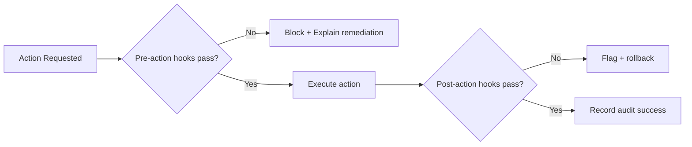

# Hooks Reference

> **TL;DR:** Hooks enforce non-negotiable safety checks at git commit time and in CI. The CI pipeline (`.github/workflows/ci.yml`) runs lint → test → build → migration verification. Git pre-commit hooks guard against secret leaks. See `CLAUDE.md` §3 for credential rules.

## CI/CD Hooks (`.github/workflows/ci.yml`)

| Step                      | Trigger           | Action                   | Blocks On                     |
| ------------------------- | ----------------- | ------------------------ | ----------------------------- |
| `npm install`             | push/PR to `main` | Install dependencies     | dependency resolution failure |
| `npm run lint`            | push/PR to `main` | ESLint + Prettier checks | lint violations               |
| `npm run test`            | push/PR to `main` | Vitest unit tests        | test failures                 |
| `npm run build`           | push/PR to `main` | Next.js production build | build errors                  |
| Supabase migration verify | push/PR to `main` | Validate SQL migrations  | syntax errors                 |

## Spatial Validation Workflows

| Workflow                     | File                                                 | Purpose                                      |
| ---------------------------- | ---------------------------------------------------- | -------------------------------------------- |
| Spatial validation           | `.github/workflows/spatial-validation.yml`           | Validates GeoJSON/WKT within Cape Town bbox  |
| Immersive spatial validation | `.github/workflows/immersive-spatial-validation.yml` | Validates 3DGS/NeRF spatial outputs          |
| PR Rebase                    | `.github/workflows/rebase.yml`                       | Auto-rebase on `rebase-me` label application |

## Git Pre-Commit Hook Specification

Minimum checks:

1. High-entropy secret pattern scan
2. Block commits containing non-empty `.env` secrets
3. Validate no hardcoded provider keys in source/docs (CLAUDE.md Rule 3)
4. Require explicit bypass reason for emergency override

## Application-Level Hooks

| Hook                     | Type       | Fires On           | Action                                    | Prevents                 |
| ------------------------ | ---------- | ------------------ | ----------------------------------------- | ------------------------ |
| `validate-crs`           | pre-action | Geo file import    | Validates CRS; fallback EPSG:4326 warning | Wrong-location rendering |
| `tenant-isolation-check` | pre-action | Cross-tenant query | Blocks unsafe access                      | Data leakage (Rule 4)    |
| `secret-scan`            | pre-commit | Git commit         | Scans staged diff for key patterns        | Secret commits (Rule 3)  |

## Governance Flow

## Fallback Behavior

- Critical pre-action hook fails → block operation; no override without audit trace
- Non-critical post-action hook fails → quarantine output and mark degraded
- Hook engine unavailable → **safe mode** (read-only operations only)

## Multitenant Isolation

- Enforce `tenantId` in hook context for tenant-scoped actions (CLAUDE.md Rule 4)
- Validate storage paths include tenant partition segment
- Reject actor/target tenant mismatch without explicit share grant

## Assumptions

- **[VERIFIED]** CI workflow runs on push/PR to `main` branch
- **[ASSUMPTION — UNVERIFIED]** Hook registration UX differs across Copilot CLI and IDE

## References

- `.github/workflows/ci.yml` (CI pipeline)
- `CLAUDE.md` §3 (credentials), §4 (RLS + tenant isolation)
- `docs/infra/skills-catalog.md` (skill-triggered hooks)
