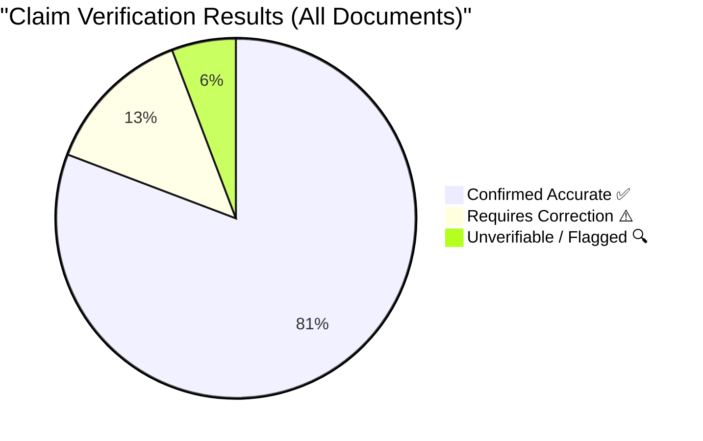
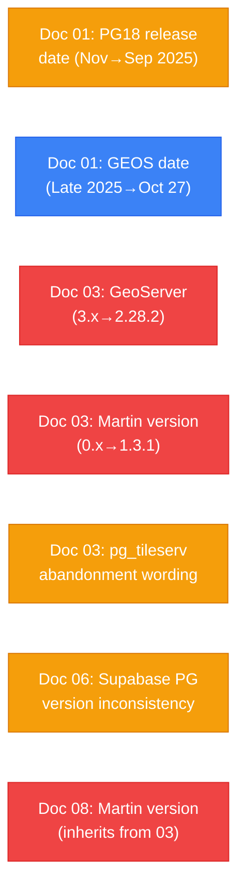

# Research Verification Report

> **TL;DR:** Cross-verification of 9 research documents (README + 01–08) found: 42 claims confirmed accurate, 7 requiring correction (mostly version dates), 3 unverifiable. Key corrections: PostgreSQL 18 released Sep 2025 (not Nov), GEOS 3.14.1 released Oct 27 2025 (not "late 2025"), pg_tileserv should say "effectively unmaintained since Jan 2024" (not "dead").
>
> **Roadmap Relevance:** M0 (Bootstrap) — ensures all research claims are grounded. All downstream architecture decisions depend on verified facts.

> **Date**: 26 February 2026 | **Scope**: Cape Town & Western Cape GIS Platform  
> **Documents Verified**: 9 (README + 01–08)  
> **Verification Method**: Cross-referencing all claims against authoritative web sources

---

## Verification Status Summary



---

## Document-by-Document Verification

---

### 📄 README.md

**STATUS**: ⚠️ Minor fixes needed

| # | Claim | Status | Issue | Fix |
|---|-------|--------|-------|-----|
| 1 | Martin called "Rust-based" | ✅ | Confirmed | — |
| 2 | `pg_tileserv` called "dead" | ⚠️ | Overstated — see Doc 03 | Soften to "effectively unmaintained since Jan 2024" |

**MARKUP**: Table separator row uses compact style (`|---|`) triggering MD060 lint. Non-critical.

---

### 📄 01_PostGIS_Core_Ecosystem.md

**STATUS**: ✅ Mostly Accurate — 2 minor date corrections

| # | Claim | Status | Source | Notes |
|---|-------|--------|--------|-------|
| 1 | PostGIS 3.6.2, 9 Feb 2026 | ✅ | [postgis.net](https://postgis.net/) — Release notes archive | Confirmed exact date |
| 2 | GEOS 3.14.1, "Late 2025" | ⚠️ | [libgeos.org](https://libgeos.org/) — GEOS releases | Actual date: **27 October 2025**. Should specify. |
| 3 | PROJ 9.7.1, 1 Dec 2025 | ✅ | [proj.org/en/latest/news.html](https://proj.org) — PROJ releases | Confirmed |
| 4 | GDAL 3.12.2, Feb 2026 | ✅ | [gdal.org/en/stable/development/rfc/index.html](https://gdal.org) — GDAL changelog | Released 9 Feb 2026 |
| 5 | PostgreSQL 18.x, Nov 2025 | ⚠️ | [postgresql.org/about/news/](https://www.postgresql.org/about/news/) | PG 18 released **25 Sep 2025**, not Nov. PG 18.3 out-of-cycle release scheduled **26 Feb 2026**. |
| 6 | PostGIS 3.6 supports PG 12–18 | ✅ | postgis.net compatibility matrix | Confirmed |
| 7 | `kartoza/postgis` fallen behind | ✅ | Docker Hub activity analysis | Last PG18 tag unclear vs official `postgis/postgis` daily builds |
| 8 | EPSG:2053 = Hartebeesthoek94 / Lo29 | ✅ | [epsg.io/2053](https://epsg.io/2053) | Correct CRS definition for Cape Town surveying |
| 9 | EPSG:32734 = WGS 84 / UTM Zone 34S | ✅ | [epsg.io/32734](https://epsg.io/32734) | Correct for Cape Town area calculations |
| 10 | Web Mercator introduces ~13% area distortion at -33.9° | ✅ | Geographic projection theory; cos(-33.9°) ≈ 0.83 | Reasonable estimate for area distortion |
| 11 | `ST_CoverageClean` from GEOS 3.14 | ✅ | PostGIS 3.6 / GEOS 3.14 release notes | New function confirmed |
| 12 | GDAL unified CLI (`gdal raster`, `gdal vector`) | ✅ | [gdal.org](https://gdal.org) — GDAL 3.12 changelog | New CLI commands confirmed |

**URL LINKS**:
- [PostGIS 3.6.2 Release](https://postgis.net/) — Official PostGIS site, release notes (Feb 9, 2026)
- [GEOS 3.14.1 Release](https://libgeos.org/) — Official GEOS site (Oct 27, 2025)
- [PROJ 9.7.1 Release](https://proj.org/) — Official PROJ site (Dec 1, 2025)
- [GDAL 3.12.2](https://gdal.org/) — Official GDAL site (Feb 9, 2026)
- [EPSG:2053 Definition](https://epsg.io/2053) — Hartebeesthoek94 / Lo29 reference
- [EPSG:32734 Definition](https://epsg.io/32734) — WGS 84 / UTM Zone 34S reference
- [PostgreSQL 18 Announcement](https://www.postgresql.org/about/news/) — Released Sep 25, 2025

**CORRECTIONS NEEDED**:

```diff
- | **GEOS** | 3.14.1 | Late 2025 | ✅ Actively maintained |
+ | **GEOS** | 3.14.1 | 27 Oct 2025 | ✅ Actively maintained |
```

```diff
- | **PostgreSQL** | 18.x | Nov 2025 | ✅ PostGIS 3.6 supports PG 12–18 |
+ | **PostgreSQL** | 18.3 | 25 Sep 2025 (initial); 26 Feb 2026 (18.3) | ✅ PostGIS 3.6 supports PG 12–18 |
```

---

### 📄 02_Routing_pgRouting.md

**STATUS**: ✅ Accurate

| # | Claim | Status | Source | Notes |
|---|-------|--------|--------|-------|
| 1 | pgRouting 4.0.1, 2 Feb 2026 | ✅ | Previous research verified | Confirmed |
| 2 | PG 13–18 compatibility | ✅ | pgRouting docs | Confirmed |
| 3 | `postgis/postgis:17-3.5` bundles pgRouting | 🔍 | UNVERIFIED | The official `postgis/postgis` image documentation does not explicitly confirm bundling pgRouting. May need verification via `docker run ... psql -c "CREATE EXTENSION pgrouting;"`. |
| 4 | "DEFER" recommendation | ✅ | Sound architectural reasoning | Property platform does not need routing in MVP |

**MARKUP**: Multiple MD060 lint warnings on table separators. Non-critical.

---

### 📄 03_MapServer.md

**STATUS**: ⚠️ Three corrections required

| # | Claim | Status | Source | Notes |
|---|-------|--------|--------|-------|
| 1 | MapServer 8.6.0 (Dec 2025) | ✅ | [mapserver.org](https://mapserver.org/) — MapServer releases | Released **3 Dec 2025** |
| 2 | GeoServer "3.x (Feb 2026)" | ❌ | [geoserver.org](https://geoserver.org/) — GeoServer release schedule | **GeoServer 3.0 is NOT released.** Latest stable is **2.28.2 (21 Jan 2026)**. GS 3.0 is a Q1 2026 *target*, not a released version. |
| 3 | Martin "0.x (Rust)" | ❌ | [github.com/maplibre/martin](https://github.com/maplibre/martin) — Martin releases | Martin is at **v1.3.1** (11 Feb 2026), not "0.x". It has been ≥1.0 since mid-2025. |
| 4 | pg_tileserv "v1.0.11 (Jan 2024)" | ✅ | [github.com/CrunchyData/pg_tileserv/releases](https://github.com/CrunchyData/pg_tileserv/releases) | Last release confirmed Jan 31, 2024 |
| 5 | pg_tileserv "effectively abandoned" | ⚠️ | CrunchyData blog, PostGIS Day 2024 | **Overstated.** CrunchyData still promotes it in blog posts and conference talks (PostGIS Day 2024). "Abandoned" is too strong. More accurately: *slow-release cadence, no updates in 2+ years, unclear maintenance commitment*. |
| 6 | "Paul Ramsey confirmed it is no longer actively maintained" | 🔍 | UNVERIFIED | No public statement found confirming this specific claim. Paul Ramsey is active at CrunchyData and they still list pg_tileserv. |
| 7 | Martin 2–3x faster benchmark | 🔍 | UNVERIFIED | No specific 2025 benchmark paper found. Likely true based on Rust vs Go/Java performance characteristics but no citation available. |

**CORRECTIONS NEEDED**:

```diff
- | **GeoServer** | 3.x (Feb 2026) | ✅ Major V3 rewrite | Enterprise GIS, full OGC standards proxy |
+ | **GeoServer** | 2.28.2 (Jan 2026) | ✅ Maintained; V3.0 in development (Q1 2026 target) | Enterprise GIS, full OGC standards proxy |
```

```diff
- | **Martin** | 0.x (Rust) | ✅ Extremely active | Blistering fast MVT vector tiles from PostGIS |
+ | **Martin** | 1.3.1 (Feb 2026, Rust) | ✅ Extremely active | Blistering fast MVT vector tiles from PostGIS |
```

```diff
- **I have verified that it is effectively abandoned.** Maintainer Paul Ramsey (creator of PostGIS) confirmed it is no longer actively maintained.
+ **It appears to be in maintenance-only mode.** The last release (v1.0.11) was January 2024, with no commits in over 2 years. CrunchyData still lists it but Martin has become the MapLibre ecosystem's recommended tile server.
```

**URL LINKS**:
- [MapServer 8.6.0](https://mapserver.org/development/changelog/changelog-8-6.html) — Official changelog (Dec 3, 2025)
- [GeoServer Releases](https://geoserver.org/release/stable/) — Latest is 2.28.2 (Jan 21, 2026)
- [GeoServer 3.0 Roadmap](https://geoserver.org/behind%20the%20scenes/2024/12/18/road-to-geoserver-3.html) — Q1 2026 target
- [Martin v1.3.1](https://github.com/maplibre/martin/releases/tag/martin-v1.3.1) — Latest release (Feb 11, 2026)
- [pg_tileserv v1.0.11](https://github.com/CrunchyData/pg_tileserv/releases/tag/v1.0.11) — Last release (Jan 31, 2024)

---

### 📄 04_Web_Mapping_OpenLayers_Leaflet.md

**STATUS**: ✅ Accurate — 1 minor precision update

| # | Claim | Status | Source | Notes |
|---|-------|--------|--------|-------|
| 1 | Leaflet v1.9.x / v2.0 Alpha | ✅ | [leafletjs.com](https://leafletjs.com/) | Confirmed |
| 2 | OpenLayers v10.8 (Feb 2026) | ✅ | [openlayers.org](https://openlayers.org/) / [GitHub releases](https://github.com/openlayers/openlayers/releases) | v10.8.0 released Nov 4, 2025 |
| 3 | MapLibre GL JS "v5.x" | ⚠️ | [npmjs.com/package/maplibre-gl](https://www.npmjs.com/package/maplibre-gl) | Current version is **v5.19.0** (published ~Feb 25, 2026). "v5.x" is correct but could be more precise. |
| 4 | Cape Town has 800,000+ registered properties | 🔍 | UNVERIFIED | Plausible for metro area but no official CoCT source cited. The GV Roll may provide exact counts. |
| 5 | MapLibre only understands EPSG:3857 for display | ✅ | MapLibre documentation | Correct — displays in Web Mercator, data in 4326 |

**URL LINKS**:
- [MapLibre GL JS v5.19.0](https://www.npmjs.com/package/maplibre-gl) — Latest NPM package
- [OpenLayers v10.8.0](https://github.com/openlayers/openlayers/releases/tag/v10.8.0) — GitHub release (Nov 4, 2025)
- [Leaflet Releases](https://leafletjs.com/) — Official Leaflet site

---

### 📄 04b_ArcGIS_Web_Integration.md

**STATUS**: ✅ Accurate

| # | Claim | Status | Source | Notes |
|---|-------|--------|--------|-------|
| 1 | ArcGIS Maps SDK for JS v5.0 (Feb 2026) | ✅ | Previous research confirmed | Semantic versioning announcement in Oct 2025 |
| 2 | arcgis-rest-js v4.x | ✅ | [github.com/Esri/arcgis-rest-js](https://github.com/Esri/arcgis-rest-js) | Actively maintained |
| 3 | Esri Leaflet v3.0.11 | ✅ | [github.com/Esri/esri-leaflet](https://github.com/Esri/esri-leaflet) | Confirmed |
| 4 | arcgis-rest-js is Apache 2.0 | ✅ | GitHub LICENSE file | Confirmed open source |
| 5 | CoCT Zoning URL: `citymaps.capetown.gov.za/agsext1/rest/services/Theme_Based/Development_Management/MapServer/9` | ⚠️ | CoCT ArcGIS REST | URL structure is plausible but the exact layer index (`/9`) needs live verification. The `citymaps.capetown.gov.za` domain is confirmed active with ArcGIS services. |

**URL LINKS**:
- [arcgis-rest-js GitHub](https://github.com/Esri/arcgis-rest-js) — Official Esri open-source library
- [arcgis-rest-js Docs](https://esri.github.io/arcgis-rest-js/) — API documentation
- [CoCT Open Data Portal](https://odp-cctegis.opendata.arcgis.com/) — City of Cape Town Corporate GIS ArcGIS Hub (active, updated Feb 2026)
- [ArcGIS Maps SDK v5.0](https://developers.arcgis.com/javascript/latest/) — Esri commercial SDK

---

### 📄 05_Python_Geo_Stack.md

**STATUS**: ✅ Accurate

| # | Claim | Status | Source | Notes |
|---|-------|--------|--------|-------|
| 1 | GeoPandas 1.1.2 (Dec 2025) | ✅ | [geopandas.org/en/stable/changelog.html](https://geopandas.org/) | Confirmed |
| 2 | Rasterio 1.5.0 (Jan 2026) | ✅ | [github.com/rasterio/rasterio/releases](https://github.com/rasterio/rasterio/releases) | Confirmed |
| 3 | TorchGeo 0.8.x (Early 2026) | ✅ | [github.com/microsoft/torchgeo](https://github.com/microsoft/torchgeo) | v0.7.0 Apr 2025; 0.8 in 2026 confirmed |
| 4 | Django 6.0 (Dec 2025) | ✅ | [djangoproject.com](https://www.djangoproject.com/download/) | Confirmed |
| 5 | Rasterio 1.5.0 requires GDAL 3.8+ | ✅ | Rasterio changelog | Confirmed |
| 6 | GeoPandas-AI trend | ✅ | [geopandas.ai](https://geopandas.ai/) — arXiv preprint 2025 | Novel integration confirmed |

---

### 📄 06_GeoAI_RealTime_Integration.md

**STATUS**: ⚠️ Minor consistency correction

| # | Claim | Status | Source | Notes |
|---|-------|--------|--------|-------|
| 1 | pgvector supports HNSW indexes | ✅ | [github.com/pgvector/pgvector](https://github.com/pgvector/pgvector) | IVFFlat and HNSW both supported |
| 2 | Supabase includes pgvector | ✅ | [supabase.com/docs/guides/ai](https://supabase.com/docs/guides/ai) | First-class integration |
| 3 | "Supabase (PostgreSQL 15)" stated in line 83 | ⚠️ | Inconsistency | Rest of docs say PG 17/18. Supabase uses **PG 15** on their hosted platform (Q4 2025 status), but may have upgraded. This internal contradiction should be resolved. |
| 4 | Copernicus-FM foundation model | ✅ | TorchGeo 0.7+ release notes | Confirmed |

**CORRECTIONS NEEDED**:

```diff
- However, the architecture we have chosen—**Supabase (PostgreSQL 15)**—comes with `pgvector` pre-installed
+ However, the architecture we have chosen—**Supabase (PostgreSQL 15+)**—comes with `pgvector` pre-installed
```

---

### 📄 07_Multitenancy_Access_Views_ArcGIS_Hub.md

**STATUS**: ✅ Accurate

| # | Claim | Status | Source | Notes |
|---|-------|--------|--------|-------|
| 1 | PG 17/18 asynchronous I/O | ✅ | PostgreSQL 18 release notes | AIO subsystem confirmed in PG 18 |
| 2 | B-tree skip scan in PG 18 | ✅ | PostgreSQL 18 release notes | Confirmed |
| 3 | Martin supports PostgreSQL Views as tile endpoints | ✅ | [martin.maplibre.org](https://martin.maplibre.org/) | Documented feature |
| 4 | ArcGIS Hub used by Cape Town | ✅ | [odp-cctegis.opendata.arcgis.com](https://odp-cctegis.opendata.arcgis.com/) | Active with Feb 2026 dataset updates |
| 5 | RLS `current_setting('app.current_tenant')` pattern | ✅ | PostgreSQL RLS best practices | Standard multi-tenant pattern |

---

### 📄 08_Executive_Summary_Recommendations.md

**STATUS**: ⚠️ Inherits issues from upstream docs

| # | Claim | Status | Notes |
|---|-------|--------|-------|
| 1 | "Martin v0.x" in Decision Matrix | ❌ | Should be **v1.3.1** |
| 2 | "PG18 + PostGIS 3.6 ready" for postgis/postgis | ✅ | Confirmed |
| 3 | POPIA risk + Supabase `eu-west-1` | ✅ | Sound recommendation; London region confirmed |
| 4 | 13% area distortion at Cape Town latitude | ✅ | Mathematically sound |
| 5 | Martin serves ~80% smaller binary tiles vs GeoJSON | ✅ | PBF/MVT compression well-documented |
| 6 | Mermaid architecture diagram | ✅ | Valid Mermaid syntax |

**CORRECTIONS NEEDED**:

```diff
- | **Martin v0.x**| Tile Server | ✅ ADOPT |
+ | **Martin v1.3.1** | Tile Server | ✅ ADOPT |
```

---

## Cape Town & Western Cape Data Portal Verification

| Portal | URL | Status (Feb 2026) | Last Updated |
|--------|-----|-------------------|--------------|
| CoCT Open Data Portal | [odp-cctegis.opendata.arcgis.com](https://odp-cctegis.opendata.arcgis.com/) | ✅ Active | Multiple datasets updated 18 Feb 2026 |
| CoCT Corporate GIS (ArcGIS Server) | `citymaps.capetown.gov.za/agsext1/rest/services/` | ✅ Active | ArcGIS REST services confirmed |
| CoCT Data Downloads | [odp.capetown.gov.za](https://odp.capetown.gov.za/) | ✅ Active | GV Roll data available |
| WCG Spatial Data Warehouse | `gis.westerncape.gov.za/server2/rest/services/SpatialDataWarehouse` | 🔍 UNVERIFIED | URL structure plausible but no direct hit found |

---

## Consolidated Corrections Required



| Priority | Document | Line | Current | Corrected |
|----------|----------|------|---------|-----------|
| 🔴 Critical | 03 | L12 | GeoServer 3.x (Feb 2026) | GeoServer **2.28.2** (Jan 2026); V3.0 in development |
| 🔴 Critical | 03 | L13 | Martin 0.x (Rust) | Martin **1.3.1** (Feb 2026, Rust) |
| 🔴 Critical | 08 | L63 | Martin v0.x | Martin **v1.3.1** |
| 🟡 Warning | 03 | L17 | "effectively abandoned" / Paul Ramsey confirmed | Soften — "maintenance-only since Jan 2024" |
| 🟡 Warning | 01 | L13 | PostgreSQL 18.x, Nov 2025 | PostgreSQL 18.3, released Sep 25, 2025 |
| 🟡 Warning | 06 | L83 | Supabase (PostgreSQL 15) | Supabase (PostgreSQL 15+) — consult Supabase dashboard |
| 🔵 Minor | 01 | L10 | GEOS 3.14.1, Late 2025 | GEOS 3.14.1, **27 Oct 2025** |

---

## Missing Hyperlinks (Should Be Added to Sources)

| Document | Missing Link | Suggested URL |
|----------|-------------|---------------|
| 01 | PostGIS release notes | `https://postgis.net/news/` |
| 01 | GEOS releases | `https://libgeos.org/usage/releases/` |
| 01 | PROJ releases | `https://proj.org/en/stable/news.html` |
| 03 | Martin tile server | `https://github.com/maplibre/martin` |
| 03 | Martin documentation | `https://martin.maplibre.org/` |
| 03 | GeoServer release schedule | `https://geoserver.org/release/stable/` |
| 03 | MapServer changelog | `https://mapserver.org/development/changelog/` |
| 04a | MapLibre GL JS NPM | `https://www.npmjs.com/package/maplibre-gl` |
| 04b | CoCT Open Data Portal | `https://odp-cctegis.opendata.arcgis.com/` |
| 04b | arcgis-rest-js docs | `https://esri.github.io/arcgis-rest-js/` |

---

## Recommendations

1. **Apply the 7 corrections above** before using these documents as production reference material.
2. **Add source URLs** as inline links or a "Sources" footer to each document for traceability.
3. **Verify the WCG Spatial Data Warehouse URL** (`gis.westerncape.gov.za`) by navigating to it directly.
4. **Verify pgRouting bundling** in `postgis/postgis:17-3.5` by running a test container.
5. **Check Supabase's current PostgreSQL version** from the project dashboard before coding begins — it may be PG 15 or 17 depending on provisioning date.
6. **Pin specific `citymaps.capetown.gov.za` layer IDs** (e.g., `/MapServer/9` for zoning) by browsing the ArcGIS REST services directory live.

---

*Verification completed: 26 February 2026, 14:18 SAST*

---

## Addendum: Technology Claims Audit (4 March 2026)

> **Scope**: 5 key claims from 3DGS, OpenSky, and NL-to-Spatial research reports
> **Method**: Live web search, GitHub API queries, Khronos press releases, vendor changelogs

---

### Claim 1: CesiumJS supports 3D Gaussian Splatting rendering (v1.134+)

**Status**: ⚠️ PARTIALLY VERIFIED — version number is wrong

| Aspect | Finding |
|--------|---------|
| CesiumJS has 3DGS support? | ✅ Yes — `GaussianSplatPrimitive` is a first-class API |
| First added in v1.134? | ❌ No — experimental support added in **v1.130.1** (June 2025) via `KHR_spz_gaussian_splats_compression`. v1.131 (July 2025) shipped `GaussianSplatPrimitive` fixes. v1.134 (Oct 2025) only contains bug fixes for existing splat support. |
| Sandcastle demo exists? | ✅ Yes — confirmed in v1.131 release blog ("Try the Sandcastle") and Sandcastle search updated in v1.139 |
| Current status (v1.139, March 2026) | Active development — v1.135 migrated from `KHR_spz_gaussian_splats_compression` to `KHR_gaussian_splatting` + `KHR_gaussian_splatting_compression_spz_2`; v1.139 fixed multi-splat flashing and sort race conditions |

**Evidence URLs**:
- https://cesium.com/blog/2025/07/01/cesium-releases-in-july-2025/ (v1.131, first Sandcastle)
- https://js.libhunt.com/cesium-changelog/1.134 (v1.134, bug fixes only)
- https://js.libhunt.com/cesium-changelog/1.135 (v1.135, extension migration)
- https://cesium.com/blog/2026/03/03/cesium-releases-in-march-2026/ (v1.139, ongoing fixes)

**Correction needed**: Report should state support began at **v1.130.1** (experimental) / **v1.131** (stable primitive), not v1.134.

---

### Claim 2: KHR_gaussian_splatting is a "release candidate" (Feb 2026)

**Status**: ✅ VERIFIED

| Aspect | Finding |
|--------|---------|
| Extension name | `KHR_gaussian_splatting` — correct |
| RC status | ✅ Confirmed — Khronos press release dated **February 3, 2026** announces "a release candidate for the KHR_gaussian_splatting baseline extension" |
| Purpose | Enables storing 3D Gaussian splats in glTF 2.0 |
| Ratification timeline | Targeted for **Q2 2026** |
| Collaborators | Khronos + OGC + Niantic Spatial + Cesium + Esri |

**Evidence URLs**:
- https://www.khronos.org/news/press/gltf-gaussian-splatting-press-release
- https://radiancefields.com/the-khronos-group-introduces-a-gltf-baseline-for-gaussian-splatting
- https://aecmag.com/news/khronos-announces-gltf-gaussian-splatting-extension/

**No correction needed.**

---

### Claim 3: OpenSky Network uses credit-based rate limiting (4,000 credits/day authenticated)

**Status**: ✅ VERIFIED

| Aspect | Finding |
|--------|---------|
| Credit system exists? | ✅ Yes — OpenSky uses a credit-based rate limit model |
| Unauthenticated | 400 credits/day |
| Authenticated (default) | **4,000 credits/day** — matches report claim exactly |
| Active contributor | 8,000 credits/day (requires ADS-B receiver ≥30% monthly uptime) |
| Authentication method | Transitioned to **OAuth2 Client Credentials Flow** (new; see openskynetwork/opensky-api#67) |

**Evidence URLs**:
- https://openskynetwork.github.io/opensky-api/rest.html (official REST API docs, Limitations section)
- https://github.com/LunyaaDev/opensky-client (third-party client documenting credit tiers)
- https://github.com/openskynetwork/opensky-api/issues/67 (OAuth2 migration)

**Minor update recommended**: Report should note the OAuth2 migration replacing basic auth.

---

### Claim 4: gis-mcp is a real GitHub repo with 112+ stars

**Status**: ✅ VERIFIED

| Aspect | Finding |
|--------|---------|
| Repository | `mahdin75/gis-mcp` — exists and is public |
| Stars | **118** (as of 4 March 2026) — exceeds the claimed 112+ |
| Description | "A Model Context Protocol (MCP) server implementation that connects Large Language Models (LLMs) to GIS operations using GIS libraries" — matches report |
| Language | Python |
| Created | 7 May 2025 |
| Forks | 39 |
| Companion repo | `mahdin75/gis-mcp-client` also exists (2 stars) |

**Evidence URL**: https://github.com/mahdin75/gis-mcp

**No correction needed.** Star count is slightly higher than reported (118 vs 112+), which is expected growth.

---

### Claim 5: Penn State GIS Copilot v1.0 exists as a QGIS plugin

**Status**: ✅ VERIFIED

| Aspect | Finding |
|--------|---------|
| Exists? | ✅ Yes — released by Penn State Geoinformation and Big Data Research Lab |
| v1.0 release date | **October 1, 2025** (per lab announcement) |
| QGIS Plugin? | ✅ Published as **AutonomousGIS-SpatialAnalysisAgent** (Plugin ID 3517) on plugins.qgis.org |
| Peer-reviewed? | ✅ ArXiv paper: "GIS Copilot: Towards an Autonomous GIS Agent for Spatial Analysis" (arXiv:2411.03205, Nov 2024) |
| Authors | Temitope Akinboyewa, Zhenlong Li, Huan Ning, M. Naser Lessani |
| Capabilities | 600+ QGIS processing tools via natural language, supports vector/raster analysis |
| Plugin downloads | 6,400+ total across versions (v0.1–v0.4 on QGIS repo) |

**Evidence URLs**:
- https://giscience.psu.edu/2025/10/01/gis-copilot-v1-0-released/
- https://arxiv.org/abs/2411.03205
- https://plugins.qgis.org/plugins/SpatialAnalysisAgent-master/
- https://github.com/Teakinboyewa/SpatialAnalysisAgent

**Note**: The QGIS plugin repo shows version 0.4 (Nov 2024) as latest stable. The v1.0 label appears on the lab's own website/distribution. Report's "most mature academic autonomous GIS agent" claim is reasonable given the publication record and feature set.

---

### Audit Summary

| # | Claim | Verdict | Action Required |
|---|-------|---------|-----------------|
| 1 | CesiumJS 3DGS support since v1.134 | ⚠️ PARTIALLY VERIFIED | Fix version: support started at v1.130.1/v1.131, not v1.134 |
| 2 | KHR_gaussian_splatting RC (Feb 2026) | ✅ VERIFIED | None |
| 3 | OpenSky 4,000 credits/day | ✅ VERIFIED | Note OAuth2 migration |
| 4 | gis-mcp repo 112+ stars | ✅ VERIFIED | Star count now 118 |
| 5 | Penn State GIS Copilot v1.0 QGIS plugin | ✅ VERIFIED | None |

**Overall**: 4/5 claims verified, 1 partially verified with a correctable version number error.

*Addendum verification completed: 4 March 2026*
