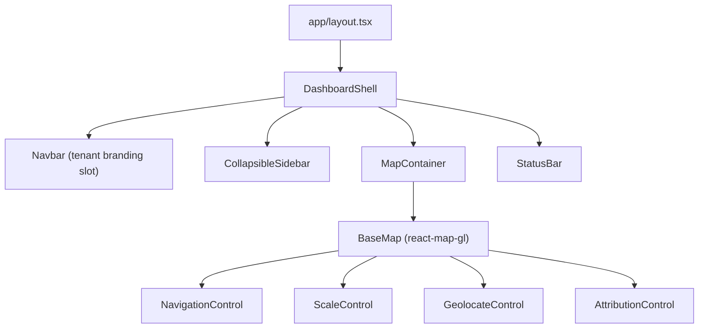

# 01 — Base Map & Dashboard Shell

> **TL;DR:** Renders a full-viewport MapLibre GL JS map on CartoDB Dark Matter, bounded to Western Cape, inside a responsive dark dashboard shell with collapsible sidebar, tenant-branded navbar, and status bar. SSR-excluded via `next/dynamic`.

| Field | Value |
|-------|-------|
| **Milestone** | M3 — MapLibre Base Map |
| **Status** | Draft |
| **Depends on** | M2 (Auth/RBAC) |
| **Architecture refs** | [ADR-002](../architecture/ADR-002-mapping-engine.md), [SYSTEM_DESIGN](../architecture/SYSTEM_DESIGN.md) |

## Topic
The base map renders a MapLibre GL JS map centred on Cape Town with a responsive dark dashboard shell.

## Component Hierarchy



## SSR Exclusion — Critical Implementation Detail

MapLibre GL JS requires `window`, `document`, and WebGL — none of which exist during server-side rendering.

```typescript
// components/map/MapContainer.tsx
import dynamic from 'next/dynamic';

const BaseMap = dynamic(() => import('./BaseMap'), {
  ssr: false,        // NEVER render on the server
  loading: () => <MapSkeleton />,  // Show placeholder during hydration
});
```

**Failure mode:** If `ssr: false` is omitted, Next.js will attempt to call `maplibregl.Map()` on the server → `ReferenceError: window is not defined` → page crash. This is the #1 MapLibre + Next.js bug.

## Map Initialization

```typescript
// components/map/BaseMap.tsx
import Map from 'react-map-gl/maplibre';
import 'maplibre-gl/dist/maplibre-gl.css';

export default function BaseMap() {
  return (
    <Map
      initialViewState={{
        longitude: 18.4241,
        latitude: -33.9249,
        zoom: 11,
      }}
      maxBounds={[
        [17.85, -34.83],   // SW corner (WC Province)
        [23.30, -31.05],   // NE corner (WC Province)
      ]}
      style={{ width: '100%', height: '100%' }}
      mapStyle="https://basemaps.cartocdn.com/gl/dark-matter-gl-style/style.json"
      attributionControl={true}
      customAttribution="© OpenStreetMap contributors © CARTO"
    />
  );
}
```

**`maxBounds` enforcement:** The map cannot be panned outside Western Cape Province. This prevents accidental queries against non-Cape Town data and reduces API misuse.

## Performance Targets

| Metric | Target | Measurement |
|---|---|---|
| Map first paint | <3s on 5 Mbps | Lighthouse + WebPageTest |
| Tile load (basemap) | <1s per tile | Performance API `performance.getEntriesByType('resource')` |
| JS bundle (map chunk) | <150KB gzipped | `next build --analyze` |
| No layout shift | CLS <0.1 | Vercel Analytics |

## Tile Caching Strategy (Basemap)

| Strategy | Detail |
|---|---|
| Type | Stale-while-revalidate (Serwist) |
| Max age | 7 days |
| Storage | Cache Storage API |
| Offline behavior | Cached tiles serve immediately; stale tiles replaced in background |

## Responsive Breakpoints

| Breakpoint | Sidebar | Map | Navbar |
|---|---|---|---|
| Mobile (375px) | Hidden (sheet overlay) | Full viewport | Hamburger menu |
| Tablet (768px) | Collapsible (icons only) | Viewport minus sidebar | Full navbar |
| Desktop (1440px) | Full sidebar with labels | Viewport minus sidebar | Full navbar |

## Failure Modes

| Failure | User Experience | Recovery |
|---|---|---|
| CartoDB CDN unavailable | Map shows grey canvas | Serwist serves cached tiles |
| WebGL not supported | Show static fallback image | Display "Your browser doesn't support WebGL maps" with Chrome link |
| Slow connection (<2 Mbps) | Tiles load progressively | Lower-resolution tiles at reduced zoom levels |
| `next/dynamic` fails to load | MapSkeleton persists | Error boundary with "Reload map" button |

## Data Sources
- Basemap tiles: CARTO CDN (no auth required, ODbL licence)
- Style JSON: `https://basemaps.cartocdn.com/gl/dark-matter-gl-style/style.json`

## Data Source Badge (Rule 1)
- Basemap badge: `[CARTO · 2026 · LIVE]` when CDN is reachable
- Falls back to: `[CARTO · 2026 · CACHED]` when serving from Serwist cache
- Badge displayed in the bottom status bar, visible without hovering

## Three-Tier Fallback (Rule 2)
- **LIVE:** CartoDB CDN tiles fetched in real-time
- **CACHED:** Serwist cache serves stale tiles (7-day max age)
- **MOCK:** Static fallback image of Cape Town at zoom 11 — never blank canvas

## Edge Cases
- **Double initialisation:** React StrictMode calls `useEffect` twice in dev — ref guard prevents second `maplibregl.Map()` instance
- **Race condition:** User navigates away before map loads — `map.remove()` in cleanup prevents memory leak
- **Viewport resize:** Map must `resize()` on sidebar toggle and window resize events
- **Geolocation denied:** GeolocateControl shows "Location unavailable" toast; map stays at default centre
- **maxBounds edge:** User zooms to edge of Western Cape bounds — map springs back, does not render out-of-scope tiles

## Security Considerations
- No API keys required for CARTO basemap (public ODbL)
- `customAttribution` string is static — no injection vector
- CSP headers must allow `basemaps.cartocdn.com` as img-src and connect-src

## POPIA Implications
- None — no personal data handled in this component

## Acceptance Criteria
- ✅ Renders full-viewport MapLibre GL JS map centred on Cape Town CBD (-33.9249, 18.4241) at zoom 11
- ✅ Uses CARTO Dark Matter basemap tiles
- ✅ Displays legally required attribution: `© OpenStreetMap contributors © CARTO`
- ✅ Includes NavigationControl (zoom +/−), ScaleControl, and GeolocateControl
- ✅ Dashboard shell has: collapsible sidebar, top navbar with tenant branding slot, bottom status bar
- ✅ Responsive across 375px (mobile), 768px (tablet), 1440px (desktop) breakpoints
- ✅ No React StrictMode double-initialisation or SSR `window` errors
- ✅ Map loads within 3 seconds on 5 Mbps connection
- ✅ `maxBounds` prevents panning outside Western Cape Province
- ✅ WCAG 2.1 AA baseline for dashboard chrome
- ✅ Data source badge `[CARTO · 2026 · LIVE|CACHED]` visible in status bar
- ✅ Three-tier fallback: LIVE tiles → cached tiles → static fallback image
