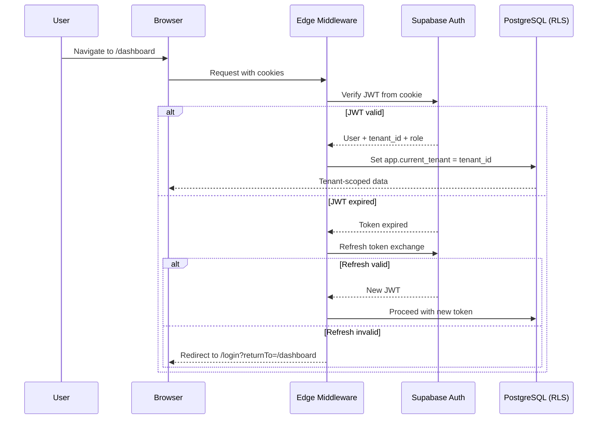
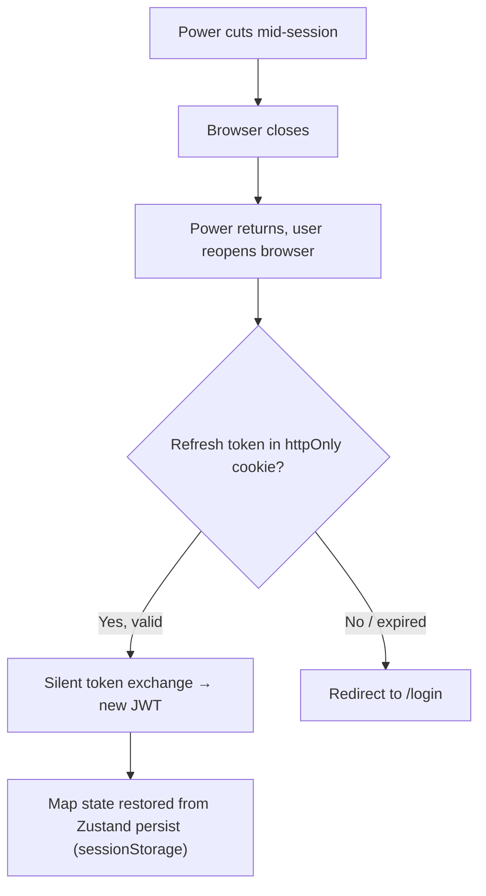

# 02 — Authentication & RBAC

> **TL;DR:** Supabase Auth (email/password + Google OAuth) with six RBAC roles (`GUEST→PLATFORM_ADMIN`), JWT in httpOnly cookies, tenant-scoped session variables for RLS, POPIA consent at registration, and load-shedding-resilient sessions via refresh tokens.

| Field | Value |
|-------|-------|
| **Milestone** | M2 — Auth, RBAC, POPIA Consent |
| **Status** | Draft |
| **Depends on** | M1 (Database Schema) |
| **Architecture refs** | [ADR-005](../architecture/ADR-005-tenant-subdomains.md), [SYSTEM_DESIGN](../architecture/SYSTEM_DESIGN.md) |

## Topic
The authentication system manages user sessions with Supabase Auth and enforces role-based access control across six roles.

## Auth Flow



## JWT Token Strategy

| Token | Storage | Lifetime | Purpose |
|---|---|---|---|
| Access token (JWT) | In-memory (Supabase client) | 1 hour | API authentication |
| Refresh token | `httpOnly` cookie | 7 days | Silent token renewal |
| Session cookie | `httpOnly`, `Secure`, `SameSite=Lax` | Session | Server-side auth check |

> [!WARNING]
> **Never store JWT in `localStorage`.** Default `supabase-js` uses `localStorage` — override with `supabase-ssr` package which uses `httpOnly` cookies. This prevents XSS token theft.

```typescript
// lib/supabase/server.ts — Server-side client (cookies-based)
import { createServerClient } from '@supabase/ssr';
import { cookies } from 'next/headers';

export function createClient() {
  const cookieStore = cookies();
  return createServerClient(
    process.env.NEXT_PUBLIC_SUPABASE_URL!,
    process.env.NEXT_PUBLIC_SUPABASE_ANON_KEY!,
    {
      cookies: {
        get: (name) => cookieStore.get(name)?.value,
        set: (name, value, options) => cookieStore.set({ name, value, ...options }),
        remove: (name, options) => cookieStore.set({ name, value: '', ...options }),
      },
    }
  );
}
```

## RBAC Permission Matrix

| Feature | PLATFORM_ADMIN | TENANT_ADMIN | POWER_USER | ANALYST | VIEWER | GUEST |
|---|:-:|:-:|:-:|:-:|:-:|:-:|
| View map + basemap layers | ✅ | ✅ | ✅ | ✅ | ✅ | ✅ |
| View property details panel | ✅ | ✅ | ✅ | ✅ | ✅ | ❌ (sign-up prompt) |
| Draw tools + spatial analysis | ✅ | ✅ | ✅ | ✅ | ❌ | ❌ |
| Save searches / favourites | ✅ | ✅ | ✅ | ✅ | ❌ | ❌ |
| Export PDF / GeoJSON | ✅ | ✅ | ✅ | ✅ | ❌ | ❌ |
| View analytics dashboard | ✅ | ✅ | ✅ | ✅ | ❌ | ❌ |
| Manage tenant users | ✅ | ✅ | ❌ | ❌ | ❌ | ❌ |
| Invite new tenant users | ✅ | ✅ | ❌ | ❌ | ❌ | ❌ |
| Access ALL tenants' data | ✅ | ❌ | ❌ | ❌ | ❌ | ❌ |
| Manage platform settings | ✅ | ❌ | ❌ | ❌ | ❌ | ❌ |

## Permission Resolution

```typescript
// lib/auth/permissions.ts
type Role = 'PLATFORM_ADMIN' | 'TENANT_ADMIN' | 'POWER_USER' | 'ANALYST' | 'VIEWER' | 'GUEST';

const ROLE_HIERARCHY: Record<Role, number> = {
  PLATFORM_ADMIN: 6,
  TENANT_ADMIN: 5,
  POWER_USER: 4,
  ANALYST: 3,
  VIEWER: 2,
  GUEST: 1,
};

export function hasPermission(userRole: Role, requiredRole: Role): boolean {
  return ROLE_HIERARCHY[userRole] >= ROLE_HIERARCHY[requiredRole];
}

// Usage in components:
// if (!hasPermission(user.role, 'ANALYST')) return <UpgradePrompt />;
```

## Load-Shedding Session Resilience



## Middleware — Tenant Resolution

```typescript
// middleware.ts
import { type NextRequest, NextResponse } from 'next/server';
import { updateSession } from '@/lib/supabase/middleware';

export async function middleware(request: NextRequest) {
  // 1. Refresh Supabase session (prevents expired JWT on page nav)
  const response = await updateSession(request);

  // 2. Resolve tenant from subdomain
  const hostname = request.headers.get('host') || '';
  const subdomain = hostname.split('.')[0];
  response.headers.set('x-tenant-slug', subdomain);

  return response;
}

export const config = {
  matcher: ['/((?!_next/static|_next/image|favicon.ico|api/health).*)'],
};
```

## Failure Modes

| Failure | Behavior | Recovery |
|---|---|---|
| Supabase Auth unavailable | Login/register forms show error | Retry with exponential backoff |
| JWT expired + refresh fails | Redirect to /login with returnTo | User re-authenticates |
| Rate-limited (429) | "Too many attempts" message | 60-second cooldown timer |
| POPIA consent unchecked | Submit button disabled | User checks box to proceed |
| Account deleted mid-session | Next API call returns 401 | Force logout + "Account deleted" message |

## Data Sources
- Supabase Auth (built-in) — eu-west-1 London region

## POPIA Implications
- **Personal data:** Email, name, login timestamps, session tokens
- **Lawful basis:** Consent (registration checkbox)
- **Retention:** Account active + 30 days after deletion request
- **Audit log:** Survives account deletion (regulatory requirement)

## Data Source Badge (Rule 1)
- Auth state badge not required (auth is infrastructure, not data display)

## Three-Tier Fallback (Rule 2)
- N/A — authentication is not an external data source
- However, if Supabase Auth is unreachable, the app degrades to Guest mode (read-only public layers)

## Edge Cases
- **Concurrent sessions:** User logs in on two devices — both sessions valid; logout on one does not invalidate the other [ASSUMPTION — UNVERIFIED]
- **Token refresh race:** Multiple tabs refresh simultaneously — `supabase-ssr` handles via cookie lock
- **Role downgrade mid-session:** TENANT_ADMIN demotes a POWER_USER — next API call returns 403; UI shows "Permissions changed" toast
- **Google OAuth email mismatch:** User's Google email differs from registered email — reject; show "Email mismatch" error
- **POPIA consent version change:** Policy updated after user consented — re-prompt on next login with new `consent_version`
- **Subdomain mismatch:** User authenticated on `stellenbosch.capegis.com` tries to access `capetown.capegis.com` — middleware rejects; tenant_id does not match JWT claim

## Security Considerations
- JWT stored in `httpOnly` cookie — immune to XSS token theft
- CSRF protection via `SameSite=Lax` cookie attribute
- Rate limiting: max 5 failed login attempts per 15 minutes per IP
- Password requirements: minimum 8 characters [ASSUMPTION — UNVERIFIED]
- Session variables (`app.current_tenant`, `app.current_role`) set at connection time for RLS

## Performance Budget

| Metric | Target |
|--------|--------|
| Login flow (email/password) | < 2s end-to-end |
| JWT verification (middleware) | < 50ms |
| Role permission check | < 1ms (in-memory lookup) |
| Token refresh (silent) | < 500ms |

## Acceptance Criteria
- ✅ Login, registration, and password reset forms render and submit successfully
- ✅ Registration form includes mandatory POPIA consent checkbox (NOT pre-checked)
- ✅ Six RBAC roles resolve permissions correctly per the matrix above
- ✅ JWT stored in `httpOnly` cookie, never `localStorage`
- ✅ Sessions survive unexpected browser close (refresh token in cookie)
- ✅ Guest mode provides map browsing without auth or PII collection
- ✅ Protected routes redirect unauthenticated users with `returnTo` preserved
- ✅ Users see only data within their tenant (RLS enforced)
- ✅ Account deletion completes within 30 days (POPIA §23)
- ✅ Failed login attempts logged for security monitoring
- ✅ TENANT_ADMIN can invite and assign role in <2 minutes
