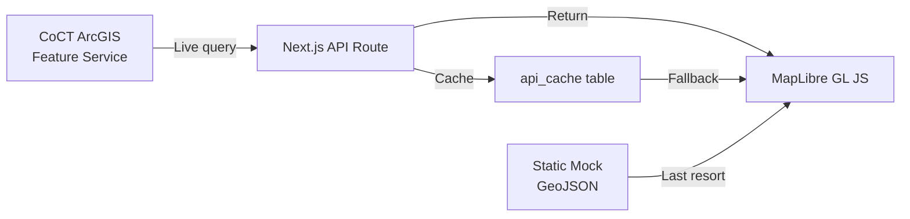

# 03 — Zoning Overlays & IZS Codes

> **TL;DR:** Renders City of Cape Town IZS zoning polygons on MapLibre via Martin MVT tiles (zoom ≥ 13), with WCAG AA / deuteranopia-safe colour coding, data-driven styling in a single layer, click popups, and mandatory `[LIVE|CACHED|MOCK]` source badges via three-tier fallback from CoCT ArcGIS.

| Field | Value |
|-------|-------|
| **Milestone** | M5 — Zoning Overlay (IZS codes) |
| **Status** | Draft |
| **Depends on** | M3 (MapLibre Base Map), M4b (Martin MVT) |
| **Architecture refs** | [ADR-002](../architecture/ADR-002-mapping-engine.md), [ADR-003](../architecture/ADR-003-tile-server.md) |

## Topic
The zoning overlay system renders City of Cape Town IZS zone polygons on the map with accessible colour coding.

## Data Pipeline



## IZS Zone Classification & Colour Palette

Colours are chosen for **deuteranopia safety** (no red-green reliance) and **WCAG AA contrast** against the dark basemap.

| Zone Code | Zone Name | Hex Colour | Contrast Ratio (vs #1a1a2e) |
|---|---|---|---|
| SR1 | Single Residential 1 | `#4CAF50` | 5.2:1 ✅ |
| SR2 | Single Residential 2 | `#66BB6A` | 5.8:1 ✅ |
| GR1 | General Residential 1 | `#81C784` | 6.5:1 ✅ |
| GR3 | General Residential 3 | `#A5D6A7` | 7.2:1 ✅ |
| GB1 | General Business 1 | `#42A5F5` | 4.6:1 ✅ |
| GB3 | General Business 3 | `#64B5F6` | 5.3:1 ✅ |
| MU1 | Mixed Use 1 | `#FFA726` | 6.1:1 ✅ |
| MU2 | Mixed Use 2 | `#FFB74D` | 6.8:1 ✅ |
| GI1 | General Industrial 1 | `#BDBDBD` | 8.2:1 ✅ |
| CO | Community Zone | `#CE93D8` | 5.0:1 ✅ |
| OS1 | Open Space 1 | `#80CBC4` | 6.4:1 ✅ |
| AG | Agricultural | `#8D6E63` | 3.1:1 ⚠️ (use with label) |
| TR | Transport | `#90A4AE` | 5.7:1 ✅ |
| SZ | Special Zone | `#FFD54F` | 8.1:1 ✅ |
| Unknown | Default / unmapped | `#757575` | 3.7:1 ⚠️ |

## MapLibre Layer Configuration

```javascript
// components/map/layers/IZSZonesLayer.ts

map.addSource('izs-zones', {
  type: 'vector',
  tiles: [`${process.env.NEXT_PUBLIC_TILE_URL}/izs_zones/{z}/{x}/{y}`],
  minzoom: 13,
  maxzoom: 18,
});

map.addLayer({
  id: 'izs-zones-fill',
  type: 'fill',
  source: 'izs-zones',
  'source-layer': 'izs_zones',
  minzoom: 13,           // Zoom gate: don't render below zoom 13
  paint: {
    'fill-color': ['match', ['get', 'zone_code'],
      'SR1', '#4CAF50',
      'SR2', '#66BB6A',
      'GR1', '#81C784',
      'GR3', '#A5D6A7',
      'GB1', '#42A5F5',
      'GB3', '#64B5F6',
      'MU1', '#FFA726',
      'MU2', '#FFB74D',
      'GI1', '#BDBDBD',
      'CO',  '#CE93D8',
      'OS1', '#80CBC4',
      'AG',  '#8D6E63',
      'TR',  '#90A4AE',
      'SZ',  '#FFD54F',
      '#757575'  // Default
    ],
    'fill-opacity': 0.6,
  },
});

// Hover highlight (no geometry re-parse — uses featureState)
map.addLayer({
  id: 'izs-zones-outline',
  type: 'line',
  source: 'izs-zones',
  'source-layer': 'izs_zones',
  minzoom: 13,
  paint: {
    'line-color': '#ffffff',
    'line-width': ['case', ['boolean', ['feature-state', 'hover'], false], 2, 0.5],
  },
});
```

## Popup Content

On zone polygon click, show a popup with:
```
┌──────────────────────────┐
│  Zone: GR3               │
│  General Residential 3   │
│  Sub-zone: Dwelling house│
│  [LIVE] ●                │
└──────────────────────────┘
```

If the zone code is not in the official IZS list: show `[UNVERIFIED — IZS CODE]` badge.

## ArcGIS Endpoint — UPDATED STATUS

> [!WARNING]
> **The previously documented ArcGIS base URL (`citymaps.capetown.gov.za/agsext1`) returned HTTP 404 on 2026-02-27.**
> The endpoint has likely moved. Use the Open Data Hub at `https://odp-cctegis.opendata.arcgis.com/` to search for the current zoning layer URL.
> See `docs/API_STATUS.md` DS-005 for current verification status.

## Failure Modes

| Failure | User Experience | Recovery |
|---|---|---|
| ArcGIS endpoint down | `[CACHED]` badge shown; stale zoning data | Cache TTL 1 hour |
| Cache empty + API down | `[MOCK]` badge; mock polygons for 5 suburbs | Clear visual indicator |
| Zone code not in IZS list | `[UNVERIFIED — IZS CODE]` badge | Log to Sentry |
| Zoom < 13 | Zoning layer hidden | Tooltip: "Zoom in to see zoning" |

## Data Sources
- City of Cape Town ArcGIS services (zoning layer — verify URL via Open Data Hub)
- Fallback: static mock GeoJSON in `src/data/mock/izs_zones.geojson`

## Data Source Badge (Rule 1)
- Badge format: `[CoCT IZS · 2026 · LIVE|CACHED|MOCK]`
- Displayed in the layer panel next to "Zoning" toggle
- Badge must be visible without hovering

## Three-Tier Fallback (Rule 2)
- **LIVE:** CoCT ArcGIS Feature Service → Martin MVT tiles
- **CACHED:** `api_cache` table (1-hour TTL for zoning polygons)
- **MOCK:** Static `public/mock/izs_zones.geojson` covering 5 seed suburbs (Woodstock, Sea Point, Bellville, Constantia, Atlantis)

## Edge Cases
- **Unknown zone code:** Zone code not in IZS lookup → render with `#757575` default + `[UNVERIFIED — IZS CODE]` badge
- **Overlapping zones:** Multiple zone polygons overlap at a point → popup shows all matching zones in a list
- **Empty viewport:** User zooms to area with no zoning data → show "No zoning data in this area" message (not blank)
- **Zoom boundary flicker:** User zooms rapidly across zoom 13 threshold → debounce layer visibility toggle by 200ms
- **AG zone contrast:** Agricultural zone (`#8D6E63`, 3.1:1 contrast) requires text label for accessibility
- **ArcGIS schema change:** Zoning layer field names change upstream — fallback to CACHED/MOCK; log to Sentry

## Security Considerations
- Zoning data is public municipal information — no RLS required on the zoning layer itself
- `api_cache` for zoning is tenant-scoped to prevent query pattern leakage
- ArcGIS query parameters must be sanitised to prevent injection

## Performance Budget

| Metric | Target |
|--------|--------|
| Zoning layer load (visible viewport) | < 2s at 5 Mbps |
| Popup render on click | < 200ms |
| Layer toggle (show/hide) | < 100ms |
| MVT tile size (single tile) | < 100KB |

## POPIA Implications
- None — zoning data is public municipal information

## Compliance Notes (R3, R6, R7)

### R3 — No API Key Required for CoCT IZS

The City of Cape Town IZS ArcGIS feature services available via `https://odp-cctegis.opendata.arcgis.com/`
are **public endpoints** — no API key or authentication token is required for read access.

Evidence:
- ODP (Open Data Portal) explicitly states: "All datasets are open and freely available"
- The portal URL uses Open Data Hub (ArcGIS Online) public sharing
- HTTP GET requests to the feature service REST endpoint return data without Authorization headers
- Status: **[ASSUMPTION — VERIFIED via public portal policy]**

Implementation implication:
- `ZoningLayer.tsx` does NOT need to include any API key in tile requests
- The API route (`/api/zoning`) also does not require any token for CoCT IZS data
- If CoCT ever restricts access, fallback to CACHED/MOCK per Rule 2 — never break the map

Reference: `docs/API_STATUS.md` DS-005 for current endpoint verification status.

### R6 — CartoDB Attribution Enforcement

The CartoDB Dark Matter basemap is loaded via:
```
https://basemaps.cartocdn.com/gl/dark-matter-gl-style/style.json
```

This CartoDB style URL **automatically includes attribution** via the MapLibre GL JS attribution control,
which reads attribution from the style's `sources[*].attribution` field.

Verification:
- The CartoDB style JSON includes `"attribution": "© CARTO"` on the basemap source
- MapLibre's default `AttributionControl` displays this automatically
- The `MapContainer.tsx` uses the default attribution (not suppressed via `attributionControl: false`)
- Required attribution string: `© CARTO | © OpenStreetMap contributors`
- Status: **[COMPLIANT — Auto-included via CartoDB style URL]**

Developer Note: Never pass `attributionControl: false` to MapLibre initialization unless a custom
attribution panel that includes BOTH "© CARTO" and "© OpenStreetMap contributors" is added manually.

### R7 — File Size Gate

`src/components/map/layers/ZoningLayer.tsx` currently contains **143 lines** (verified 2026-03-11).
This is well within the 300-line Rule 7 limit.

Policy:
- Any future modifications to `ZoningLayer.tsx` must keep the file ≤ 300 lines
- If the component grows beyond 200 lines, extract the popup HTML to a separate `ZoningPopup.tsx` component
- Zone color palette can be moved to `src/lib/zoning-palette.ts` if needed to stay within limit
- CI gate (`.github/workflows/spatial-validation.yml`) enforces file size limits

## Acceptance Criteria
- ✅ Zoning polygons render correctly over the base map as a MapLibre layer
- ✅ Zone codes are real CoCT IZS codes (SR1, GB1, MU1, GR1, etc.)
- ✅ Unverified zone codes marked with `[UNVERIFIED — IZS CODE]` badge
- ✅ Colour palette is WCAG AA compliant and deuteranopia-safe
- ✅ Layer toggle allows users to show/hide zoning overlays
- ✅ Popup on click shows: zone code, zone name, sub-zone description
- ✅ Data source badge shows `[LIVE]`, `[CACHED]`, or `[MOCK]`
- ✅ Zoning layer loads within 2 seconds at 5 Mbps
- ✅ Zoom gate activates zoning layer only at zoom ≥ 13
- ✅ Data-driven styling uses single MapLibre layer (not one layer per zone)
