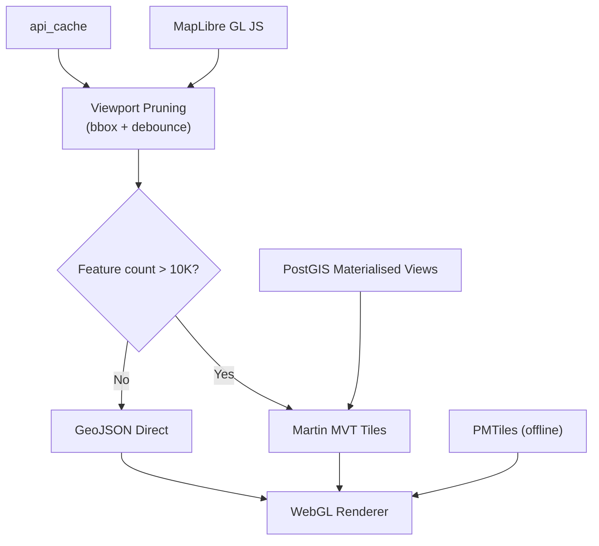

# 04 — Spatial Data Architecture

> **TL;DR:** Manages 830,000+ GV Roll records and IZS polygons using viewport pruning (debounced bbox queries with AbortController), Martin MVT for dense layers (>10K features), `api_cache` with hashed bbox keys and TTL, PostGIS server-side aggregation via materialised views, and PMTiles for offline field use. CRS: store EPSG:4326, render EPSG:3857.

| Field | Value |
|-------|-------|
| **Milestone** | M4 — Architecture Layer (M4a fallback, M4b Martin) |
| **Status** | Draft |
| **Depends on** | M1 (Database Schema) |
| **Architecture refs** | [SYSTEM_DESIGN](../architecture/SYSTEM_DESIGN.md), [ADR-003](../architecture/ADR-003-tile-server.md), [tile-layer-architecture](../architecture/tile-layer-architecture.md) |

`[SPATIAL_ARCH]`

## Topic

The spatial data architecture manages massive Cape Town datasets (830,000+ GV Roll records, IZS polygons) using a "Thin-Server, Thick-Client" model with progressive enhancement from viewport pruning to vector tiles.

## Component Hierarchy



## Data Source Badge (Rule 1)
- Each spatial layer badge: `[SOURCE · YEAR · LIVE|CACHED|MOCK]`
- GV Roll: `[CoCT GV Roll · 2022 · LIVE|CACHED|MOCK]`
- IZS Zones: `[CoCT IZS · 2026 · LIVE|CACHED|MOCK]`
- Badge must be visible without hovering on every data display

## Three-Tier Fallback (Rule 2)
- **LIVE:** PostGIS queries via Supabase RPC or Martin MVT
- **CACHED:** `api_cache` table with hashed bbox+zoom+filter keys (1-hour TTL live data, 24-hour TTL zoning)
- **MOCK:** Static GeoJSON files in `public/mock/` for 5 seed suburbs

## Phase 1: Viewport Pruning (MVP)

MapLibre GL JS (and Leaflet) degrades significantly with >5,000 raw GeoJSON features. The MVP must implement dynamic spatial loading:

- Load data **only for the visible bounding box** — never request the full dataset
- **Debounce** fetches by 400–500ms on pan/zoom to prevent request storms
- **Remove features** outside the viewport with a +20% buffer to keep memory usage bounded
- **Zoom-gated rendering:**
  - Zoom 10–13: Render macro views (heatmaps, cluster aggregations, suburb-level summaries)
  - Zoom 14+: Render individual property boundaries and detailed polygons
- Use `AbortController` to cancel in-flight requests when the viewport changes before a response arrives

## Phase 2: Vector Tile Server (Martin)

Upgrade from raw GeoJSON to compressed Mapbox Vector Tiles (MVT) served by Martin:

- Martin (Rust-based) connects to Supabase PostGIS and **auto-discovers** spatial tables
- Converts large tables into compressed MVT on the fly — no manual config files required
- Frontend renders via MapLibre GL JS (WebGL/WebGPU) targeting **smooth 60fps** even with dense polygons
- Martin also serves static **PMTiles** for offline/cached scenarios

> See [specs/07-martin-tile-server.md](file:///home/mr/Desktop/Geographical%20Informations%20Systems%20(GIS)/specs/07-martin-tile-server.md) for Martin-specific documentation.

## Payload Optimization

- **Coordinate precision:** Reduce GeoJSON coordinates to **6 decimal places** (~11cm accuracy), cutting payload size by up to 40%
- **Polygon simplification:** Use `ST_Simplify` (PostGIS), Mapshaper, or Turf.js to reduce vertex count before sending to client
- **Response compression:** Enable gzip/brotli on all GeoJSON API responses

## Caching & Pre-Aggregation

### `api_cache` Table

Create an `api_cache` table in Supabase to store fetched API responses:

```sql
-- [SPATIAL_ARCH] API Response Cache
CREATE TABLE api_cache (
  id UUID DEFAULT gen_random_uuid() PRIMARY KEY,
  cache_key TEXT NOT NULL UNIQUE,        -- hashed bounding-box + zoom + filters
  response_data JSONB NOT NULL,
  created_at TIMESTAMPTZ DEFAULT now(),
  expires_at TIMESTAMPTZ NOT NULL,       -- TTL-based expiration
  hit_count INTEGER DEFAULT 0
);

CREATE INDEX idx_api_cache_key ON api_cache(cache_key);
CREATE INDEX idx_api_cache_expires ON api_cache(expires_at);
```

- Hash the bounding-box key (`bbox + zoom + filter params`) to serve subsequent requests in **under 100ms**
- Set TTL-based expiration (e.g., 1 hour for live data, 24 hours for zoning polygons)
- Run a periodic cleanup job to evict expired entries

### Server-Side Aggregation

- Run aggregations in PostGIS (`AVG`, `COUNT`, `ST_Union`) instead of sending raw records to the client
- Pre-compute per-suburb statistics (average valuation, property count, zoning distribution) as materialised views
- Refresh materialised views on a schedule (daily for GV Roll, weekly for zoning)

## Offline Support (PMTiles)

PMTiles are Cloud-Optimised Archives designed for field workers operating during load-shedding:

- **Single flat file:** Pack entire vector tilesets into one file hosted on cloud storage or cached locally via IndexedDB
- **HTTP Range Requests:** Fetch only the needed bytes — no active server required
- **Local caching:** Store PMTiles in IndexedDB for fully offline operation
- **Update strategy:** Check for new PMTiles versions on app start; download delta updates if available

### PMTiles Workflow

```
PostGIS → Martin (generate tiles) → tippecanoe (pack PMTiles) → S3/Cloud Storage
                                                                       ↓
                                                              IndexedDB (local cache)
                                                                       ↓
                                                              MapLibre GL JS (render)
```

## Data Sources

- City of Cape Town General Valuation Roll (830,000+ records)
- City of Cape Town Integrated Zoning Scheme (IZS) polygons
- City of Cape Town ArcGIS REST Services

## Edge Cases
- **Rapid pan/zoom:** User pans rapidly — AbortController cancels stale in-flight requests; debounce prevents request storms
- **Bbox wrapping at antimeridian:** N/A for Cape Town (all within 18-19°E longitude)
- **Empty viewport:** User zooms to area with no spatial data — show "No data in this area" instead of blank
- **Cache key collision:** Two different bbox queries produce same hash — use SHA-256 with full precision to minimise collision risk
- **Materialised view stale:** View not refreshed after GV Roll import — `REFRESH MATERIALIZED VIEW CONCURRENTLY` must run post-import
- **PMTiles file corruption:** SHA-256 checksum validation on download; re-download on mismatch

## Security Considerations
- `api_cache` has RLS with `tenant_id` isolation
- PostGIS views for tile serving must exclude PII columns (owner names)
- AbortController prevents resource exhaustion from abandoned requests

## Performance Budget

| Metric | Target |
|--------|--------|
| Viewport query (bbox, indexed) | < 200ms |
| Cache hit response | < 100ms |
| Martin MVT tile generation | < 50ms per tile |
| GeoJSON payload (single viewport) | < 500KB |
| Coordinate precision reduction | ≥ 30% payload savings |
| Materialised view refresh | < 60s for 830K records |

## POPIA Implications

- GV Roll contains property owner names — must be treated as personal data
- Cache entries containing personal data must respect `expires_at` and be purged on user deletion
- PMTiles for field workers must NOT contain personal data (zoning and boundaries only)

## Acceptance Criteria

- [ ] Spatial data guidelines are documented under `[SPATIAL_ARCH]`
- [ ] Viewport pruning implemented with debounce, buffer, and zoom gating
- [ ] `api_cache` table created with hashed bounding-box keys and TTL expiration
- [ ] Payload reduction achieves ≥30% size reduction via coordinate precision + simplification
- [ ] PMTiles workflow produces offline-capable archives without personal data
- [ ] Martin auto-discovers and serves PostGIS tables as MVT endpoints
