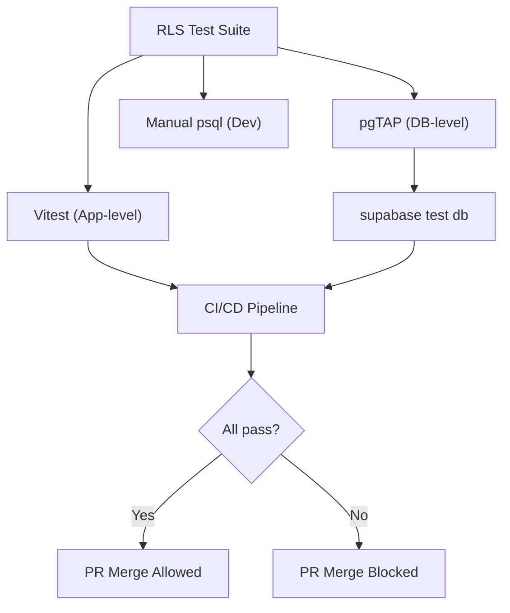

# 05 — Row-Level Security Testing

> **TL;DR:** Validates RLS tenant isolation and RBAC enforcement via three approaches: pgTAP database-level unit tests (cross-tenant read/write/escalation), Vitest integration tests authenticating as real tenant users, and manual `psql` checks. All six roles tested. CI blocks merge on failure. RLS is a critical POPIA control — cross-tenant leaks are reportable breaches.

| Field | Value |
|-------|-------|
| **Milestone** | M4d — RLS Test Harness |
| **Status** | Draft |
| **Depends on** | M1 (Database Schema + RLS policies) |
| **Architecture refs** | [SYSTEM_DESIGN](../architecture/SYSTEM_DESIGN.md) |

`[RLS_TESTING]`

## Topic

The RLS testing strategy validates that Supabase Row-Level Security policies prevent cross-tenant data leaks and privilege escalation across all six RBAC roles.

## Three Testing Approaches

### 1. Database-Level Unit Testing (pgTAP)

Test RLS policies directly in SQL using pgTAP via the Supabase CLI, without application overhead:

```sql
-- [RLS_TESTING] pgTAP example: cross-tenant read must return 0 rows
BEGIN;
SELECT plan(1);

-- Simulate Tenant A user
SET LOCAL request.jwt.claims = '{"sub": "user-a-uuid", "tenant_id": "tenant-a-uuid"}';
SET LOCAL role = 'authenticated';

-- Query Tenant B's data — must return exactly 0 rows
SELECT is(
  (SELECT count(*) FROM properties WHERE tenant_id = 'tenant-b-uuid')::integer,
  0,
  'Cross-tenant read returns zero rows (silent failure)'
);

SELECT * FROM finish();
ROLLBACK;
```

- Run via `supabase test db` in CI/CD
- Each test runs in a transaction and rolls back — no cleanup needed
- Test all six roles: `PLATFORM_ADMIN`, `TENANT_ADMIN`, `POWER_USER`, `ANALYST`, `VIEWER`, `GUEST`

### 2. Application-Level Integration Testing (Vitest)

Authenticate as a tenant user in the test suite and attempt cross-tenant access:

```typescript
// [RLS_TESTING] Integration test: cross-tenant write must fail
describe('RLS: Cross-Tenant Write Protection', () => {
  it('rejects insert with another tenants UUID', async () => {
    const tenantAClient = createSupabaseClient(tenantAToken);

    const { error } = await tenantAClient
      .from('properties')
      .insert({
        tenant_id: 'tenant-b-uuid',  // Malicious cross-tenant payload
        address: '123 Fake Street',
      });

    expect(error).toBeDefined();
    expect(error?.code).toBe('42501'); // permission denied
  });
});
```

- Use **unique IDs per test** instead of resetting the database
- Run as CI/CD guardrails — block merge on failure
- Test both `SELECT` (silent zero rows) and `INSERT`/`UPDATE` (permission denied)

### 3. Manual SQL Checks (Development)

Simulate queries in `psql` by setting tenant session variables manually:

```sql
-- [RLS_TESTING] Manual check: simulate tenant user
SET LOCAL request.jwt.claims = '{"sub": "user-uuid", "tenant_id": "tenant-a-uuid", "role": "VIEWER"}';
SET LOCAL role = 'authenticated';

-- Verify: only Tenant A data visible
SELECT count(*) FROM properties;                              -- Should return Tenant A count
SELECT count(*) FROM properties WHERE tenant_id = 'tenant-b-uuid';  -- Should return 0
```

Use during active development to verify read/write blocks before writing automated tests.

## Core Test Scenarios

### Scenario 1: Cross-Tenant Read (Silent Failure)

| Aspect | Detail |
|---|---|
| **Action** | Tenant A queries Tenant B's data |
| **Expected** | Exactly **0 rows** returned (no error, silent failure) |
| **Why silent** | RLS `SELECT` policies filter rows, they don't raise errors |
| **Roles to test** | All 6 roles |
| **Tables** | `properties`, `favourites`, `saved_searches`, `audit_log` |

### Scenario 2: Cross-Tenant Write (Malicious Insert)

| Aspect | Detail |
|---|---|
| **Action** | Tenant A inserts/updates data with Tenant B's UUID |
| **Expected** | **Permission denied** error (PostgreSQL error code `42501`) |
| **Attack vector** | Attacker crafts payload with another tenant's `tenant_id` |
| **Roles to test** | All roles with write permissions (`TENANT_ADMIN`, `POWER_USER`, `ANALYST`) |
| **Tables** | `properties`, `profiles`, `favourites`, `saved_searches` |

### Scenario 3: Privilege Escalation

| Aspect | Detail |
|---|---|
| **Action** | Standard user self-updates their profile to gain `PLATFORM_ADMIN` role |
| **Expected** | HTTP **403** or RLS violation error |
| **Policy** | `role` column must be immutable by non-admin users |
| **Roles to test** | `VIEWER`, `ANALYST`, `POWER_USER` attempting to set `role = 'PLATFORM_ADMIN'` |
| **Tables** | `profiles` |

## CI/CD Integration

```yaml
# In GitHub Actions workflow
- name: Run RLS Tests (pgTAP)
  run: supabase test db

- name: Run RLS Integration Tests (Vitest)
  run: npx vitest run --reporter=verbose tests/rls/
```

- Both test suites must pass before PR merge
- Failure blocks deployment

## Data Sources

- Supabase Auth (JWT claims with `tenant_id`)
- PostGIS RLS policies on all tenant-scoped tables

## Component Hierarchy



## Data Source Badge (Rule 1)
- N/A — testing infrastructure does not display data to users

## Three-Tier Fallback (Rule 2)
- N/A — testing infrastructure, not a data service

## Edge Cases
- **PLATFORM_ADMIN cross-tenant access:** Must succeed (intentional) — test verifies this positive case
- **Null tenant_id:** Row with `NULL` tenant_id should be invisible to all non-platform-admin roles
- **Service role bypass:** `service_role` key bypasses RLS — test that application code never exposes this to clients
- **Concurrent role change:** User's role changes mid-transaction — RLS uses session-level setting, so the old role applies until next connection
- **RLS policy on new table:** CI must fail if a migration adds a tenant-scoped table without an RLS policy [ASSUMPTION — UNVERIFIED]

## Security Considerations
- Test data must use synthetic records — never real personal data
- Service role key must never appear in client bundles or test fixtures committed to git
- pgTAP tests run in transactions and ROLLBACK — no persistent test data

## Performance Budget

| Metric | Target |
|--------|--------|
| pgTAP full suite (all tables × 6 roles) | < 30s |
| Vitest RLS integration suite | < 60s |
| CI gate total (RLS only) | < 2 minutes |

## POPIA Implications

- RLS is a **critical POPIA control** — cross-tenant data leaks constitute a reportable breach
- All RLS policy changes must be logged in the `audit_log` table
- Test data must use synthetic records — never real personal data

## Acceptance Criteria

- [ ] RLS testing strategies documented under `[RLS_TESTING]`
- [ ] pgTAP tests cover all three core scenarios for all six RBAC roles
- [ ] Vitest integration tests run as CI/CD guardrails
- [ ] Cross-tenant read returns exactly 0 rows (silent failure)
- [ ] Cross-tenant write returns permission denied error
- [ ] Privilege escalation returns HTTP 403 or RLS violation
- [ ] Manual SQL check procedures documented for developer workflow
