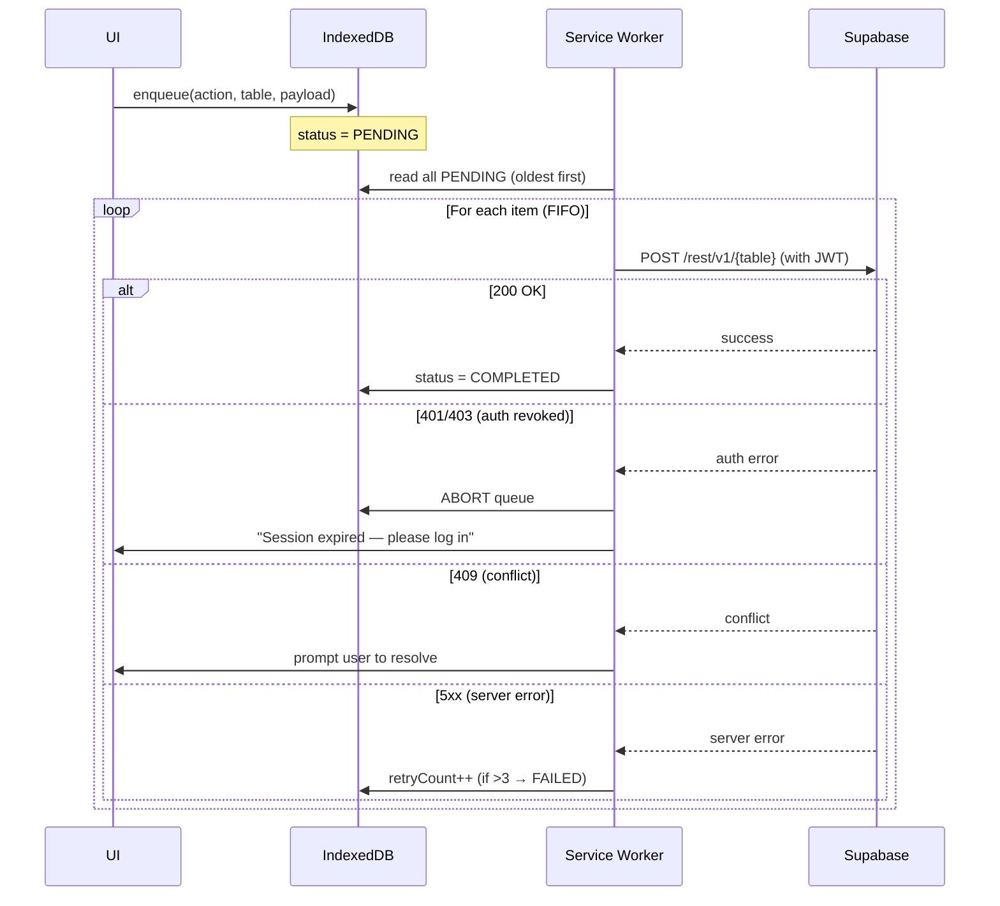

# Offline Sync Queue

> **TL;DR:** Buffers user-generated changes (saved searches, favourites, drawn polygons) in IndexedDB while offline, flushes FIFO to Supabase on reconnect with RLS enforcement, exponential backoff (max 3 retries), optimistic concurrency conflict resolution, 24-hour security lockout, and iOS `visibilitychange` fallback for missing Background Sync API.

| Field | Value |
|-------|-------|
| **Milestone** | M4c — Serwist PWA / Offline |
| **Status** | Draft |
| **Depends on** | M2 (Auth/RBAC), M4a (Three-Tier Fallback) |
| **Architecture refs** | [SYSTEM_DESIGN](../architecture/SYSTEM_DESIGN.md) |

## Overview
The sync queue buffers user-generated changes (saved searches, favourites, drawn polygons) while offline.
When connectivity returns, the queue flushes items to Supabase in FIFO order, respecting RLS and POPIA.

## Queue Schema (IndexedDB — Client Side)

```typescript
interface SyncQueueItem {
  id: string;              // crypto.randomUUID()
  action: 'INSERT' | 'UPDATE' | 'DELETE';
  table: string;           // e.g., 'saved_searches', 'favourites'
  payload: Record<string, unknown>;
  createdAt: string;       // ISO 8601
  status: 'PENDING' | 'IN_PROGRESS' | 'FAILED' | 'COMPLETED';
  retryCount: number;      // default 0, max 3
  errorMessage?: string;
}
```

## Process Flow



## Conflict Resolution
- **Optimistic concurrency:** Each record has an `updated_at` timestamp.
- **On conflict:** Compare client `updated_at` vs server `updated_at`.
- **If server is newer:** Show a diff dialog — "Your change conflicts with a newer version."
- **If client is newer:** Apply the client change (this shouldn't happen if only one user edits).

## iOS Limitation

> [!WARNING]
> Background Sync API is **NOT supported in Safari/iOS**. For iOS users:
> - Implement a manual retry prompt on app foreground (`visibilitychange` event).
> - Show a toast: "You have X pending changes. Tap to sync."

## 24-Hour Security Lockout

> [!IMPORTANT]
> If `lastSyncTimestamp` is >24 hours ago when the app comes to foreground:
> 1. Force re-authentication before showing any cached data.
> 2. Do NOT flush the sync queue until the user's JWT is verified.
> 3. If JWT verification fails (user was revoked), purge all cached data and sync queue.

## Data Source Badge (Rule 1)
- While serving from sync queue (offline): data displays show `[LOCAL · PENDING SYNC]` badge
- After sync completes: badge reverts to `[SOURCE · YEAR · LIVE]`

## Three-Tier Fallback (Rule 2)
- Sync queue is the **write-side complement** to the three-tier read fallback
- Queued writes go to IndexedDB (offline) → Supabase API (on reconnect)
- Failed writes after 3 retries: item marked `FAILED`; user notified

## Edge Cases
- **Queue ordering violation:** Dependent operations (INSERT then UPDATE) must sync in order — enforce via `createdAt` timestamp sort
- **Duplicate sync:** Network reconnects during flush → use idempotency keys to prevent double-writes
- **User deletes then re-creates:** DELETE followed by INSERT for same record → process both in FIFO order
- **Large payload:** Single sync item > 1MB → warn user; split if possible
- **Browser crash during sync:** Item status stuck at `IN_PROGRESS` → on restart, reset to `PENDING` and retry

## Security Considerations
- All sync operations go through Supabase authenticated API — RLS enforced server-side
- Sync queue stored in IndexedDB — not encrypted by default in browsers [ASSUMPTION — UNVERIFIED]
- JWT tokens refreshed before sync; expired sessions require re-authentication
- Failed sync items with 401/403 errors abort entire queue — never retry with invalid credentials
- 24-hour lockout: purge all cached data if JWT verification fails after extended offline period

## Performance Budget

| Metric | Target |
|--------|--------|
| Enqueue operation (to IndexedDB) | < 10ms |
| Flush throughput | ≥ 5 items/second |
| Max queue size | 1000 items |
| Conflict resolution dialog render | < 200ms |

## POPIA Implications
- Sync queue payloads may contain personal data (saved searches with addresses, favourites)
- On user logout: purge entire sync queue
- On account deletion: purge queue + all local data within 30 days
- Completed sync items retained for 7 days for debugging, then auto-purged

## Acceptance Criteria
- ✅ Queue persists across app restarts (IndexedDB)
- ✅ FIFO order maintained — verified by timestamp ordering
- ✅ Offline actions survive a full device reboot
- ✅ RLS enforced on every server-side operation
- ✅ User sees a toast when a sync fails after 3 retries
- ✅ iOS fallback prompt appears on `visibilitychange`
- ✅ 24-hour lockout triggers re-authentication
