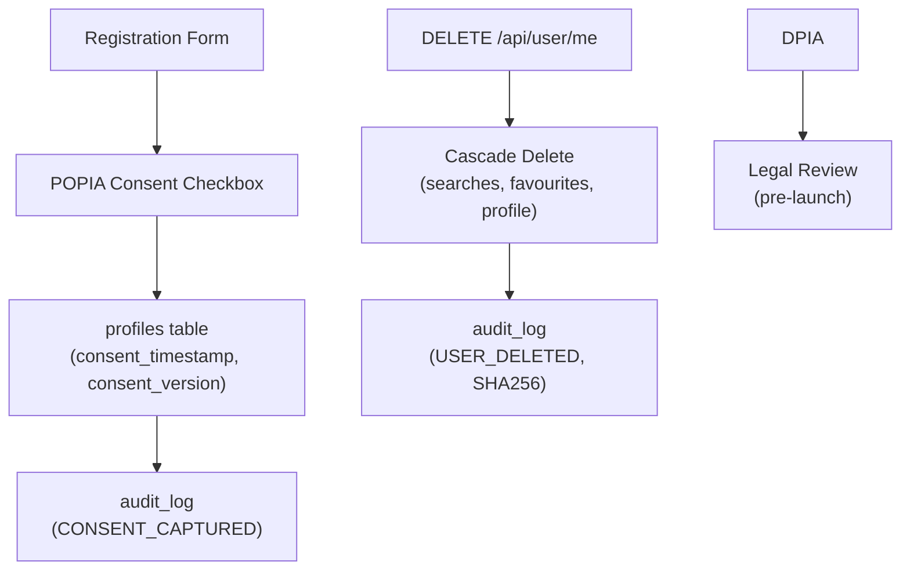
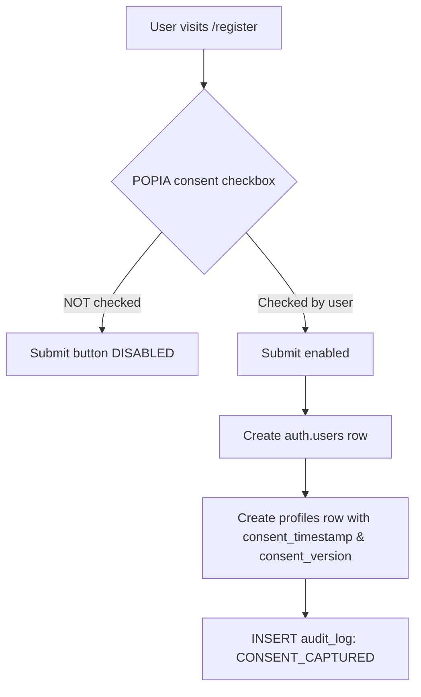
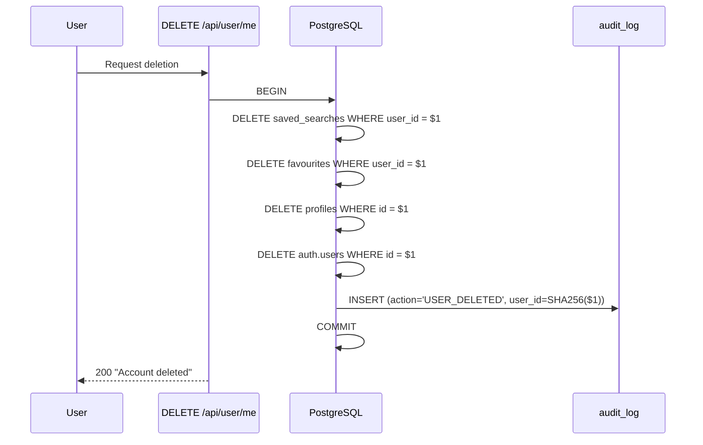

# POPIA Compliance Specification

> **TL;DR:** Implements South Africa's Protection of Personal Information Act (Act 4 of 2013) via data classification (PII/spatial/aggregate/audit), mandatory consent at registration (not pre-checked), 30-day deletion SLA with anonymised audit trail, cross-border transfer controls (Supabase eu-west-1), and a legally required DPIA before launch. RLS is the primary POPIA technical control.

| Field | Value |
|-------|-------|
| **Milestone** | M2 — Auth/RBAC/POPIA Consent + M15 — DPIA + Production Deploy |
| **Status** | Draft |
| **Depends on** | M1 (Database Schema) |
| **Architecture refs** | [SYSTEM_DESIGN](../architecture/SYSTEM_DESIGN.md) |

## Overview
This spec defines the platform's compliance with the Protection of Personal Information Act (Act 4 of 2013).
It covers data classification, consent, access controls, retention, deletion, and cross-border transfer.

## Component Hierarchy

## Data Source Badge (Rule 1)
- All data displays referencing personal data must show source badge
- GV Roll displays: `[CoCT GV Roll · 2022 · LIVE|CACHED|MOCK]` — with attribution that values are municipal, not market

## Three-Tier Fallback (Rule 2)
- N/A as a standalone concern — POPIA applies to all tiers equally
- CACHED and MOCK tiers must not contain PII unless encrypted and access-controlled
- `api_cache` entries containing PII must respect `expires_at` and be purged on user deletion

## Edge Cases
- **Double consent submit:** Idempotent — second submit updates `consent_timestamp` but does not create duplicate audit entry
- **Consent withdrawal:** User un-consents → account must be deactivated within 30 days; data deleted per deletion workflow
- **Partial deletion failure:** Transaction fails mid-cascade → ROLLBACK; retry; alert admin if persistent
- **Audit log retention vs deletion right:** Audit logs use SHA256(user_id) — not reversible PII; retained 7 years per regulatory requirement
- **Cross-border data request:** Law enforcement request from non-SA jurisdiction → escalate to Information Officer; do not auto-comply [ASSUMPTION — UNVERIFIED]
- **Minor's data:** Platform does not target users under 18 — add age confirmation at registration [ASSUMPTION — UNVERIFIED]

## Failure Modes

| Failure | User Experience | Recovery |
|---------|----------------|----------|
| Deletion endpoint timeout | "Deletion in progress" email sent | Retry within 30-day SLA |
| Consent version mismatch | Re-prompt on next login | User re-consents to updated policy |
| DPA with Supabase unsigned | Cannot launch to production | Legal escalation required |
| Audit log write failure | Deletion proceeds but audit missing | Alert admin; manual audit entry |

## Security Considerations
- RLS is the primary POPIA technical control — cross-tenant leaks are reportable breaches
- JWT 1h expiry + 30-min idle timeout minimise exposure window
- All data encrypted at rest (Supabase managed encryption) and in transit (TLS 1.3)
- `audit_log` is append-only — no UPDATE or DELETE permissions for any role except PLATFORM_ADMIN

## Performance Budget

| Metric | Target |
|--------|--------|
| Consent capture (registration) | < 500ms |
| Account deletion (full cascade) | < 10s |
| Audit log write | < 50ms |
| DPIA completion | Pre-launch requirement (not runtime) |

## Data Classification

| Category | Examples | POPIA Applies? | Controls |
|---|---|---|---|
| **PII (Personal)** | email, user ID, saved searches, favourites | ✅ Yes | RLS, encryption, 30-day deletion |
| **Spatial (Public)** | zoning polygons, suburb boundaries, flood zones | ❌ No | Open data — no restriction |
| **Spatial (Sensitive)** | Property owner names (if in GV Roll) | ✅ Yes | Strip on import, never store |
| **Aggregate** | Suburb avg price/m², zoning distribution | ❌ No | Derived from public data |
| **Audit** | Action logs, timestamps, anonymised user IDs | ⚠️ Partial | Retained 7 years, anonymised |

## POPIA Conditions Mapping

| # | Condition | Implementation |
|---|---|---|
| 1 | **Accountability** | Platform Admin as Information Officer; `audit_log` table |
| 2 | **Processing limitation** | Only collect email + role; no unnecessary data |
| 3 | **Purpose specification** | Consent text specifies: "property intelligence and spatial analysis" |
| 4 | **Further processing** | No selling or sharing user data with third parties |
| 5 | **Information quality** | GV Roll year disclosed; `_source` badge on all data |
| 6 | **Openness** | Privacy policy linked at registration; `consent_version` tracked in DB |
| 7 | **Security safeguards** | RLS, JWT 1h expiry (with 30-min idle timeout), TLS, encrypted at rest |
| 8 | **Data subject participation** | Access, correction, deletion within 30 days |

## Consent Flow

**Rules:**
- Checkbox MUST NOT be pre-checked (AC-30)
- Consent text: "I agree to the processing of my personal information for property intelligence and spatial analysis purposes in accordance with POPIA."
- `consent_timestamp` stored as `TIMESTAMPTZ` in `profiles` table
- `consent_version` stored as `TEXT` in `profiles` table to track the specific policy version accepted

## Deletion Workflow

**SLA:** 30 calendar days from request.
**Audit survival:** `audit_log` row uses `SHA256(user_id)` — no reversible PII.

## Cross-Border Transfer (Section 72)

| Transfer | Destination | Legal Basis | Status |
|---|---|---|---|
| User data → Supabase | eu-west-1 (London) | UK GDPR adequacy + signed DPA | ⏳ DPA pending |
| Tile cache (no PII) | CDN edge | Not PII — §72 N/A | ✅ |
| Audit logs (anonymised) | Encrypted S3 | Not PII — §72 N/A | ✅ |

## Vendor Policy Mapping (Location/Privacy Obligations)

| Vendor/Service | Location/Privacy Obligation | POPIA Control Mapping | Status |
|---|---|---|---|
| Google Maps tiles | Do not misuse location traces; preserve required attribution/terms | Minimize telemetry granularity, tenant-isolated logs, explicit notice in privacy docs | In progress `[PL]` |
| Cesium ion (+ third-party content) | Honor inherited third-party terms and privacy duties | Provider-aware policy checks + attribution compliance in UI/export | In progress `[PL]` |
| OpenSky | Public telemetry still sensitive when linked to persons | No de-anonymisation, role-gated emergency handling, tenant-isolated access logs | In progress `[PL][SI]` |
| AI providers (Anthropic/Gemini paths) | Provider-specific retention/training policy differences | Tenant-specific model routing policy + audit logs of model path decisions | In progress `[PL]` |

> Assumption note: jurisdiction-specific sufficiency of this mapping is `[ASSUMPTION — UNVERIFIED]` until legal counsel validates final control set.

## AI Evidence Boundary and POPIA
- AI reconstruction outputs are treated as analysis aids and must carry visible labels, provenance metadata, and human-review status.
- POPIA controls apply to the processing context around AI outputs (especially telemetry, linkage risk, and export logs), not only to base PII tables.
- [ASSUMPTION — UNVERIFIED] final evidentiary wording for specific legal proceedings requires counsel review.

## DPIA Requirement

> [!CAUTION]
> A **Data Protection Impact Assessment (DPIA)** is legally required before launching with paying tenants.
> This is not optional. Engage a POPIA legal consultant before MVP launch.

## Acceptance Criteria
- ✅ Consent checkbox not pre-checked; blocks submit when unchecked
- ✅ `consent_timestamp` stored in `profiles` table
- ✅ Deletion endpoint removes all user data within 30 days
- ✅ `audit_log` survives deletion with anonymised user ID
- ✅ RLS prevents cross-tenant data leakage (pgTAP test)
- ✅ GV Roll import strips any owner name columns
- ✅ DPA signed with Supabase before production launch
