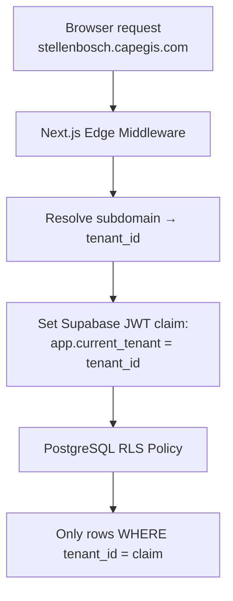

# Multi-Tenant Architecture

> **TL;DR:** Shared-schema multi-tenancy via `tenant_id` column on all tenant-scoped tables, enforced by RLS (`current_setting('app.current_tenant')`) and application-layer middleware. Tenants resolved from subdomains (`[slug].capegis.com`) in Next.js Edge Middleware. White-label branding (logo, colours, features) per tenant. PLATFORM_ADMIN sees all tenants; all other roles scoped to their own.

| Field | Value |
|-------|-------|
| **Milestone** | M1 — Database Schema + M12 — Multi-Tenant White-Labeling |
| **Status** | Draft |
| **Depends on** | M0 (Foundation) |
| **Architecture refs** | [ADR-005](../architecture/ADR-005-tenant-subdomains.md), [SYSTEM_DESIGN](../architecture/SYSTEM_DESIGN.md) |

## Overview
The platform uses a **shared-schema** multi-tenancy strategy. All tenants share the same PostgreSQL tables,
isolated by a `tenant_id` column and enforced by Row-Level Security (RLS) policies.

## Architecture Pattern



## Tenant Resolution

```typescript
// middleware.ts — runs on EVERY request
import { NextRequest, NextResponse } from 'next/server';

export function middleware(request: NextRequest) {
  const hostname = request.headers.get('host') || '';
  const subdomain = hostname.split('.')[0]; // e.g., 'stellenbosch'

  // Look up tenant by slug
  // In production: cache this lookup in Edge Config or KV
  const response = NextResponse.next();
  response.headers.set('x-tenant-slug', subdomain);
  return response;
}
```

## External System Tenant-Claim Mapping (Cycle 1)

External systems (e.g., ERP/workflow sidecars) must map into the existing trust model without replacing it:

1. Subdomain-resolved tenant remains authoritative for request context.
2. External claims must match `tenant_id` used by app/session and DB RLS checks.
3. No external integration may bypass `current_setting('app.current_tenant', TRUE)::uuid` policy enforcement.
4. Cross-tenant operations remain break-glass-only and auditable.

This keeps external integration API/event-driven while preserving existing tenant boundary guarantees.

*(Source: `docs/research/swarm-frappe-spatial-integrations.md`, `docs/architecture/swarm-architecture-insights-cycle1.md`)*

## RLS Policy Template

```sql
-- Applied to EVERY tenant-scoped table
CREATE POLICY "tenant_isolation" ON saved_searches
  FOR ALL
  USING (
    tenant_id = (
      SELECT tenant_id FROM profiles WHERE id = auth.uid()
    )
  );
```

**Tables requiring this policy:** `profiles`, `saved_searches`, `favourites`, `valuation_data` (if tenant-partitioned), `sync_queue`.

**Tables NOT requiring tenant-row filters by default:** `tenants` (platform admin only), `suburbs_metadata` (public reference data). `audit_log` and `api_cache` still require tenant-attributed partition keys and strict access controls.

## Tenant Configuration

```typescript
interface TenantConfig {
  id: string;
  slug: string;                    // subdomain: 'stellenbosch', 'capetown'
  name: string;                    // Display: 'Stellenbosch Estate Agency'
  logoUrl: string;                 // Supabase Storage path
  primaryColor: string;            // Hex: '#1B5E20'
  mapStyle?: string;               // Optional custom MapLibre style JSON URL
  defaultCenter: [number, number]; // [lng, lat]
  defaultZoom: number;
  features: {
    drawTools: boolean;
    pdfExport: boolean;
    analyticsTab: boolean;
  };
}
```

## RBAC × Multi-Tenancy Matrix

| Role | Can see own tenant data | Can see other tenant data | Can manage tenant users |
|---|:-:|:-:|:-:|
| PLATFORM_ADMIN | ✅ | Break-glass only (audited) | ✅ (all tenants) |
| TENANT_ADMIN | ✅ | ❌ | ✅ (own tenant) |
| POWER_USER | ✅ | ❌ | ❌ |
| ANALYST | ✅ | ❌ | ❌ |
| VIEWER | ✅ (limited) | ❌ | ❌ |
| GUEST | ❌ (public layers only) | ❌ | ❌ |

## Break-Glass Approval Workflow

PLATFORM_ADMIN cross-tenant access is break-glass only. The following steps MUST be followed:

### Step-by-Step Protocol

1. **Initiate Request**: PLATFORM_ADMIN submits a break-glass request via internal ticketing system (Jira/Linear), including:
   - Tenant ID and slug being accessed
   - Specific data or table being queried
   - Business justification (incident ID, legal request, support escalation)
   - Estimated access duration

2. **Dual Approval**: Requires approval from two of:
   - Second PLATFORM_ADMIN (if available)
   - CTO or Engineering Lead
   - Legal Officer (for POPIA-relevant access)

3. **Time-Limited Token**: Issue a time-limited service_role token with a maximum 4-hour expiry, scoped to the specific operation.

4. **Audit Log Entry (Immutable)**: Before access, create an audit entry:
   ```sql
   INSERT INTO audit_log (tenant_id, user_id, action, table_name, record_id, new_data)
   VALUES (
     '<target_tenant_id>',
     '<platform_admin_user_id>',
     'BREAK_GLASS_ACCESS',
     '<target_table>',
     gen_random_uuid(),
     jsonb_build_object(
       'reason', '<ticket_id>',
       'approved_by', '<approver_ids>',
       'expires_at', now() + interval '4 hours'
     )
   );
   ```

5. **Notify Tenant Admin**: Send email notification to tenant's TENANT_ADMIN that break-glass access occurred, including ticket reference.

6. **Revoke Token**: After operation completes (or at expiry), revoke the service_role token.

7. **Post-Access Report**: Within 48 hours, provide report of what data was accessed, changes made (if any), and outcome.

### POPIA Implications
- Break-glass access is a POPIA-relevant event (cross-organizational data access)
- Must be logged in `audit_log` with `action = 'BREAK_GLASS_ACCESS'`
- Tenant must be notified (§18 Openness obligation)
- If data was a reportable breach trigger, notify the Information Regulator within 72 hours

### What Constitutes Break-Glass
- Any query that bypasses RLS using service_role
- Any cross-tenant join or union
- Any modification of another tenant's data
- Any read of `profiles` or `audit_log` for a different tenant

## Data Source Badge (Rule 1)
- Tenant branding does not display external data — N/A for badge
- All data layers within tenant context inherit their own source badges

## Three-Tier Fallback (Rule 2)
- Tenant resolution itself is not a three-tier data source
- However, `api_cache` is tenant-scoped — cache entries include `tenant_id` in composite key
- If tenant lookup fails: redirect to `capegis.com` landing page (not a blank page)

## Edge Cases
- **Unknown subdomain:** `unknown.capegis.com` → redirect to `capegis.com` with "Tenant not found" message
- **Tenant deactivated:** Tenant admin deactivates account → middleware returns 403 for all tenant users
- **Subdomain collision:** Two tenants request same slug → enforce uniqueness at DB level (`UNIQUE` constraint on `tenants.slug`)
- **PLATFORM_ADMIN cross-tenant query:** Break-glass only, with approved reason code, `service_role` execution, and immutable audit entry
- **JWT tenant_id mismatch:** JWT claims `tenant_id` differs from subdomain-resolved tenant → reject with 403
- **Tenant data migration:** Moving a tenant between subdomains → update `tenants.slug`; invalidate all active JWTs

## Failure Modes

| Failure | User Experience | Recovery |
|---------|----------------|----------|
| Tenant lookup service down | "Service unavailable" page | Retry with exponential backoff; fall back to cached tenant config |
| Tenant DB config corrupted | Default branding shown | Alert PLATFORM_ADMIN; load defaults |
| Subdomain DNS not propagated | Browser shows DNS error | Wait for propagation (24-48h); provide IP-based fallback [ASSUMPTION — UNVERIFIED] |

## Tenant Isolation Risk Treatment (Cycle 1 Alignment)
- Tenant isolation is treated as a high-severity risk domain; suspected cross-tenant exposure is an incident, not a bug backlog item.
- Platform-wide analytics must use aggregated/de-identified outputs unless break-glass approval is documented.
- [ASSUMPTION — UNVERIFIED] exact break-glass approval workflow tooling is pending implementation detail.

## Security Considerations
- RLS on every tenant-scoped table + application layer verifies `tenant_id` from session (dual-layer)
- Canonical RLS pattern: `current_setting('app.current_tenant', TRUE)::uuid`
- `tenants` table: PLATFORM_ADMIN access only — no tenant user can read other tenants' configs
- White-label tokens stored in `tenant_settings` — not exposed to client except own tenant's branding

## POPIA Implications
- Tenant isolation is a POPIA control — cross-tenant leaks are reportable breaches
- Each tenant's data is subject to POPIA independently (each tenant may be a separate responsible party)
- Tenant deactivation must trigger data retention workflow (not immediate deletion)

## Tenant-Isolated Telemetry Retention (Cycle 1 Delta)

| Telemetry Class | Partition Key | Retention Baseline | POPIA/Policy Note |
|---|---|---|---|
| Map tile access logs | `tenant_id` | 30–90 days operational window | No cross-tenant analytics joins without explicit authorization |
| AI routing/model decision logs | `tenant_id` + `model_provider` | Provider-policy aware window | Needed for proving compliant model path selection `[PL]` |
| OpenSky polling telemetry | `tenant_id` + `source_mode` | Short operational retention + aggregated metrics | Required for commercialization/audit defensibility |
| Security/audit events | `tenant_id` + hashed actor ID | 7 years (audit/legal) | Keep immutable and access-controlled |

- Mandatory: retention jobs, dashboards, and exports must enforce tenant partition filters first.
- [ASSUMPTION — UNVERIFIED] exact duration per telemetry class may change after legal/security review.

## Performance Budget

| Metric | Target |
|--------|--------|
| Tenant resolution (middleware) | < 10ms |
| Tenant config load (branding) | < 100ms |
| Tenant provisioning (end-to-end) | < 5 minutes |
| RLS policy evaluation overhead | < 5ms per query |

## Acceptance Criteria
- ✅ Subdomain routing resolves correct `tenant_id` in middleware
- ✅ RLS prevents cross-tenant data access (pgTAP test: 0 rows returned)
- ✅ Tenant branding (logo, color) renders correctly per subdomain
- ✅ PLATFORM_ADMIN can query across all tenants
- ✅ New tenant can be provisioned via admin dashboard in < 5 minutes
