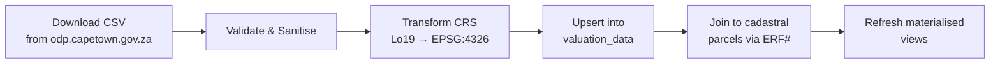

# GV Roll Data Ingestion

> **TL;DR:** Imports ~830,000 City of Cape Town General Valuation Roll records from CSV/Excel via a scripted pipeline: download → validate & strip PII (owner names) → transform CRS (Lo19 → EPSG:4326) → upsert into `valuation_data` → join to cadastral parcels via ERF# → refresh materialised views. Source: CoCT GV Roll 2022. No Lightstone data (Rule 8).

| Field | Value |
|-------|-------|
| **Milestone** | M6 — GV Roll 2022 Import |
| **Status** | Draft |
| **Depends on** | M1 (Database Schema), M4b (Martin MVT for display) |
| **Architecture refs** | [SYSTEM_DESIGN](../architecture/SYSTEM_DESIGN.md) |

## Overview
The City of Cape Town General Valuation Roll is a periodic bulk dataset (~830,000 property records).
It is downloaded as CSV/Excel and imported into the `valuation_data` table via a scripted pipeline.

## Data Source Badge (Rule 1)
- All valuation displays: `[CoCT GV Roll · 2022 · LIVE|CACHED|MOCK]`
- Badge visible without hovering on property detail panels and aggregate views
- Attribution string required: "Based on City of Cape Town General Valuation Roll [YEAR]. Municipal valuations for rating purposes only — not market value estimates."

## Three-Tier Fallback (Rule 2)
- **LIVE:** PostGIS `valuation_data` table via Supabase RPC
- **CACHED:** `api_cache` with 30-day TTL (GV Roll data rarely changes)
- **MOCK:** Static mock valuations for 5 seed suburbs in `public/mock/gv_roll.geojson`

## Edge Cases
- **Duplicate ERF numbers:** Some ERF numbers appear multiple times (sectional title) → handle as multiple records per ERF
- **Missing coordinates:** ~5-10% of records may lack coordinates → join to cadastral parcels via ERF#; log unmatched
- **Lo19 → WGS84 precision:** CRS transform may introduce sub-metre drift → acceptable for property-level display
- **Zero-value properties:** Municipal value of R0 → valid (exempt properties); do not filter out
- **Negative values:** Invalid → reject row; log to import error report
- **Non-numeric ERF:** ERF contains letters or special chars → reject row; log
- **GV Roll schema change:** Column names differ between valuation cycles → validate schema before import; fail fast

## Failure Modes

| Failure | Impact | Recovery |
|---------|--------|----------|
| Source CSV download fails | No new data imported | Retry; use existing data (annual cycle, not urgent) |
| CRS transform error | Coordinates placed outside bbox | `ST_Within` check post-import; reject out-of-bounds |
| ERF join success < 95% | Missing parcel geometries | Log unmatched ERFs; investigate with CoCT data team |
| Import script OOM | Partial import | Use streaming/batched import (10K rows per batch) |

## Security Considerations
- GV Roll contains property owner names — MUST be stripped before insert (POPIA)
- Import script runs with `service_role` key — never expose to client
- `valuation_data` table has RLS: tenant isolation via `tenant_id` column
- Import logs (with error rows) must not contain PII — log ERF numbers only

## Performance Budget

| Metric | Target |
|--------|--------|
| Full import (830K records) | < 30 minutes |
| Batch size | 10,000 rows |
| Materialised view refresh | < 60s |
| Single property valuation query | < 200ms |

## POPIA Implications (Rule 5)

```typescript
/**
 * POPIA ANNOTATION
 * Personal data handled: Property owner names (stripped on import, never stored)
 * Purpose: Property valuation display for spatial analysis
 * Lawful basis: Legitimate interests (public municipal data)
 * Retention: Duration of valuation cycle (4 years)
 * Subject rights: access ✓ | correction ✓ | deletion ✓ | objection ✓
 */
```

## Pipeline



## Step 1: Download
- Source: `https://odp.capetown.gov.za` → search "General Valuation Roll"
- Format: CSV or Excel
- Frequency: After each formal valuation cycle (roughly every 4 years; supplementary rolls annually)

## Step 2: Validate & Sanitise

```typescript
// scripts/import-gv-roll.ts
function sanitiseRow(row: RawGVRollRow): CleanGVRollRow | null {
  // POPIA: Strip any PII columns
  if ('owner_name' in row) delete row.owner_name;
  if ('owner_email' in row) delete row.owner_email;

  // Validate ERF number format
  if (!row.erf_no || !/^\d+$/.test(row.erf_no.trim())) return null;

  // Validate coordinates are within Cape Town Metro bbox
  if (row.lat && row.lng) {
    if (row.lat < -34.3577 || row.lat > -33.4836) return null;  // Outside Metro
    if (row.lng < 18.3252 || row.lng > 19.0186) return null;
  }

  // Parse ZAR values (remove "R" prefix, spaces, commas)
  row.city_valuation_zar = parseZAR(row.total_value);

  return row;
}

function parseZAR(value: string): number {
  return parseInt(value.replace(/[R\s,]/g, ''), 10);
}
```

## Step 3: Coordinate Transform

```sql
-- If source data is in Lo19 (EPSG:22279), transform to WGS84
INSERT INTO valuation_data (parcel_id, suburb, zone_code, city_valuation_zar, coordinates)
SELECT
  erf_no,
  suburb,
  zone_code,
  total_value::integer,
  ST_Transform(ST_SetSRID(ST_MakePoint(x, y), 22279), 4326)
FROM staging_gv_roll
WHERE x IS NOT NULL AND y IS NOT NULL;
```

## Step 4: ERF Number Join

```sql
-- Join GV Roll valuations to cadastral parcel geometries
UPDATE valuation_data v
SET coordinates = c.geom
FROM cadastral_parcels c
WHERE v.parcel_id = c.erf_no
  AND v.coordinates IS NULL;  -- Only fill in missing coordinates
```

## Step 5: Refresh Materialised Views

```sql
REFRESH MATERIALIZED VIEW CONCURRENTLY suburbs_avg_price;
REFRESH MATERIALIZED VIEW CONCURRENTLY zone_distribution;
```

## Attribution Requirement
All valuation displays MUST include:
> "Based on City of Cape Town General Valuation Roll [YEAR]. Municipal valuations for rating purposes only — not market value estimates."

## Acceptance Criteria
- ✅ Import script strips any `owner_name` / PII columns before insert
- ✅ All coordinates within Cape Town Metro bbox (PostGIS `ST_Within` check)
- ✅ ERF numbers match between GV Roll and cadastral parcels (join success rate > 95%)
- ✅ ZAR values parse correctly (no NaN, no negatives)
- ✅ Attribution string present on all valuation displays
- ✅ Materialised views refresh after import
- ✅ Data source badge `[CoCT GV Roll · 2022 · LIVE]` on all valuation displays
- ✅ Three-tier fallback: PostGIS → api_cache (30-day TTL) → mock GeoJSON
- ✅ Full import completes in < 30 minutes for 830K records
- ✅ No Lightstone data used (Rule 8 compliance)
