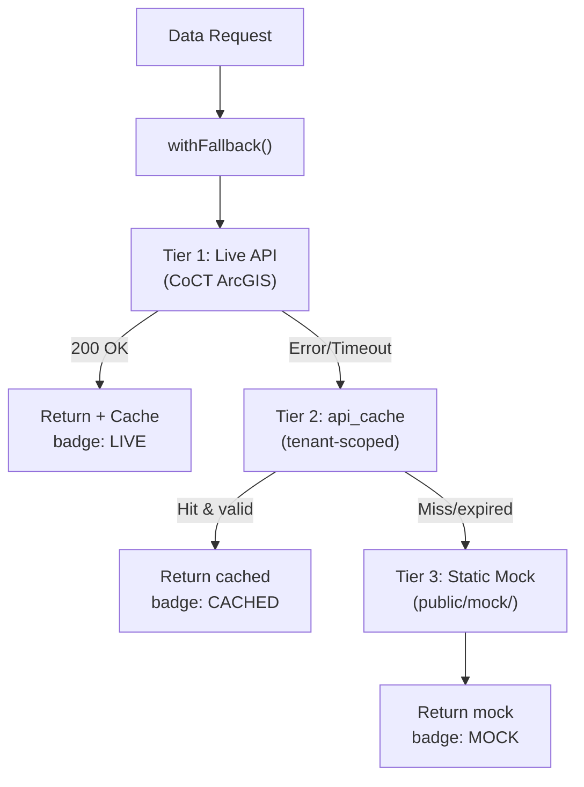
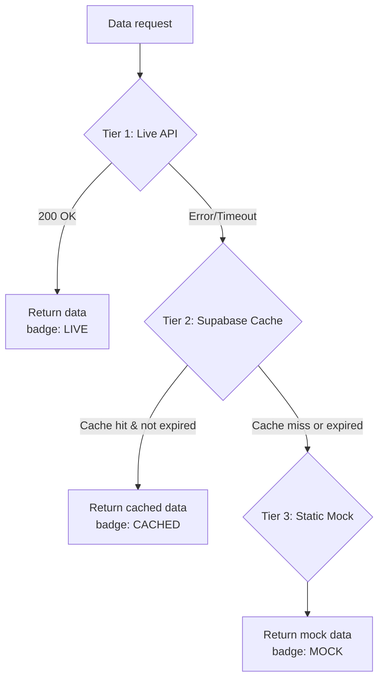

# ArcGIS Three-Tier Fallback Strategy

> **TL;DR:** Every external data service implements `LIVE → CACHED → MOCK` with mandatory `[SOURCE · YEAR · STATUS]` badges. LIVE hits CoCT ArcGIS; CACHED reads from tenant-scoped `api_cache` table (RLS-enforced, 1-hour TTL, pg_cron hourly sweep); MOCK serves static GeoJSON with `MOCK-` prefixed IDs from 5 seed suburbs. Rate-limited/timeout responses fall to cache immediately.

| Field | Value |
|-------|-------|
| **Milestone** | M4a — Three-Tier Fallback |
| **Status** | Draft |
| **Depends on** | M1 (Database Schema + `api_cache` table) |
| **Architecture refs** | [SYSTEM_DESIGN](../architecture/SYSTEM_DESIGN.md) |

## Overview
Every data service that fetches from an external API MUST implement the three-tier fallback pattern.
This ensures the platform remains functional even when City of Cape Town ArcGIS services are down.

## Component Hierarchy



## Edge Cases
- **Stale cache served during outage:** Cache TTL extended by 2x during ArcGIS outage to prevent premature fallback to MOCK [ASSUMPTION — UNVERIFIED]
- **Partial API response:** ArcGIS returns 200 but with truncated features → validate response has expected fields before caching
- **Cache stampede:** Multiple requests hit expired cache simultaneously → use mutex/lock on cache refresh; others wait
- **Tenant A and B query same bbox:** Each gets separate cache entries (tenant-scoped) — cache duplication is acceptable for isolation
- **Mock data for unknown area:** User pans outside seed suburbs in MOCK mode → show "No mock data available for this area" toast
- **Rate limit (429):** Immediately fall to Tier 2 — do NOT retry against rate-limited endpoint

## Failure Modes

| Failure | User Experience | Recovery |
|---------|----------------|----------|
| ArcGIS endpoint moved (404) | Fall to CACHED, then MOCK | Log to Sentry; investigate new URL via Open Data Hub |
| ArcGIS schema change | Live response parsing fails | Fall to CACHED; alert admin |
| pg_cron sweep fails | Cache table grows unbounded | Monitor table size; manual sweep |
| Mock GeoJSON file missing | Tier 3 returns empty | CI validates mock files exist |

## Security Considerations
- `api_cache` has RLS: tenants can only read their own cached data
- ArcGIS query parameters sanitised against injection
- `tenant_id` in cache composite key prevents cross-tenant data leakage (even for public data — protects query patterns)
- Mock data contains no PII — `MOCK-` prefixed parcel IDs only

## Performance Budget

| Metric | Target |
|--------|--------|
| LIVE response (ArcGIS) | < 3s (external dependency) |
| CACHED response (api_cache) | < 100ms |
| MOCK response (static file) | < 50ms |
| Cache write (upsert) | < 100ms |
| pg_cron sweep (hourly) | < 5s |

## POPIA Implications
- ArcGIS data is public municipal information — no PII in responses
- However, cache entries reveal which areas a tenant is researching — tenant isolation enforced via RLS
- Mock data contains no PII

## Pattern



## Implementation Template

```typescript
// lib/data/withFallback.ts — Generic fallback wrapper

export type DataSource = 'LIVE' | 'CACHED' | 'MOCK';

export interface FallbackResult<T> {
  data: T;
  _source: DataSource;
  _fetchedAt: string;  // ISO 8601
}

export async function withFallback<T>(
  liveFn: () => Promise<T>,
  cacheKey: string,
  mockFn: () => T,
  tenantId: string,  // REQUIRED — prevents cross-tenant cache leakage
): Promise<FallbackResult<T>> {

  // Tenant-scoped cache key — prevents Tenant A's cache serving Tenant B
  const scopedKey = `${tenantId}:${cacheKey}`;

  // TIER 1: Live API
  try {
    const data = await liveFn();
    // Cache the successful response (tenant-scoped)
    await supabase.from('api_cache').upsert({
      cache_key: scopedKey,
      tenant_id: tenantId,
      response_json: data,
      expires_at: new Date(Date.now() + 3600_000).toISOString(), // 1 hour TTL
    });
    return { data, _source: 'LIVE', _fetchedAt: new Date().toISOString() };
  } catch (liveError) {
    console.warn('[Fallback] Live API failed:', liveError);
  }

  // TIER 2: Supabase Cache (tenant-scoped)
  const { data: cached } = await supabase
    .from('api_cache')
    .select('response_json')
    .eq('cache_key', scopedKey)
    .eq('tenant_id', tenantId)  // Enforce tenant isolation
    .gt('expires_at', new Date().toISOString())
    .single();

  if (cached) {
    return { data: cached.response_json as T, _source: 'CACHED', _fetchedAt: new Date().toISOString() };
  }

  // TIER 3: Static Mock
  const mockData = mockFn();
  return { data: mockData, _source: 'MOCK', _fetchedAt: new Date().toISOString() };
}
```

## UI Badge Display

| Badge | Colour | Meaning |
|---|---|---|
| `[LIVE]` | 🟢 Green | Real-time data from CoCT ArcGIS |
| `[CACHED]` | 🟡 Amber | Data from Supabase cache (up to 1h old) |
| `[MOCK]` | 🔴 Red | Static placeholder — not real data |

**Badge placement:** Bottom-right corner of the map layer panel, next to the layer name.

## Cache Table (Tenant-Scoped)

> [!IMPORTANT]
> **`tenant_id` is included in the cache table to prevent cross-tenant data leakage.**
> Even though ArcGIS data is public, caching without tenant isolation exposes query patterns
> (which areas a tenant researches). The composite primary key ensures each tenant has its own cache space.

```sql
CREATE TABLE api_cache (
  cache_key TEXT NOT NULL,           -- tenant_id:SHA256(request_params)
  tenant_id UUID NOT NULL REFERENCES tenants(id),
  response_json JSONB NOT NULL,
  bbox GEOMETRY(Polygon, 4326),      -- Spatial index for bbox-based lookups
  expires_at TIMESTAMPTZ NOT NULL,
  created_at TIMESTAMPTZ DEFAULT now(),
  PRIMARY KEY (cache_key, tenant_id) -- Composite key: tenant-scoped
);

CREATE INDEX idx_api_cache_expires ON api_cache (expires_at);
CREATE INDEX idx_api_cache_bbox ON api_cache USING GIST (bbox);
CREATE INDEX idx_api_cache_tenant ON api_cache (tenant_id);

-- RLS: tenants can only read their own cache
ALTER TABLE api_cache ENABLE ROW LEVEL SECURITY;
CREATE POLICY "tenant_cache_isolation" ON api_cache
  FOR ALL USING (tenant_id = (SELECT tenant_id FROM profiles WHERE id = auth.uid()));
```

## Cache TTL Sweep (Prevent Unbounded Growth)

```sql
-- Run via pg_cron every hour
SELECT cron.schedule('cache-ttl-sweep', '0 * * * *',
  $$DELETE FROM api_cache WHERE expires_at < now()$$
);
```

## Rate-Limit Handling
- ArcGIS services may return 429 (Too Many Requests) or slow responses.
- On 429: immediately fall to Tier 2 (cache). Do NOT retry.
- On timeout (>5s): fall to Tier 2.
- Log all fallback events to Sentry for monitoring external API reliability.

## Mock Data Requirements
- All mock GeoJSON files live in `src/data/mock/`.
- Every mock feature MUST have `parcel_id` prefixed with `MOCK-`.
- Mock data covers 5 seed suburbs: Woodstock, Sea Point, Bellville, Constantia, Atlantis.

## Acceptance Criteria
- ✅ Fallback chain works: Live → Cached → Mock
- ✅ `_source` badge displayed on every data layer
- ✅ Cache TTL enforced (expired entries not served)
- ✅ Bounding box enforced on all outbound ArcGIS queries
- ✅ Mock badge shown when using placeholder data
- ✅ Mock parcel IDs all start with `MOCK-` prefix
- ✅ Cache is tenant-scoped (Tenant A's cache never served to Tenant B)
- ✅ RLS policy on `api_cache` prevents cross-tenant reads
- ✅ `pg_cron` TTL sweep runs hourly to prevent table bloat
