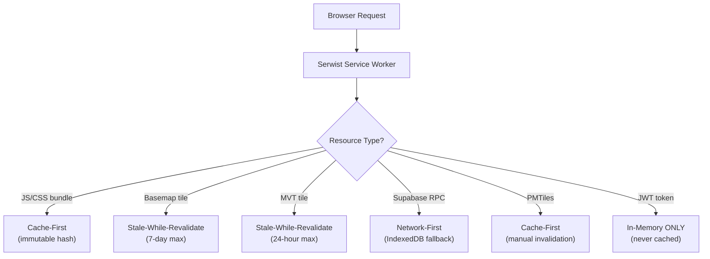

# Background Sync & Service Worker Strategy

> **TL;DR:** Serwist (maintained Workbox fork for Next.js 15 App Router) manages resource caching: cache-first for immutable JS/CSS, stale-while-revalidate for basemap/MVT tiles, network-first for Supabase RPC. JWT tokens never cached to disk. 24-hour security lockout on extended offline. iOS fallback via `visibilitychange` manual sync. PWA installable on Chrome and Safari.

| Field | Value |
|-------|-------|
| **Milestone** | M4c — Serwist PWA / Offline |
| **Status** | Draft |
| **Depends on** | M3 (MapLibre Base Map), M2 (Auth) |
| **Architecture refs** | [SYSTEM_DESIGN](../architecture/SYSTEM_DESIGN.md) |

## Overview
This spec defines the Serwist (service worker) configuration, caching strategies per resource type,
the 24-hour security lockout rule, and iOS fallback handling for the PWA.

## Component Hierarchy



## Data Source Badge (Rule 1)
- Service worker caching affects badge state:
  - Serving from network: `[SOURCE · YEAR · LIVE]`
  - Serving from Serwist cache: `[SOURCE · YEAR · CACHED]`
  - Serving from static mock: `[SOURCE · YEAR · MOCK]`

## Three-Tier Fallback (Rule 2)
- Service worker is the caching infrastructure for Tier 2 (CACHED)
- Serwist stale-while-revalidate ensures CACHED tiles are always available
- If cache is empty and network is down: fall through to MOCK static files

## Edge Cases
- **Service worker update:** New version deployed → `skipWaiting` + `clientsClaim` to activate immediately; stale cache entries invalidated
- **Cache storage full:** Browser evicts old caches → Serwist handles gracefully with LRU eviction
- **iOS 50MB cache limit:** PMTiles (50-200MB) cannot fit in iOS cache → store in IndexedDB; warn iOS users
- **iOS 7-day eviction:** Safari evicts service worker after 7 days of inactivity → re-register on next visit; re-cache tiles
- **Background Sync not supported (iOS):** `visibilitychange` fallback for manual sync prompt
- **Multiple tabs:** Service worker shared across tabs — avoid race conditions on cache writes

## Security Considerations
- JWT tokens **never** persisted to Cache Storage or IndexedDB — in-memory only
- 24-hour lockout: if `lastSyncTimestamp` > 24h ago, force re-authentication before showing cached data
- If JWT verification fails after lockout: purge all cached data, clear sync queue, show login screen
- Service worker scope: `/` — intercepts all routes; auth routes excluded from caching

## Performance Budget

| Metric | Target |
|--------|--------|
| Stale tile serve (from cache) | < 50ms |
| Background revalidation | < 2s |
| Service worker boot | < 100ms |
| PWA install prompt render | < 500ms |
| Storage quota warning threshold | 80% |

## POPIA Implications
- Cached Supabase RPC responses may contain PII → encrypted at rest by browser (OS-level)
- On user logout: clear all Serwist caches containing tenant-specific data
- JWT tokens in-memory only — no POPIA concern for token storage
- IndexedDB offline data subject to POPIA deletion requirements

## Service Worker: Serwist

**Why Serwist?** It's a maintained fork of Google Workbox, with first-class support for Next.js 15 App Router.
The original Workbox plugins don't support the RSC architecture.

## Caching Strategies

| Resource Type | Strategy | Max Age | Storage | Rationale |
|---|---|---|---|---|
| Next.js JS/CSS bundles | **Cache-first** (immutable hash) | Indefinite | Cache Storage | Hashed filenames = safe to cache forever |
| CartoDB basemap tiles | **Stale-while-revalidate** | 7 days | Cache Storage | User sees tile instantly; fresh version loads in background |
| Martin MVT tiles (viewport) | **Stale-while-revalidate** | 24 hours | Cache Storage | Dynamic tiles change more frequently |
| Supabase RPC responses | **Network-first**, IndexedDB fallback | Per `api_cache` TTL | IndexedDB | Prefer fresh data; fall back to local |
| GV Roll property attributes | **Network-first**, IndexedDB fallback | 30 days | IndexedDB | Rarely changes (annual cycle) |
| PMTiles archives | **Cache-first** | Until manually invalidated | IndexedDB | Large files (50–200MB); don't re-download |
| Auth tokens (JWT) | **In-memory ONLY — never cached** | 1 hour | Memory | Security: tokens must never persist to disk |

## Stale-While-Revalidate Flow

```
User pans map → tile request
  └─ Serwist intercepts
       ├─ RETURN cached tile immediately (user sees tile with zero wait)
       └─ FETCH updated tile from Martin in background
            └─ Next render uses the fresh tile (silent update)
```

On a 5 Mbps connection: the user sees tiles instantly instead of a loading spinner.

## PWA Manifest Requirements

```json
{
  "name": "Cape Town GIS Hub",
  "short_name": "CT GIS",
  "start_url": "/",
  "display": "standalone",
  "theme_color": "#0f172a",
  "background_color": "#0f172a",
  "icons": [
    { "src": "/icons/icon-192.png", "sizes": "192x192", "type": "image/png" },
    { "src": "/icons/icon-512.png", "sizes": "512x512", "type": "image/png" }
  ]
}
```

## 24-Hour Security Lockout

```mermaid
flowchart TD
    A["App comes to foreground<br/>(visibilitychange event)"] --> B{"lastSyncTimestamp<br/>> 24 hours ago?"}
    B -->|No| C["Continue normally"]
    B -->|Yes| D["Force re-authentication"]
    D --> E{"JWT valid?"}
    E -->|Yes| F["Update lastSyncTimestamp<br/>Resume app"]
    E -->|No (user revoked)| G["Purge cached data<br/>Clear sync queue<br/>Show login screen"]
```

**Why 24 hours?** Balances offline usability (field workers need at least a day) with security (revoked users can't access cached data indefinitely).

## iOS Limitations

> [!WARNING]
> **Safari/iOS does NOT support Background Sync API.**
> Also: iOS limits service worker cache to ~50MB and may evict after 7 days of inactivity.

**Fallback for iOS:**
1. On `visibilitychange` (app comes to foreground), check for pending sync items.
2. Show a toast: "You have X pending changes. Tap to sync."
3. Manual retry on user action.

## Quota Monitoring

```typescript
// Check available storage before caching large files
if ('storage' in navigator && 'estimate' in navigator.storage) {
  const { usage, quota } = await navigator.storage.estimate();
  const usedPct = ((usage || 0) / (quota || 1)) * 100;

  if (usedPct > 80) {
    showWarning('Storage is nearly full. Offline map tiles may be evicted.');
  }
}
```

## Acceptance Criteria
- ✅ Service worker intercepts all map tile requests
- ✅ Stale-while-revalidate serves cached tiles with zero visible delay
- ✅ JWT tokens are NEVER persisted to Cache Storage or IndexedDB
- ✅ 24-hour lockout triggers re-authentication
- ✅ iOS fallback shows manual sync prompt
- ✅ Storage quota warning appears at 80% usage
- ✅ PWA installs on Chrome (Desktop + Android) and Safari (iOS)
