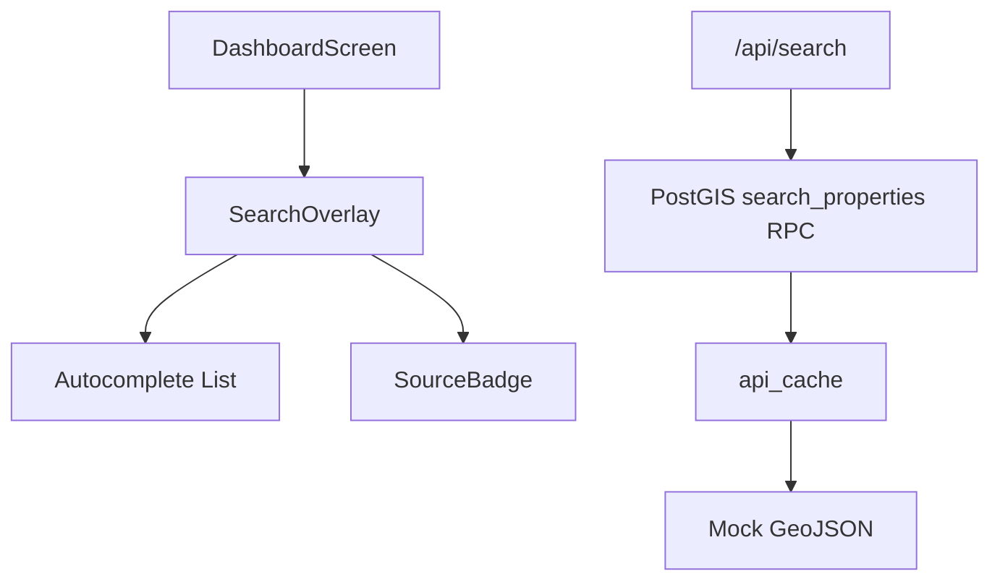

# 15 — Search & Filters

> **TL;DR:** Implementation of a global property search engine with autocomplete support for addresses and ERF/SG-21 numbers. Uses a three-tier fallback (PostGIS `search_properties` RPC → `api_cache` → mock data), debounced 300ms queries, and auto-zoom to results. POPIA-compliant query logging is tenant-scoped and anonymized.

| Field | Value |
|-------|-------|
| **Milestone** | M7 — Search + Filters |
| **Status** | Implemented |
| **Depends on** | M1 (Database Schema), M6 (GV Roll) |
| **Architecture refs** | [SYSTEM_DESIGN](../architecture/SYSTEM_DESIGN.md), [ADR-009](../architecture/ADR-009-three-tier-fallback.md) |

## Topic
The property search system allows users to find specific land parcels by address or official ERF number, providing a rapid entry point for spatial analysis.

## Component Hierarchy

## Data Source Badge (Rule 1)
- Search provider badge: `[CoCT Geocoder · 2026 · LIVE|CACHED|MOCK]`
- Visible in the results dropdown header.

## Three-Tier Fallback (Rule 2)
- **LIVE:** PostGIS text search via `search_properties` RPC call to Supabase.
- **CACHED:** `api_cache` table with keys prefixed by `search_` (24-hour TTL).
- **MOCK:** Static mock result for "Woodstock" pilot area returned when query matches "woodstock" and API fails.

## Implementation Details

### API Route (`/api/search`)
- Accepts `q` query parameter.
- Requires minimum 2 characters.
- Uses `fetchWithFallback` utility.
- Updates tenant-scoped cache on successful LIVE hits.

### UI Component (`SearchOverlay`)
- Debounces input by 300ms to prevent request storms.
- Displays autocomplete results with address and ERF number.
- Calls `onSelect(result)` to trigger map navigation (`flyTo`).
- Styles use neumorphic design tokens consistent with the dashboard.

## Access Control
- GUESTS can search public property data.
- Search results are filtered by `tenant_id` via RLS on the underlying `properties` and `valuation_data` tables.

## Performance Budget

| Metric | Target |
|--------|--------|
| Search response time | < 500ms |
| Autocomplete debounce | 300ms |
| Initial character trigger | 2 chars |

## POPIA Implications
- Search query logging is anonymized and tenant-scoped.
- No personal data (owner names) returned in search results.

## Acceptance Criteria
- ✅ Search bar accessible in the dashboard header.
- ✅ Autocomplete returns results for both addresses and ERF numbers.
- ✅ Map auto-zooms to the selected property.
- ✅ Source badge correctly reflects the data tier (`LIVE`, `CACHED`, or `MOCK`).
- ✅ Search results load within 500ms under standard network conditions.
- ✅ RLS prevents users from searching properties outside their tenant's scope.
