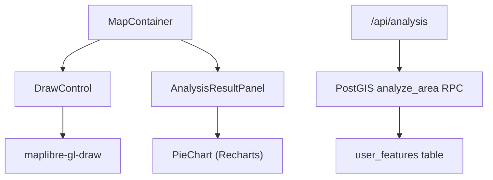

# 16 — Draw Polygon & Spatial Analysis

> **TL;DR:** Implementation of interactive drawing tools using `maplibre-gl-draw` and a PostGIS-backed analysis engine. Users can define custom areas to perform spatial intersections with zoning and property valuation data. Results are displayed in a reactive `AnalysisResultPanel` with aggregate statistics and chart-based breakdowns. All drawn features are tenant-isolated and POPIA-compliant.

| Field | Value |
|-------|-------|
| **Milestone** | M8 — Draw Polygon + Spatial Analysis |
| **Status** | Implemented |
| **Depends on** | M7 (Search + Filters), M1 (Database Schema) |
| **Architecture refs** | [SYSTEM_DESIGN](../architecture/SYSTEM_DESIGN.md), [docs/specs/04-spatial-data-architecture.md](04-spatial-data-architecture.md) |

## Topic
The drawing and analysis system enables users to create custom spatial queries by drawing on the map, allowing for on-the-fly reporting of property and zoning statistics for any arbitrary area.

## Component Hierarchy

## Data Source Badge (Rule 1)
- Analysis source badge: `[PostGIS Spatial Engine · 2026 · LIVE]`
- Displayed in the analysis result panel.

## Three-Tier Fallback (Rule 2)
- **LIVE:** PostGIS `analyze_area` RPC call performing spatial intersections.
- **CACHED:** `api_cache` for common analysis results (optional, currently LIVE-focused).
- **MOCK:** Not applicable for custom geometries; returns empty result with "No data found" if engine fails.

## Implementation Details

### Map Control (`DrawControl`)
- Integrates `maplibre-gl-draw` into the MapLibre instance.
- Supports `polygon` and `line_string` drawing modes.
- Custom styles applied for active/inactive states consistent with the dashboard theme.
- Emits `draw.create`, `draw.update`, and `draw.delete` events.

### API Route (`/api/analysis`)
- Receives GeoJSON geometry via POST request.
- Authenticates the user and sets the `app.current_tenant` context.
- Calls the `analyze_area(area_geom)` PostGIS function.
- Returns aggregated metrics: property count, total valuation, and zoning mix.

### Result Panel (`AnalysisResultPanel`)
- Displays aggregate metrics in a side panel.
- Renders a `PieChart` using Recharts for the zoning distribution.
- Includes a loading state ("Counting robot-houses...") during computation.

## Access Control
- ANALYST roles and above can access the drawing and analysis tools.
- Drawn geometries are stored in the `user_features` table, isolated by `tenant_id` and `user_id` via RLS.

## Performance Budget

| Metric | Target |
|--------|--------|
| Spatial intersection query | < 1s for 1000+ parcels |
| Panel render time | < 200ms |
| Memory usage | Bounded viewport geometry only |

## POPIA Implications
- Individual property details are not exposed in the aggregate analysis report.
- User-drawn features are private and not shared between users unless explicitly exported.

## Acceptance Criteria
- ✅ Polygon tool allows drawing closed shapes on the map.
- ✅ Analysis result panel opens automatically after a shape is completed.
- ✅ Panel displays correct count of properties within the drawn area.
- ✅ Zoning mix chart correctly reflects the proportions of different zone codes.
- ✅ All analysis results are scoped strictly to the user's tenant.
- ✅ PostGIS spatial indexes (GIST) are utilized for the intersection query.
