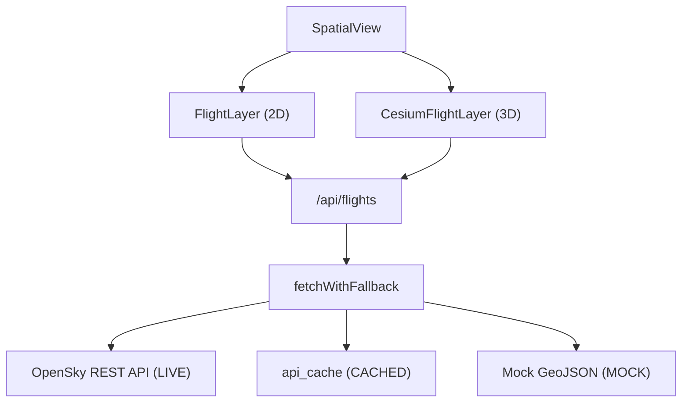

# 17 — OpenSky Flight Tracking

> **TL;DR:** Real-time airspace visualization over Cape Town and the Western Cape using the OpenSky Network ADS-B API. Features a three-tier fallback architecture (REST API → Supabase L2 Cache → Mock GeoJSON), server-side rate limiting with exponential backoff, and POPIA-compliant guest filtering. Integration includes 2D MapLibre icons and 3D CesiumJS entities.

| Field | Value |
|-------|-------|
| **Milestone** | M9 — OpenSky Flight Tracking |
| **Status** | Implemented |
| **Depends on** | M4a (Flight Data Context) |
| **Architecture refs** | [SYSTEM_DESIGN](../architecture/SYSTEM_DESIGN.md), [docs/CRS_DETECTION.md](../crs-detection.md) |

## Topic
Integration of live transponder data to provide situational awareness of the Cape Town airspace, useful for urban planning and monitoring flight patterns near noise-sensitive zones.

## Component Hierarchy

## Data Source Badge (Rule 1)
- Source badge: `[OpenSky Network · 2026 · LIVE|CACHED|MOCK]`
- Includes "Last Updated" timestamp support.
- Visible in the bottom-right of the map when the layer is active.

## Three-Tier Fallback (Rule 2)
- **LIVE:** Real-time fetch from `opensky-network.org/api/states/all` within the Cape Town BBox.
- **CACHED:** Supabase `api_cache` table stores the last successful API response (30s TTL).
- **MOCK:** Local file `public/mock/flights-cape-town.geojson` used if the API is unreachable and cache is expired.

## Implementation Details

### API Client (`src/lib/opensky-api.ts`)
- Implements `fetchFlightStates` with `AbortController` (5s timeout).
- Manages daily request caps (100/day anonymous, 4000/day authenticated).
- Automatic exponential backoff on HTTP 429 errors.
- Bounding Box: `{W:18.0, S:-34.5, E:19.5, N:-33.0}`.

### UI Component (`FlightLayer`)
- Polls `/api/flights` every 30 seconds.
- Renders SVG aircraft icons with `icon-rotate` based on aircraft heading.
- Displays callsigns as labels at higher zoom levels.
- Supports `guestMode` filtering aircraft by airline callsigns only.

### 3D Enhancement (`CesiumFlightLayer`)
- Renders aircraft as Cesium `Entity` objects with real-time altitude interpolation.
- Syncs with 2D visibility toggles.

## Access Control
- All users can see the flight layer.
- `guestMode` is enforced for non-authenticated users to redact private aircraft details (POPIA).

## Performance Budget

| Metric | Target |
|--------|--------|
| API response latency | < 2s |
| Polling interval | 30s |
| Icon render count | Up to 200 simultaneous aircraft |

## POPIA Implications
- Aircraft callsigns and flight patterns for private aircraft are considered personal data.
- **Lawful Basis:** Legitimate interests (public safety/airspace awareness).
- **Guest Mode:** Non-commercial aircraft are filtered out for public/unauthenticated views.

## Acceptance Criteria
- ✅ Aircraft icons move on the map in real-time.
- ✅ Icons are correctly rotated to reflect flight heading.
- ✅ Clicking an aircraft shows details (Callsign, Altitude, Speed).
- ✅ System falls back to MOCK data if the OpenSky API is down.
- ✅ Rate limiting prevents account suspension from provider.
- ✅ Source badge displays the correct "LIVE" or "CACHED" status.
