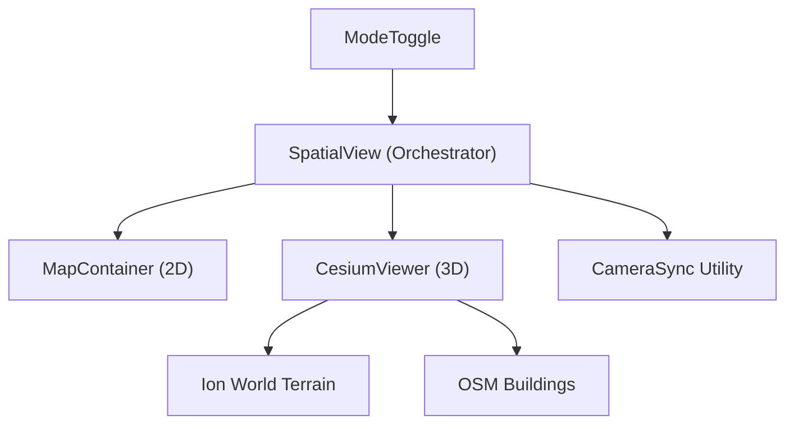

# 18 — CesiumJS Hybrid View

> **TL;DR:** Implementation of a high-performance 3D visualization layer using CesiumJS, integrated as a hybrid view with MapLibre GL JS. Features include 3D terrain, extruded buildings from OSM, and bi-directional camera synchronization. Supports a three-tier fallback for 3D data and automatic mobile fallback to 2D for performance.

| Field | Value |
|-------|-------|
| **Milestone** | M10 — CesiumJS Hybrid View |
| **Status** | Implemented |
| **Depends on** | M3 (Base Map), M4c (3D Asset Pipeline) |
| **Architecture refs** | [SYSTEM_DESIGN](../architecture/SYSTEM_DESIGN.md), [docs/cesium-rendering-workflows.md](../cesium-rendering-workflows.md) |

## Topic
Addition of an immersive 3D dimension to the GIS hub, enabling users to visualize terrain height and building massing in relation to zoning and property data.

## Component Hierarchy

## Data Source Badge (Rule 1)
- Source badge: `[CesiumJS · 2026 · LIVE|CACHED|MOCK]`
- Visible when 3D or HYBRID mode is active.

## Three-Tier Fallback (Rule 2)
- **LIVE:** Cesium Ion assets (Terrain, Buildings) fetched via Ion API.
- **CACHED:** Self-hosted 3D Tiles (Next.js `/public/cesium`) for specific pilot areas.
- **MOCK:** Fallback to 2D MapLibre view if the 3D engine fails to initialize or on low-end mobile devices.

## Implementation Details

### View Orchestrator (`SpatialView`)
- Manages state for `ViewMode` ('2d', '3d', 'hybrid').
- In 'hybrid' mode, MapLibre is rendered as a transparent overlay on top of Cesium.
- Handles mode toggling via a floating neumorphic button group.

### Cesium Integration (`CesiumViewer`)
- Initializes `Viewer` with `terrainProvider` and `OSM Buildings`.
- Uses `useImperativeHandle` to expose the Cesium `Viewer` instance to parent components.
- Configures static asset paths via `CESIUM_BASE_URL`.

### Camera Synchronization (`CameraSync`)
- `syncCesiumToMapLibre`: Updates Cesium camera height/pitch based on MapLibre zoom/pitch.
- `syncMapLibreToCesium`: Translates Cesium camera position back to MapLibre center/zoom.
- Uses `zoomToHeight` mathematical mapping for seamless altitude transitions.

## Access Control
- All users can access 2D and 3D views.
- Some high-resolution 3D datasets (e.g., 4DGS) may be restricted to ANALYST roles.

## Performance Budget

| Metric | Target |
|--------|--------|
| Engine initialization | < 2s |
| Frame rate (3D) | > 30 FPS on desktop |
| Texture memory | < 512 MB |

## POPIA Implications
- No personal data is embedded in the 3D building or terrain models.
- User location (if shared for "Find Me") is handled strictly in the client context.

## Acceptance Criteria
- ✅ 2D/3D toggle switched views without losing the current map center.
- ✅ Hybrid mode shows 2D labels and lines on top of 3D terrain.
- ✅ Terrain elevations (e.g., Table Mountain) are visible and accurate.
- ✅ Buildings are extruded based on OpenStreetMap data.
- ✅ Source badge is correctly displayed.
- ✅ Automatic 2D fallback occurs if WebGL 2.0 is not supported.
