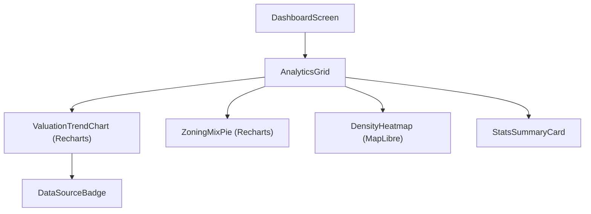

# 19 — Analytics Dashboard

> **TL;DR:** Dashboard for aggregate spatial statistics using Recharts. Visualizes suburb-level valuation trends, zoning distribution mix, and property count density. Includes guest-mode masking (blurred charts), tenant-scoped data, and PDF/CSV export for authorized roles.

| Field | Value |
|-------|-------|
| **Milestone** | M11 — Analytics Dashboard |
| **Status** | Draft |
| **Depends on** | M6 (GV Roll), M10 (Hybrid View) |
| **Architecture refs** | [SYSTEM_DESIGN](../architecture/SYSTEM_DESIGN.md) |

## Overview
The Analytics Dashboard provides high-level insights into property valuation and zoning patterns across Cape Town suburbs.

## Component Hierarchy

## Data Source Badge (Rule 1)
- Every chart must display: `[CoCT GV Roll · 2022 · LIVE|CACHED|MOCK]`
- Summary cards: `[SOURCE · YEAR · STATUS]`
- Visible without hovering.

## Three-Tier Fallback (Rule 2)
- **LIVE:** Real-time PostGIS aggregations via Supabase RPC.
- **CACHED:** `api_cache` entries for pre-aggregated suburb stats (24-hour TTL).
- **MOCK:** Static JSON files in `public/mock/analytics.json`.

## Dashboard Widgets

### 1. Valuation Trend Chart
- **Type:** Area Chart (Recharts)
- **X-Axis:** Date/Year
- **Y-Axis:** Average Valuation (ZAR)
- **Filtering:** By suburb or ward.

### 2. Zoning Mix Pie
- **Type:** Pie Chart (Recharts)
- **Data:** Percentage of each IZS zone code in the selection.
- **Palette:** Uses `ZONING_PALETTE` from Spec 03.

### 3. Property Density Summary
- **Type:** Metric Cards
- **Values:** Total Erfs, Median Value, Highest/Lowest Valuation in area.

## Access Tier Gating

| Feature | GUEST | VIEWER | ANALYST+ |
|---|---|---|---|
| Summary Metrics | ✅ | ✅ | ✅ |
| Charts | ⚠️ Blurred | ✅ | ✅ |
| Detailed Table | ❌ | ❌ | ✅ |
| Export (PDF/CSV) | ❌ | ❌ | ✅ |

## Performance Budget

| Metric | Target |
|--------|--------|
| Aggregation query (city-wide) | < 1s (PostGIS Materialized View) |
| Chart render time | < 300ms |
| Initial dashboard load | < 2s |

## POPIA Implications
- All data shown is **aggregated** (suburb/ward level).
- No individual owner names or addresses displayed in the analytics view.
- Guest mode blurring prevents scraping of granular valuation data.

## Acceptance Criteria
- [ ] Analytics dashboard accessible via "Analytics" tab in DashboardShell.
- [ ] Renders at least 3 Recharts widgets: Valuation Trend, Zoning Mix, and Summary Cards.
- [ ] Charts use `ZONING_PALETTE` colors for consistency.
- [ ] Data Source Badge visible on every widget.
- [ ] Three-tier fallback implemented for aggregation queries.
- [ ] Guest mode displays blurred charts with "Sign up to view details" overlay.
- [ ] Export button generates PDF/CSV for ANALYST roles.
- [ ] RLS policy ensures analytics are scoped to the active tenant.
