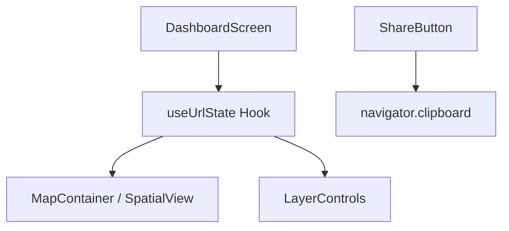

# 20 — Share URLs

> **TL;DR:** Implementation of shareable map state via URL search parameters. Encodes viewport (center, zoom, pitch, bearing) and active layer state (zoning, flights, suburbs) into the URL. Enables deep-linking to specific properties or 3D views.

| Field | Value |
|-------|-------|
| **Milestone** | M13 — Share URLs |
| **Status** | Draft |
| **Depends on** | M10 (Hybrid View), M12 (Multi-tenancy) |
| **Architecture refs** | [ADR-005](../architecture/ADR-005-tenant-subdomains.md) |

## Overview
Share URLs allow users to share their current map view, including 3D orientation and active layers, with other members of their tenant or the public (depending on role).

## URL Schema

```
https://[subdomain].capegis.com/dashboard?v=[lng],[lat],[zoom],[pitch],[bearing]&l=[layer_flags]
```

### 1. Viewport (`v`)
- Format: `lng,lat,zoom,pitch,bearing`
- Example: `18.42,-33.92,12,45,0`

### 2. Layers (`l`)
- Bitmask or comma-separated list of active layers.
- `z` = Zoning
- `f` = Flights
- `s` = Suburbs
- `d` = Draw tools
- Example: `l=z,f`

## Component Hierarchy



## Data Source Badge (Rule 1)
- N/A — URL state is metadata, not a data display.

## Three-Tier Fallback (Rule 2)
- N/A.

## Implementation Details

### `useUrlState` Hook
- Listens to map move events and updates URL search params using `window.history.replaceState`.
- On initial load, parses URL params and sets the initial state of the map and layers.

### Sharing UI
- Button in the toolbar: "Copy Share Link".
- Generates the full URL including the current subdomain.

## Access Control
- Shared links to sensitive data (e.g., specific property details) still require authentication and RLS check.
- Public layers (basemap, suburbs) are visible via share link to GUESTS.

## Performance Budget

| Metric | Target |
|--------|--------|
| URL update debounce | 500ms |
| Initial state parse | < 50ms |
| "Copy Link" feedback | < 100ms |

## POPIA Implications
- Share URLs must NOT contain PII (e.g., owner names or IDs).
- Only coordinates and layer toggles are encoded.

## Acceptance Criteria
- [ ] Map viewport (center, zoom, pitch, bearing) persists in the URL.
- [ ] Active layer toggles (zoning, flights, etc.) persist in the URL.
- [ ] Refreshing the page restores the exact map state from the URL.
- [ ] "Copy Share Link" button works and includes the tenant subdomain.
- [ ] Shared links to authenticated data redirect to login if no session.
- [ ] URL updates are debounced to prevent history bloat.
