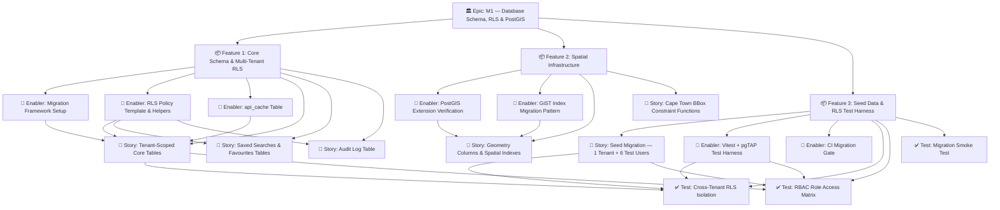
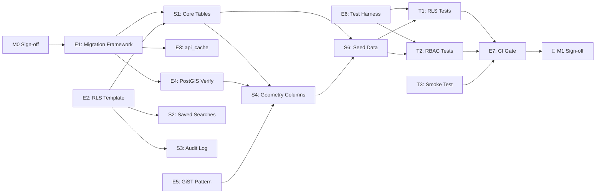

# Project Plan — M1 Database Layer: Core Schema & RLS

> **Feature**: Core Schema, Row-Level Security & Spatial Infrastructure
> **Epic**: M1 — Database Schema, RLS & PostGIS
> **Governess**: `CLAUDE.md` Rules 1–10 are non-negotiable
> **Spec refs**: [`05-rls-testing.md`](../../../../specs/05-rls-testing.md) · [`11-multitenant-architecture.md`](../../../../specs/11-multitenant-architecture.md)
> **ADR refs**: [ADR-005](../../../../architecture/ADR-005-tenant-subdomains.md) · [ADR-009](../../../../architecture/ADR-009-three-tier-fallback.md)

---

## 1. Project Overview

### Feature Summary

Establish the production-ready PostgreSQL 15 + PostGIS 3.x schema that all subsequent milestones depend on. This includes every tenant-scoped table, Row-Level Security (RLS) policies using the canonical `current_setting('app.current_tenant', TRUE)` pattern, GiST spatial indexes, the `api_cache` table for the three-tier fallback, and a seed migration with one test tenant and six role-typed test users.

### Success Criteria

| KPI | Target |
|-----|--------|
| `supabase db reset` runs to completion without errors | 100% pass |
| Cross-tenant RLS test: tenant A reads 0 rows from tenant B | All 9 tenant-scoped tables pass |
| All 6 RBAC roles exercise correct access gate | GUEST → PLATFORM_ADMIN |
| Spatial index on every geometry column | GiST index on all `geometry` cols |
| Migration runtime | < 60 s on local Docker |

### Key Milestones (no dates)

1. **Migration framework set** — naming convention, `supabase/migrations/` scaffold
2. **All 9 core tables created** with `tenant_id` FK
3. **RLS enabled and forced** on all tenant-scoped tables
4. **api_cache table live** with `expires_at` TTL
5. **GiST indexes added** on all geometry columns
6. **Seed migration complete** — 1 tenant, 6 test users
7. **RLS test harness green** in CI (Vitest + pgTAP)
8. **Human M1 sign-off** received

### Risk Assessment

| Risk | Likelihood | Impact | Mitigation |
|------|-----------|--------|-----------|
| `current_setting()` returning NULL on un-set transactions | Medium | High | Use two-arg form `current_setting('app.current_tenant', TRUE)` — returns NULL not error |
| GiST index bloat on large geometry tables | Low | Medium | Use `CREATE INDEX CONCURRENTLY` in production; local dev uses standard CREATE |
| Silent RLS failure (query returns 0 rows, no error) | Medium | High | pgTAP test `SELECT count(*)` from cross-tenant context — must be 0 |
| `supabase db reset` destroys seed data | Certain | Low | Keep seed in a dedicated `seed.sql` step, documented in README |
| PostGIS extension not available in Supabase project | Low | Critical | Verify extension enabled via Supabase dashboard before migration run |

---

## 2. Work Item Hierarchy



---

## 3. GitHub Issues Breakdown

### Epic Issue — M1 Database Layer

```markdown
# Epic: M1 — Database Schema, RLS & PostGIS Foundation

## Epic Description
Establish the production-ready PostgreSQL 15 + PostGIS 3.x schema that all subsequent
milestones depend on. Shared-schema multi-tenancy via `tenant_id` + RLS, spatial indexes,
api_cache, and a validated seed + test harness.

## Business Value
- **Primary Goal**: Secure, tenant-isolated data foundation enabling all product features
- **Success Metrics**: supabase db reset ✅ | 9-table RLS isolation ✅ | CI green ✅
- **User Impact**: Correct tenant isolation is a POPIA compliance requirement (Rule 5)

## Epic Acceptance Criteria
- [ ] All 9 tenant-scoped tables from CLAUDE.md §4 created
- [ ] RLS ENABLED + FORCED on every tenant table
- [ ] RLS policies use `current_setting('app.current_tenant', TRUE)` pattern
- [ ] GiST index on every geometry column
- [ ] api_cache table with expires_at present
- [ ] Seed migration: 1 tenant + 1 user per RBAC role (6 users)
- [ ] `supabase db reset` completes in < 60 s
- [ ] RLS isolation Vitest tests pass in CI

## Features in this Epic
- [ ] #F1 — Core Schema & Multi-Tenant RLS
- [ ] #F2 — Spatial Infrastructure
- [ ] #F3 — Seed Data & RLS Test Harness

## Definition of Done
- [ ] All feature stories completed and merged
- [ ] Vitest + pgTAP tests green in CI (GitHub Actions)
- [ ] `supabase db reset` clean run documented in README
- [ ] POPIA annotation added to any migration touching personal data
- [ ] Human M1 sign-off received

## Labels
`epic`, `priority-critical`, `value-high`, `database`, `rls`, `postgis`
## Milestone: M1
## Estimate: XL (≈ 47 story points)
```

---

### Feature 1 — Core Schema & Multi-Tenant RLS

```markdown
# Feature: Core Schema & Multi-Tenant RLS

## Description
Create all 9 tenant-scoped tables (`profiles`, `saved_searches`, `favourites`,
`valuation_data`, `api_cache`, `audit_log`, `tenant_settings`, `layer_permissions`,
`properties`) with RLS enabled, forced, and using the canonical policy pattern.

## User Stories
- [ ] #S1 — Tenant-Scoped Core Tables (3 pts)
- [ ] #S2 — Saved Searches & Favourites Tables (2 pts)
- [ ] #S3 — Audit Log Table (2 pts)

## Technical Enablers
- [ ] #E1 — Migration Framework Setup (2 pts)
- [ ] #E2 — RLS Policy Template & Helpers (3 pts)
- [ ] #E3 — api_cache Table (2 pts)

## Dependencies
**Blocks**: Feature 2 (spatial indexes depend on tables existing), Feature 3 (seed depends on tables)
**Blocked by**: M0 sign-off

## Acceptance Criteria
- [ ] All tables exist in `public` schema with `id UUID PRIMARY KEY DEFAULT gen_random_uuid()`
- [ ] All tables have `tenant_id UUID NOT NULL REFERENCES tenants(id)`
- [ ] `ALTER TABLE ... ENABLE ROW LEVEL SECURITY` + `FORCE ROW LEVEL SECURITY` applied
- [ ] RLS policy: `USING (tenant_id = current_setting('app.current_tenant', TRUE)::uuid)`
- [ ] api_cache has `key TEXT`, `value JSONB`, `expires_at TIMESTAMPTZ`, `tenant_id`

## Labels
`feature`, `priority-critical`, `value-high`, `database`, `rls`
## Epic: #E-M1
## Estimate: L (12 pts)
```

---

### Feature 2 — Spatial Infrastructure

```markdown
# Feature: Spatial Infrastructure

## Description
Enable PostGIS on the database, add geometry columns to tables that need spatial storage,
create GiST indexes, and wire in bounding-box constraint helpers for the Cape Town scope.

## User Stories
- [ ] #S4 — Geometry Columns & Spatial Indexes (3 pts)
- [ ] #S5 — Cape Town BBox Constraint Functions (2 pts)

## Technical Enablers
- [ ] #E4 — PostGIS Extension Verification (1 pt)
- [ ] #E5 — GiST Index Migration Pattern (2 pts)

## Dependencies
**Blocks**: M3 (MapLibre base map), M4b (Martin MVT)
**Blocked by**: Feature 1 (tables must exist)

## Acceptance Criteria
- [ ] PostGIS 3.x extension verified: `SELECT PostGIS_Version();`
- [ ] All geometry columns use SRID 4326 (WGS 84)
- [ ] `CREATE INDEX ... USING GIST (geom)` on all geometry columns
- [ ] `ST_Within(geom, ST_MakeEnvelope(18.0, -34.5, 19.5, -33.0, 4326))` helper function exists

## Labels
`feature`, `priority-high`, `value-high`, `database`, `postgis`, `spatial`
## Epic: #E-M1
## Estimate: S (8 pts)
```

---

### Feature 3 — Seed Data & RLS Test Harness

```markdown
# Feature: Seed Data & RLS Test Harness

## Description
A seed migration providing 1 test tenant with 6 users (one per RBAC role), plus a
Vitest + pgTAP test harness validating tenant isolation and role-based access in CI.

## User Stories
- [ ] #S6 — Seed Migration: 1 Tenant + 6 Test Users (3 pts)

## Technical Enablers
- [ ] #E6 — Vitest + pgTAP Test Harness (5 pts)
- [ ] #E7 — CI Migration Gate (3 pts)

## Test Issues
- [ ] #T1 — Cross-Tenant RLS Isolation Tests (3 pts)
- [ ] #T2 — RBAC Role Access Matrix Tests (3 pts)
- [ ] #T3 — Migration Smoke Test (1 pt)

## Dependencies
**Blocked by**: Feature 1 + Feature 2 (needs tables and spatial setup)
**Blocks**: M4d (full RLS test harness — this is the M1 subset)

## Acceptance Criteria
- [ ] `supabase/migrations/seed.sql` creates tenant `capegis-test` + users for GUEST → PLATFORM_ADMIN
- [ ] Vitest test: tenant A sees 0 rows from tenant B across all 9 tables
- [ ] pgTAP test: privilege escalation attempt blocked
- [ ] CI gate: `npm test` in GitHub Actions runs migrations + tests

## Labels
`feature`, `priority-critical`, `value-high`, `database`, `testing`, `rls`
## Epic: #E-M1
## Estimate: M (15 pts)
```

---

### User Stories Detail

| ID | Story | Acceptance Criteria (key) | Points | Priority |
|----|-------|--------------------------|--------|----------|
| S1 | As a TENANT_ADMIN, I want `profiles`, `valuation_data`, `tenant_settings`, `layer_permissions`, and `properties` tables so that all core entity data is tenant-isolated | Tables exist; RLS enabled+forced; policy uses `current_setting` | 3 | P0 |
| S2 | As a VIEWER, I want `saved_searches` and `favourites` tables so that I can persist map state across sessions | Tables linked to `profiles`; RLS enforced; POPIA annotation present | 2 | P1 |
| S3 | As a PLATFORM_ADMIN, I want an `audit_log` table so that all tenant data changes are traceable for POPIA compliance | Immutable append-only; captures action, actor, tenant, timestamp; RLS: PLATFORM_ADMIN sees all | 2 | P1 |
| S4 | As a spatial analyst, I want PostGIS geometry columns with GiST indexes so that `ST_Within` and `ST_DWithin` queries run in < 200 ms | geometry(Point,4326) on `properties`; GiST index confirmed via `\d` | 3 | P0 |
| S5 | As a developer, I want Cape Town bounding box helper functions so that all spatial inserts are automatically validated | `fn_validate_cape_town_bbox()` rejects geometries outside bbox | 2 | P1 |
| S6 | As a developer, I want seed data so that I can test locally without manual setup | 1 tenant, 6 users with distinct roles; `supabase db reset` reproducible | 3 | P0 |

---

### Technical Enablers Detail

| ID | Enabler | Technical Requirements | Points | Priority |
|----|---------|----------------------|--------|----------|
| E1 | Migration Framework | Convention: `YYYYMMDDHHMMSS_description.sql`; `supabase/migrations/` enforced; README documents reset procedure | 2 | P0 |
| E2 | RLS Policy Template | SQL helper function `fn_rls_tenant_policy(table_name)` applies canonical pattern; PLATFORM_ADMIN bypass policy | 3 | P0 |
| E3 | api_cache Table | `key TEXT NOT NULL`, `value JSONB`, `expires_at TIMESTAMPTZ`, `tenant_id`, RLS enforced; used by three-tier fallback | 2 | P0 |
| E4 | PostGIS Verification | Migration asserts `SELECT PostGIS_Version()` returns ≥ 3.0; fails fast if missing | 1 | P0 |
| E5 | GiST Index Pattern | Template migration for `CREATE INDEX CONCURRENTLY` → documentation note: local dev can skip CONCURRENTLY | 2 | P1 |
| E6 | Vitest + pgTAP Harness | `supabase/tests/` directory; pgTAP for SQL-level; Vitest for app-level auth simulation | 5 | P0 |
| E7 | CI Migration Gate | `ci.yml` job: `supabase db reset` → `npm test` → fail build on any RLS test failure | 3 | P1 |

---

## 4. Priority and Value Matrix

| ID | Item | Priority | Value | Rationale |
|----|------|----------|-------|-----------|
| E1 | Migration Framework | P0 | High | Everything else depends on it |
| E2 | RLS Policy Template | P0 | High | CLAUDE.md Rule 4 — mandatory dual-layer isolation |
| E3 | api_cache Table | P0 | High | CLAUDE.md Rule 2 — three-tier fallback required |
| E4 | PostGIS Verification | P0 | High | Blocks all spatial work |
| S1 | Core Tables | P0 | High | Foundation for all features |
| S4 | Geometry Columns | P0 | High | Blocks M3, M4b |
| S6 | Seed Data | P0 | High | Required for any meaningful local dev |
| E6 | Test Harness | P0 | High | POPIA: cross-tenant leak = reportable breach |
| S2 | Saved Searches/Favourites | P1 | Medium | M9 dependency; not M1 blocker |
| S3 | Audit Log | P1 | Medium | POPIA compliance; needed before M15 |
| S5 | BBox Constraint | P1 | Medium | Data quality; CLAUDE.md Rule 9 |
| E5 | GiST Index Pattern | P1 | Medium | Performance; needed before data load |
| E7 | CI Gate | P1 | High | Prevents RLS regression on future PRs |
| T1 | Cross-Tenant Tests | P0 | High | Core POPIA control |
| T2 | RBAC Role Tests | P1 | High | Security validation |
| T3 | Migration Smoke | P1 | Medium | Developer experience |

---

## 5. Sprint Planning

### Sprint Capacity

- **Sprint Duration**: 2-week sprints
- **Buffer**: 20% for unexpected issues
- **Focus Factor**: 75%

### Suggested Sprint 1 — Foundation (P0 Enablers + Core Tables)

| Issue | Title | Points |
|-------|-------|--------|
| E1 | Migration Framework Setup | 2 |
| E4 | PostGIS Extension Verification | 1 |
| E2 | RLS Policy Template & Helpers | 3 |
| E3 | api_cache Table | 2 |
| S1 | Tenant-Scoped Core Tables | 3 |

**Total**: 11 pts · **Goal**: `supabase db reset` produces a clean schema with RLS active

### Suggested Sprint 2 — Spatial + Seed + Tests

| Issue | Title | Points |
|-------|-------|--------|
| E5 | GiST Index Migration Pattern | 2 |
| S4 | Geometry Columns & Spatial Indexes | 3 |
| S5 | Cape Town BBox Constraint Functions | 2 |
| S2 | Saved Searches & Favourites Tables | 2 |
| S3 | Audit Log Table | 2 |
| S6 | Seed Migration — 1 Tenant + 6 Users | 3 |

**Total**: 14 pts · **Goal**: All tables exist, spatial infrastructure live, seed runnable

### Suggested Sprint 3 — Testing & CI

| Issue | Title | Points |
|-------|-------|--------|
| E6 | Vitest + pgTAP Test Harness | 5 |
| T1 | Cross-Tenant RLS Isolation Tests | 3 |
| T2 | RBAC Role Access Matrix Tests | 3 |
| T3 | Migration Smoke Test | 1 |
| E7 | CI Migration Gate | 3 |

**Total**: 15 pts · **Goal**: All RLS tests green in GitHub Actions CI

### Estimated Total: ~40 story points | T-shirt: **XL**

---

## 6. GitHub Project Board Configuration

### Column Structure

| Column | Trigger | WIP Limit |
|--------|---------|-----------|
| **Backlog** | Issue created | — |
| **Sprint Ready** | Estimation + ACs defined | — |
| **In Progress** | Branch created / PR opened | 3 |
| **In Review** | PR ready for review | 5 |
| **Testing** | Merge to main; CI running | — |
| **Done** | CI green; human sign-off | — |

### Required Labels

```
epic, feature, user-story, enabler, test-issue
priority-critical, priority-high, priority-medium, priority-low
value-high, value-medium, value-low
database, rls, postgis, spatial, testing, infrastructure
```

### Custom Fields

| Field | Type | Values |
|-------|------|--------|
| Priority | Single select | P0, P1, P2, P3 |
| Milestone | Single select | M0, M1, M2, M3, M4a–d, M5–M15 |
| Component | Single select | Database, Backend, Frontend, Infrastructure, Testing |
| Estimate | Number | Story points (Fibonacci: 1,2,3,5,8) |
| Sprint | Number | Sprint number |

---

## 7. Dependency Graph



---

## 8. POPIA Considerations (Rule 5)

The following tables in this epic contain personal data and require POPIA annotations:

| Table | Personal Data | Lawful Basis |
|-------|-------------|-------------|
| `profiles` | email, display name, phone | Contract |
| `audit_log` | actor UUID, IP (optional) | Legal obligation |
| `saved_searches` | search terms (potentially identifying) | Consent |
| `favourites` | property interest (location preference = PII) | Consent |

All migration files touching these tables must include the POPIA annotation block per CLAUDE.md Rule 5.

---

## 9. Automation (GitHub Actions)

### CI Pipeline (`.github/workflows/ci.yml` — existing)

Add a `db-test` job:

```yaml
db-test:
  runs-on: ubuntu-latest
  services:
    postgres:
      image: postgis/postgis:15-3.4
      env:
        POSTGRES_PASSWORD: postgres
      ports: ['5432:5432']
  steps:
    - uses: actions/checkout@v4
    - name: Install Supabase CLI
      run: npm install -g supabase
    - name: Reset DB + Run Migrations
      run: supabase db reset --local
    - name: Run RLS Tests
      run: npm test -- --project rls
```

---

*Project plan generated: 2026-03-05 · Governed by CLAUDE.md v2.0 · Refs: specs/05, specs/11, ADR-005, ADR-009*
